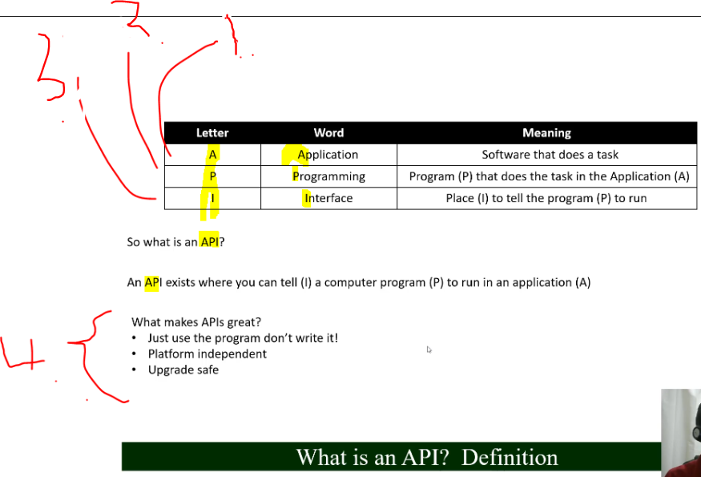
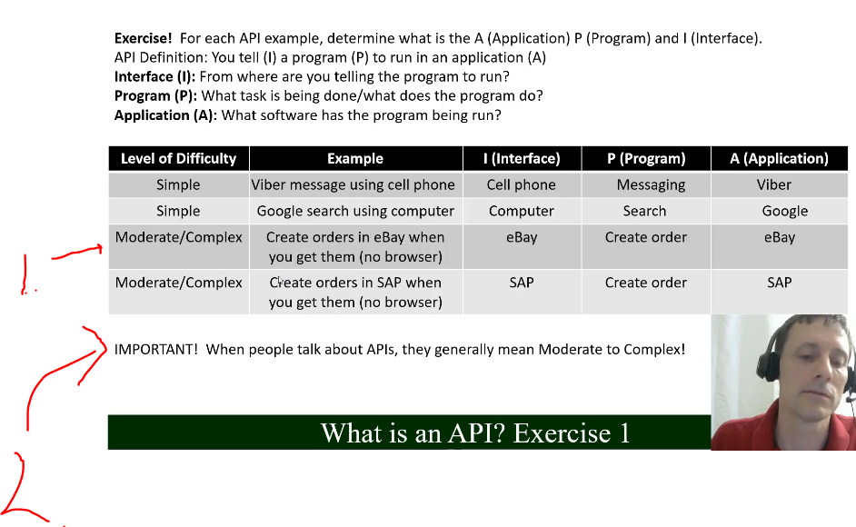
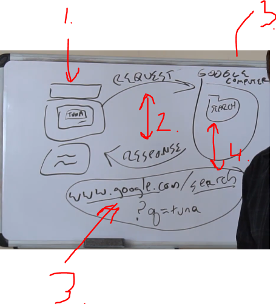
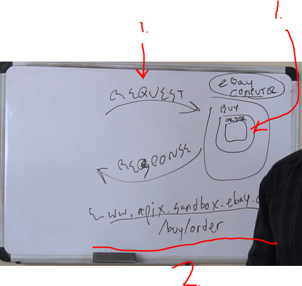
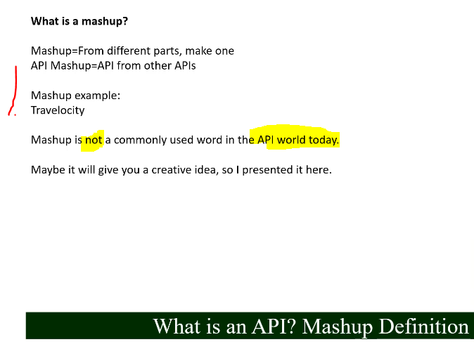

# Section 02: API.

API.

# What I learned.

# 2. What is an API?

1. **A** contains the program what is going to be run.
2. **P** program that executes task that is going to be run.
3. **I** stand for where we are telling to the program to run.
4. These are platform independence, upgrade safe and easy to use.
    
# 3. API Exercise 1.

1. **eBay** exposes API to access the orders. Not from browser. 
2. Lets consumers access the API. Brings flexibility. 

# 4. API Exercise 2.

- Some API to explore. [Ebay API:s](https://developer.ebay.com/develop)
    - Usually **tokens** are need to access API:s.

# 5. API Details.

1. **Request** is made. To something to be run.
2. **Program** is run. To finish that been requested.
3. **Response**. That what is returned.

1. Program is located at **URL**.
2. Computer is making the **request** and **request**.
3. We are making **query** to google computer.
4. We are accessing folder inside **Googles** computer, called `search`.

- In this example we are using API from program.

1. We are making order. This order is stored in **eBay:s** computer. 
2. URL for **eBay:s** folder in their computer.

# 6. API Details Example.

- URL:s has different folders.

- Pretty basic stuff. ✔️

# 7. API Mashup.

- Mashup is mixing different things.

1. We have API calling all other API:s.