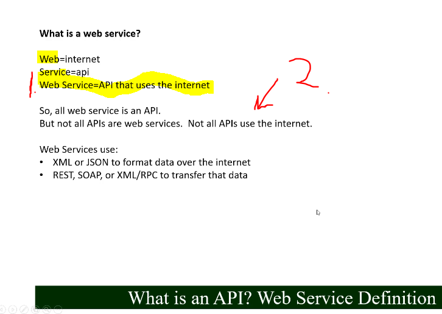

# Section 03: Web Services.

Web Services.

# What I learned.

# 8. What is a Web Service?

1. Web service = API that uses the **internet**.
2. Not all API are **web services**.
    - If API is not in **web**!

# 9. API and Web Service Conclusion.

- 5 stars man! ✔️.
