# Section 04: HTTP.

HTTP.

# What I learned.

# 10. Introduction to HTTP.

- We are calling using **HTTP**.

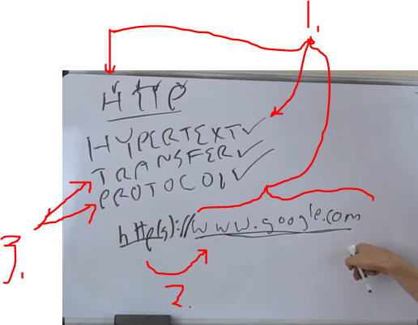

1. **H**, like **Hyper**. This is just normal text `www.google.com`, this will be **Hyper text**. Hyper to somewhere else.
2. **Http** enables **Hypert text**!
3. How it's done, it's done with **Transfer Protocol**.

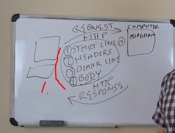

1. **Contains:**
    - Start line.
    - Headers.
    - Blank line.
    - Body.

|HTTP|REQUEST|RESPONSE|
|---|---|---|
| START LINE | Version HTTP **1.1**. This what most people using. **Method**: Main methods used `GET`, `POST`, `PUT`,`DELETE`. | Status codes. |      
| HEADERS | Host: `www.google.com`, Token: `*******`. | Cookies. |      
| BLANK LINE | Just blank to separate. | Just blank to separate. |      
| BODY | For `POST` there are parameters. | What we requested. |      

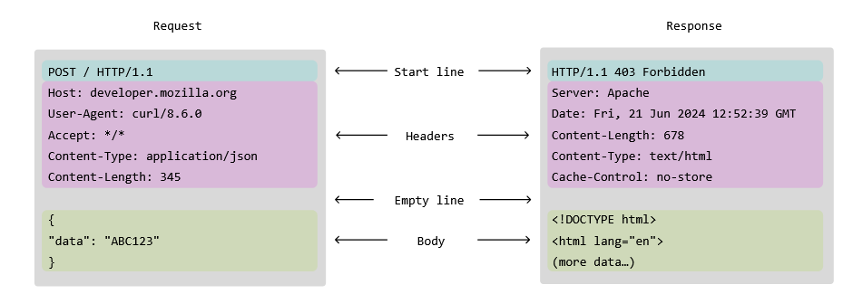

# 11. HTTP Exercise.

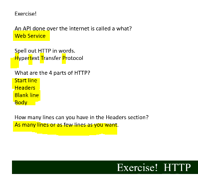

# 12. HTTP Parts.

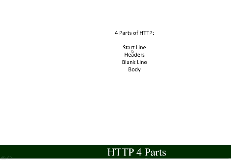

# 13. HTTP Start Line.

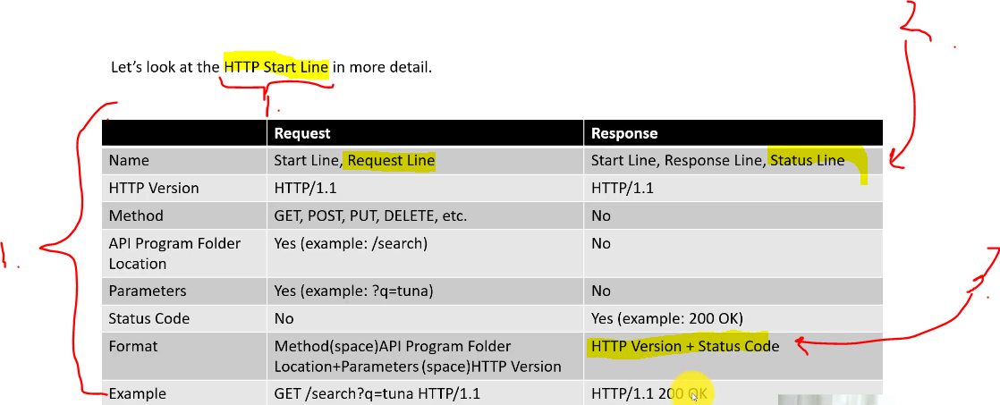

1. In general **HTTP Start Line** **contains** or **does not** contain these attributes, depending on the usage. 
2. `Requests` of **Start Line** can be called also **Request Line**. For `Response` this can be called also **Status Line**
3. For formatting responses, is little different. Check network tool.

- Some list for [methods](https://en.wikipedia.org/wiki/HTTP#Request_methods).

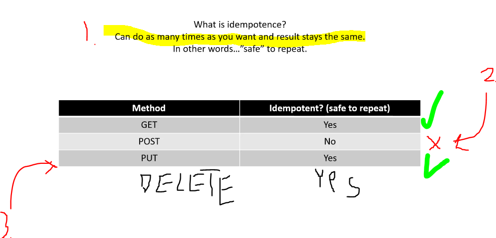

1. Thing that we are repeating **over and over again** and be safe. 
2. With **POST** you need to be careful not create same resource again, so this **method** is **not** IDEMPOTENT.
3. With **PUT** you can repeat and repeat modification. This **method** is idempotent.

# 14. HTTP Start Line Exercise.

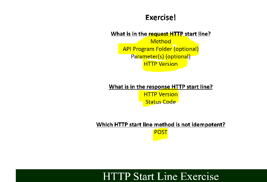

# 15. HTTP Headers.

- [Some headers](https://en.wikipedia.org/wiki/List_of_HTTP_header_fields).

- Example we can define for `POST` header `Content-Type` in which format we will send this payload.

- `Server` header, this will be the **name of server**, when the response comes back.

# 16. HTTP Headers Exercise.

- Check web for headers. ✅

# 17. HTTP Blank Line.

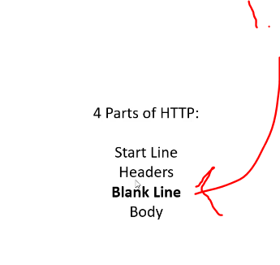

1. **Blank line** will be separation mark for response.

# 18. HTTP Body.

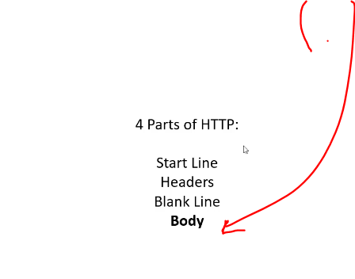

1. Content will be inside **body**.

- You can check **common** media types:
    - [Different MIME types](https://en.wikipedia.org/wiki/Media_type#Common_examples)

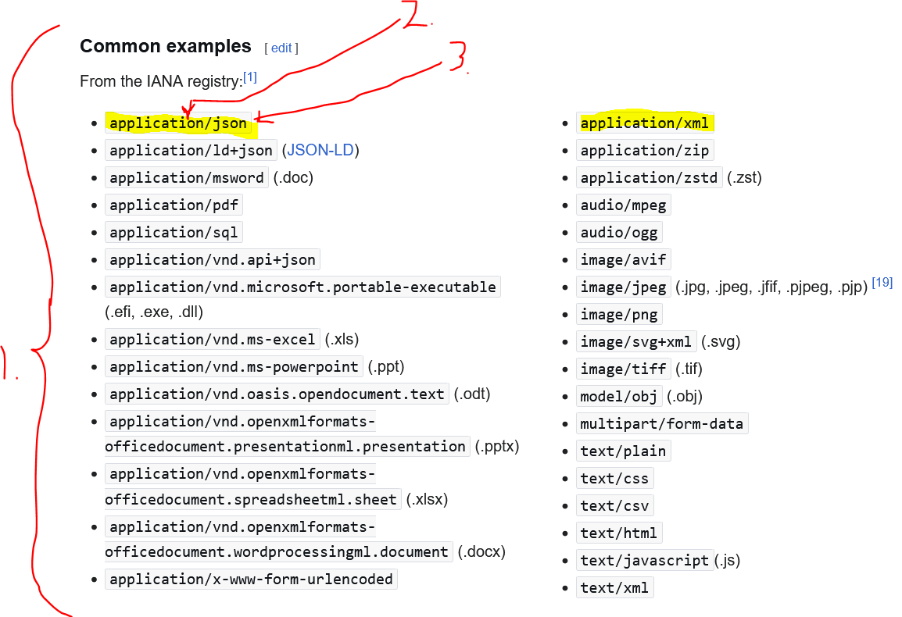

1. These are very **common** types. 
2. Main type will be `application`.
3. The subtype will be `json`.
    - This will be **more** important, defining the type. 

- For **API**s context, please note `application/json` and `application/xml`.

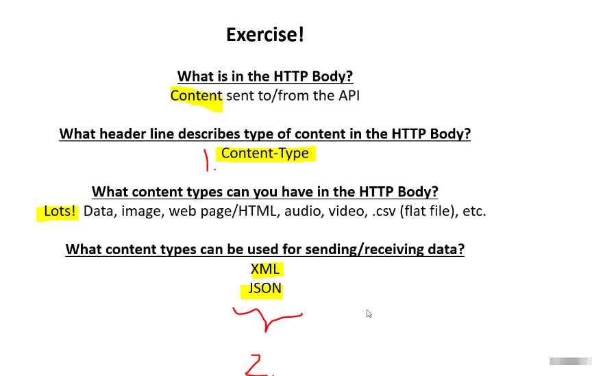

1. `Content-type` with different Media types.
2. These `JSON` and `XML` are very important for APIs.

# 20. Advanced Topics HTTP: Stateless, Cookies, Security, Infrastructure.

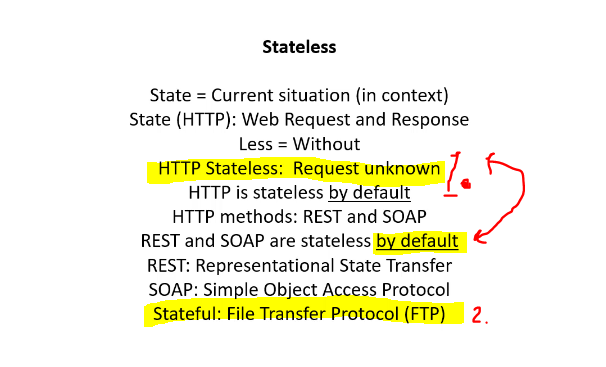

1. Server **does not know**, that **request is incoming**, hence we call **stateless**.
2. Example of **stateful** communication is **FTP**. You know, 
    - Who you're talking to.
    - What needs to be done.
    - **BEFORE** request is made, hence **STATEFUL**.

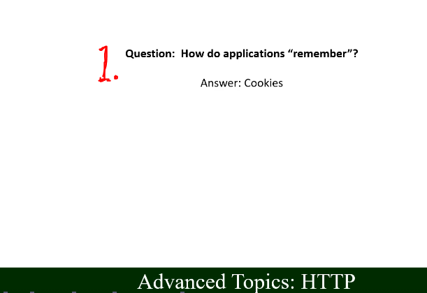

1. If **HTTP** is stateless, how website knows, what's it been up to? Storing orders on the website for example.
    - **Cookies**.
        - **Session** is stored inside **Cookie**.

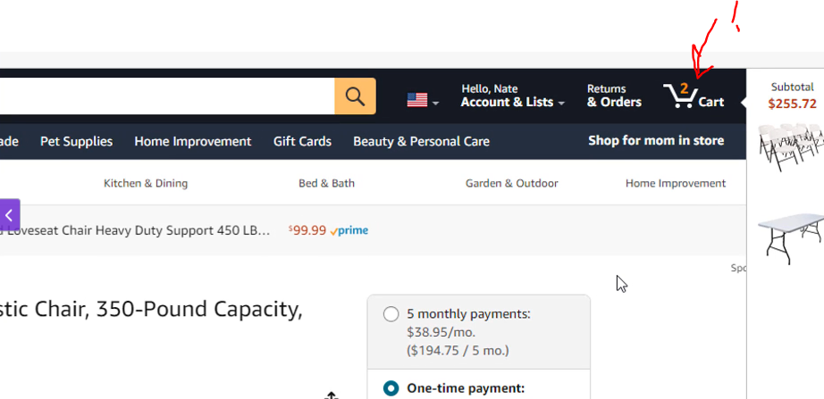

1. **Amazon** something to store.

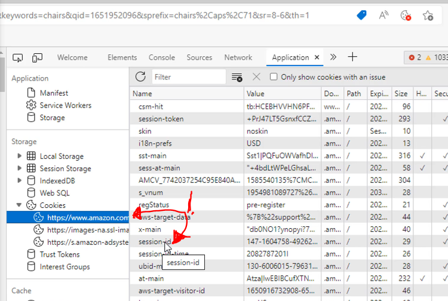

1. Example of `www.amazon.com` having **session ID** stored inside cookie!
    - This associates the two items with the client and the **Amazon** server.

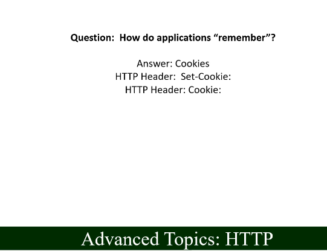

- Cookies as set often!
- Cookies are setted in HTTP Header section!

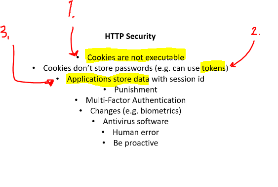

1. **Cookies** are just lines of text.
2. **Cookies** does not hold password. They can hold encrypted **Tokens**.
3. Application can associate IP-address with **Session ID**.

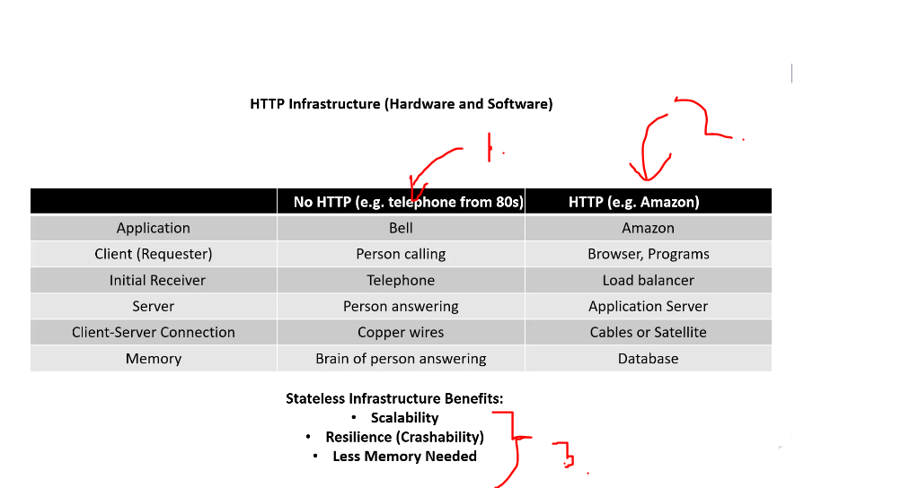

1. Without HTTP age.
2. With HTTP age.
3. Benefits with **Stateless**.

1. Services at **windows**.