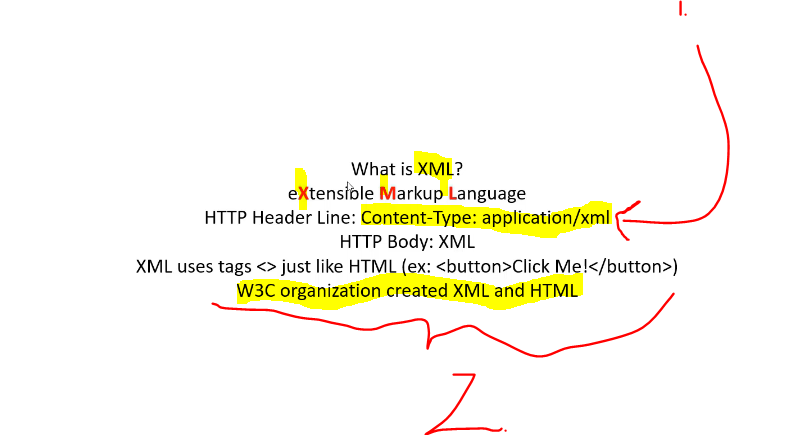
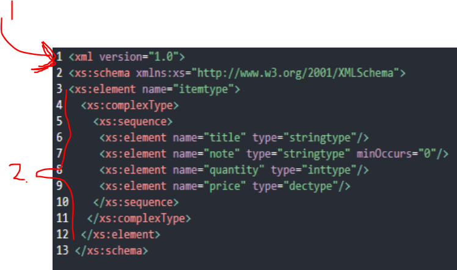

# Section 05: XML.

XML.

# What I learned.

# 21. XML Introduction.



1. Holds data that you can send to **API**.
2. HTML and XML was created by **W3C** organization.

- With **XML** you can **extend** tags to mean something.

 - We can send this **XML** to pizza API.

 ```
 <Pizza>
    <Size>Small</Size>
        <Topping>Cheese</Topping>
        <Topping>Tomato</Topping>
        <Topping>Meat</Topping>
        <Topping>Onnion</Topping>
 </Pizza>
 ```

 - If you want to have some **specific** `xml`. Use **XPATH**.

 - Telling how you **XML** need to be **structured**, you can define [XML schema](https://fi.wikipedia.org/wiki/XML_Schema).
    - With **XSD**.

- Following using **XSD**.



1. We define **Schema** here.
2. These needs to have the following structure.

- When receiving, If field is wrong type or not present this will be ❌**rejected**❌.

# 22. XML Exercise.

- My answer:

```
 <Pizza>
    <Size>Small</Size>
        <Topping>Cheese</Topping>
        <Topping>Tomato</Topping>
        <Topping>Meat</Topping>
        <Topping>Onnion</Topping>
 </Pizza>
```


