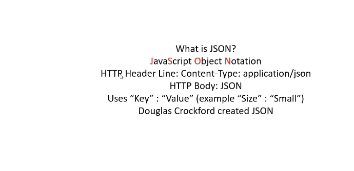

# Section 06: JSON.

JSON.

# What I learned.

# 23. JSON Introduction.



1. When sending **JSON** we should use `Content-type: application/json`.

- For reflecting **XML** was created with **~11** people.
    - **JSON** was with one person.

- **Object** start with `{}`.
- **List** with `[]`.

```
xml
```

> [!IMPORTANT]
> To reflect look for example from the **XML**, with **JSON** structure.


 ```
 <Pizza>
    <Size>Small</Size>
        <Topping>Cheese</Topping>
        <Topping>Tomato</Topping>
        <Topping>Meat</Topping>
        <Topping>Onnion</Topping>
 </Pizza>
 ```