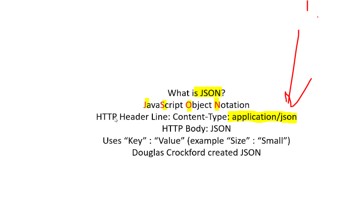

# Section 06: JSON.

JSON.

# What I learned.

# 23. JSON Introduction.



1. When sending **JSON** we should use `Content-type: application/json`.

- For reflecting **XML** was created with **~11** people.
    - **JSON** was with one person.

- **Object** start with `{}`.
- **List** with `[]`.

```
<Pizza>
    <Size>Small</Size>
        <Topping>Cheese</Topping>
        <Topping>Tomato</Topping>
        <Topping>Meat</Topping>
        <Topping>Onnion</Topping>
 </Pizza>
```

> [!IMPORTANT]
> To reflect look for example from the **XML**, with **JSON** structure.


```
{
	"Pizza" : [
		{
			"Size" : "Small",Tomato
			"Topping" : ["Cheese", "Mushrooms", "Meat", "Onnion"]
		}
	]
}
```

- [JSON](https://www.json.org/json-en.html).

- JSON has **schema**, but it's rarely used!

# 24. JSON Exercise.

```
{
	"Pizza" : [
		{
			"Size" : "Small",
			"Topping" : ["Onions", "Mushrooms"]
		},
		{
			"Size" : "Large",
			"Topping" : ["Olives", "Something"]
		}
	]
}
```

# 25. XML JSON Comparison.

 

- **JSON** much more popular.