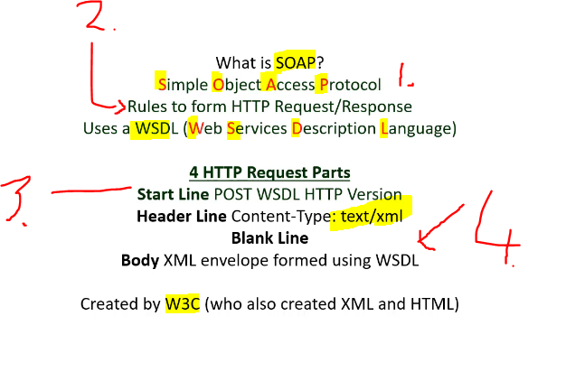
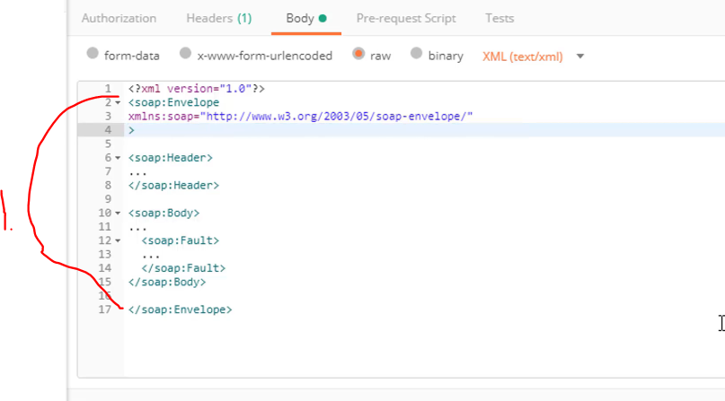
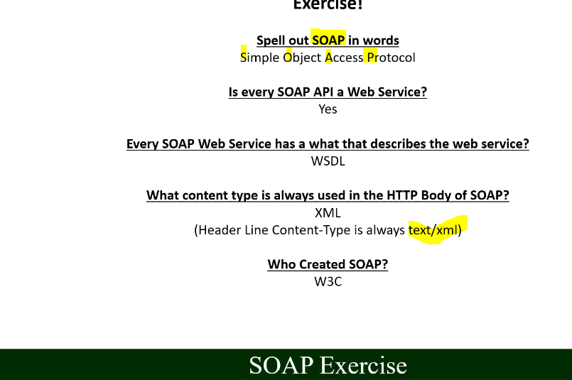

# Section 07: SOAP.

SOAP.

# What I learned.

# 26. SOAP REST Comparison.

- SOAP REST are just ways to form HTTP request and responses.

# 27. SOAP Introduction.

 

1. SOAP is not "simple", but more complex. My opinion.
2. There are **rules** to form HTTP **Request/Response**.
3. In **SOAP** **Start Line**
    - First we need to use **POST**.
    - Second we need use **WSDL**.
    - Third is **HTTP Version**.
4. XML in the body, which is generated using **WSDL**.

- **W3C**, is creator if **SOAP** and **WSDL**.

# 28. SOAP Examples.

 1. Every **SOAP** messages need to have **Envelope**.

- Troubles to find Valid SOAP XML endpoint.

- REST in general, is much easier.

# 29. SOAP Exercise.

