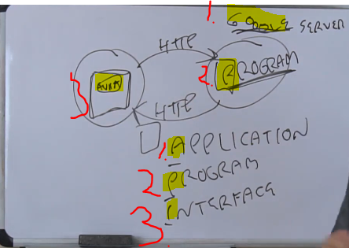

# Section 08: REST.

REST.

# What I learned.

# 30. REST Introduction Part One.

 

1. **Google** is the application.   
    - Piece of software which holds the program.
2. Program, **search program**, return search results for tuna. 
3. Interface the **web** browser.

|TIME|API METHOD|
|---|---|
| 1980s | ~~SUN RPC~~ (Nowadays technically Oracle) |      
| 1989 | HTTP came out (Replaced **Sun RPC**) |      
| 1998 | ~~XML-RPC~~ (used, but rarely) |      
| 1999 | SOAP (**SOAP** is used over XML-RPC) |      
| 2000 | **REST**, is the modern way to make APIs | 

1. For **SOAP** and **XML-RPC** is using `POST`.
2. For **REST** different `methods` are used.

- Main methods:
    - `GET` - **R**ead.
    - `POST` - **C**reate.
    - `PUT` - **U**pdate.
    - `DELTE` - **D**elete.

- In database world, `Table` has records. **CRUD**.
    - **Create** the record.
    - **Read** the record.
    - **Update** the record.
    - **Delete** the record.

- Thinking with **REST** is fundamentally, calling the records.

1. You can put stuff into cache.

# 31. REST Introduction Part Two.

# 32. REST Example (Call EBay API).

1. You can send back custom headers!

- Checked ✔️.

# 33. REST Example (Create Twitter App).

- `callback URL` if login on some authorization service. Example **OAuth**.
    - The **authorization server** sends a response to the specified **callback URL**. This URL is where the service returns the results, such as an access token or error message.

1. **Security Key** or **API key** can be identified and authenticate the caller. This example from **Twitter**.

- You can create **X** app using **Java** library (https://docs.x.com/x-api/tools-and-libraries/overview#java).

# 34. REST Exercise.

