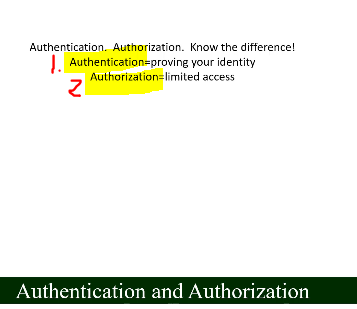

# Section 09: API Access.

API Access.

# What I learned.

# 35. HTTPS.

1. **S** is just **encrypted.

# 36. Authentication and Authorization.

1. **Authentication** is proving your identity.
2. **Authorization** is providing access for resource.

1. `Google` website, anyone kind use this.
2. `Email` you only log in, but not restrict any resource.
3. `Bearer token` does not authenticate user and authorize the user for specific folders
4. **OAuth** has both.

# 37. Apps.

1. Types of **app types**:
    - Native.
        - Runs of OS.
            - OS resides between **you** and **hardware**.
                - **Hardware** without software is **useless**.
            - Operating system has **API**s.
    - Native app has access for your OS.
        - You need to have installed **OS** specific.
    - Web.
        - Inside web browser.
    - Hybrid.
        - App can use both.
        - Or other way, there is **Middle** ware.

# 38. OAuth.

- TODO.

# 39. Advanced Topic: OAuth Authorization Code Grant (Google Cloud).

- TODO.

# 40. Advanced Topic: OpenID Connect.

- TODO.

# 41. Exercise: API Access Definitions.

