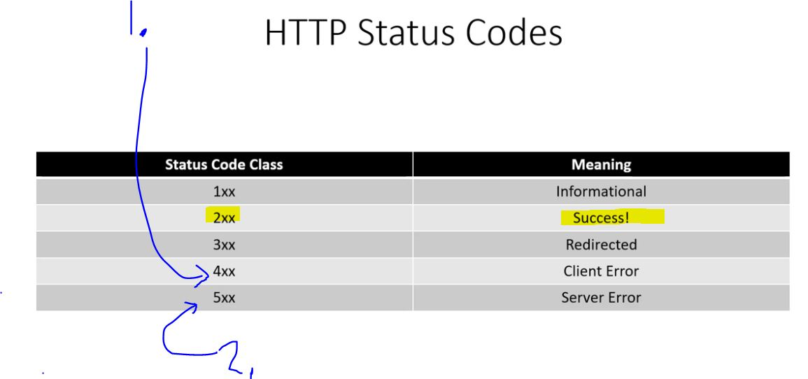
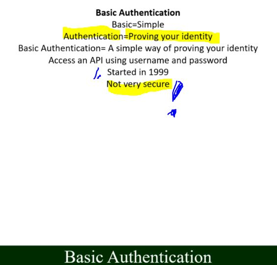

# Section 10: API Examples.

API Examples.

# What I learned.

# 42. Postman Installation.

- Just installing here. ✔️

- **Postman** is API tool.

# 43. Postman Simple Example.

- todo.

# 44. No Authentication + HTTP Status Codes.

- Just select `no auth` from PostMan.

- **No Auth** means no authentication.

- Status code will be in the **Start Line**.

1. The user have made it wrong, meaning **client** typed `www.google.com/sdasdasdsdaSomeShit`.

2. Server who returning result, is having error. 

# 45. Basic Authentication.

1. From `1990` on!

- This is still being used!

- Echo service [PostMan Echo](https://learning.postman.com/docs/developer/echo-api/#using-the-echo-api).

- **Base64** is binary format.

# 46. Digest Authentication.

1. Example. Encrypted `zip` file is **digested** or decrypted to readable format.

# 47. Bearer Token.

- Todo.

# 48. OAuth.

- Todo.

# 49. Postman Exercise.

- Todo.

# 50. Postman Exercise.

- Todo.
