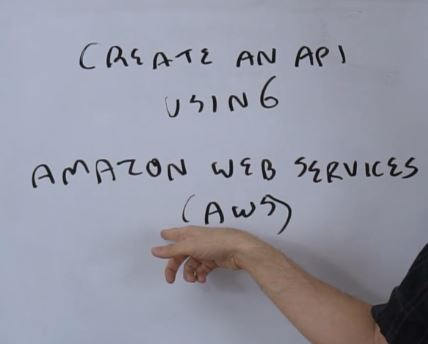
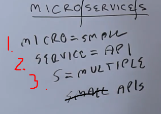
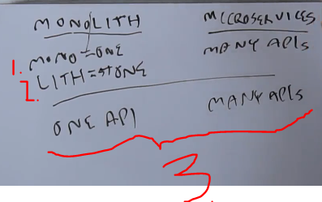
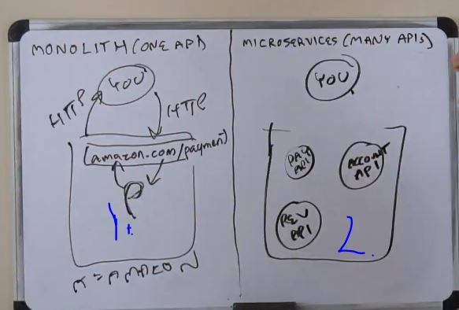
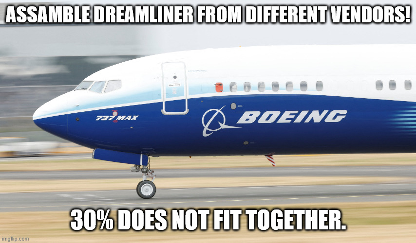

# Section 11: Extras.

Extras.

# What I learned.

# 51. Create an API (Amazon Web Services).

- These **AWS** are cloud computing.

- Todo.

# 52. Calling APIs Using Programming Languages.

- Todo.

# 53. Webhooks.

- Name **Webhooks**.
    - **Web** → Web service.
    - **Hook** → Connected to **event**. Examples of such **events**:
        - Payment has **occurred**.
        - Time, delivery is **about to come**.
        - Login, login has occurred, which should have not been occurred.
        - Prize, prize watch triggers event for item under $100.
    - **Hook** is attached to the **event**.

1. **WebHook** can be called as **Reverse API** or in this case **Reverse Web Service**.
2. **Cell Phone** login with **HTTP** request **Bank**. **Bank** send back **HTTP** response.

1. In Reverse API, this thinking **is flipped**.
    - Event occurs, example that login has occurred. **Bank** send **Cell Phone** request in form of verification and **Cell Phone** reposes to **Bank**.

- With **oauth** with **webhooks**, there is authorization.

1. Db login table.
2. Event is fire in case of **unusual login**.
3. Notification is sent in form of **text** message or other endpoints.
4. Follows the same **HTTP** response and request.

# 54. Microservices.

1. `MICRO` means **Small**.
2. `SERVICE` means **API**.
3. `S` means **multiple**.

1. `MONO` mean **one**.
2. `LITH` means **stone**.
3. `MONOLITH` Would be one **API** and `MICROSERVICES` Would be many **API**.

1. All the programs are here as example **API**s.

2. In **microservices** this comes as small services.
    - There will bunch of **API**s.

- Microservices: **Advantages** ➕:
    - Scalability.
    - Code language independent.
        - We can write these in **multiple languages**.
    - Small and Specialized teams

- Microservices: **Negatives** ➖:
    - IF there are multiple teams, this coordination will be difficult.

- **Example** is **BOINGS** plane.
    - Parts were from different vendors, parts just didn't fit together.
        - ❌ This same with the microservices, if multiple teams will be working together ❌.

# 55. General Technical Interview Tips.

- Todo

# 56. What's Next/After This Course.

- Todo.

