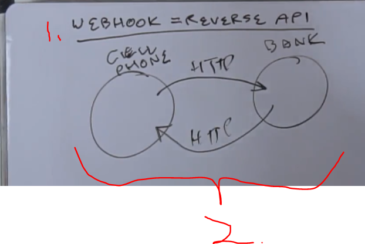
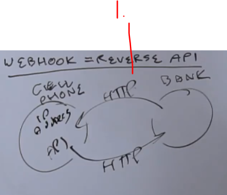
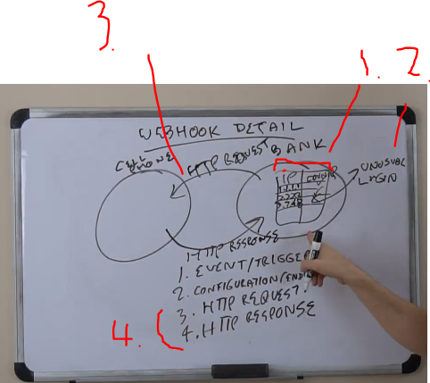

# Section 11: Extras.

Extras.

# What I learned.

# 53. Webhooks.

- Name **Webhooks**.
    - **Web** → Web service.
    - **Hook** → Connected to **event**. Examples of such **events**:
        - Payment has **occurred**.
        - Time, delivery is **about to come**.
        - Login, login has occurred, which should have not been occurred.
        - Prize, prize watch triggers event for item under $100.
    - **Hook** is attached to the **event**.

1. **WebHook** can be called as **Reverse API** or in this case **Reverse Web Service**.
2. **Cell Phone** login with **HTTP** request **Bank**. **Bank** send back **HTTP** response.

1. In Reverse API, this thinking **is flipped**.
    - Event occurs, example that login has occurred. **Bank** send **Cell Phone** request in form of verification and **Cell Phone** reposes to **Bank**.

- With **oauth** with **webhooks**, there is authorization.

1. Db login table.
2. Event is fire in case of **unusual login**.
3. Notification is sent in form of **text** message or other endpoints.
4. Follows the same **HTTP** response and request.

# 54. Microservices.

