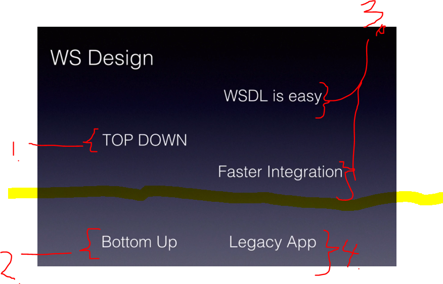
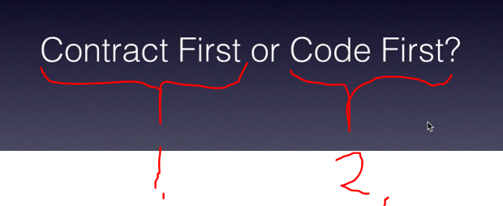

# Section 06: SOAP Web Services Design and Implementation.

SOAP Web Services Design and Implementation.

# What I learned.

# Section Summary.

        

1. **Contract** first or the **WSDL** first!
    - This is called **Top Down** approach.
        - Top down have certain advantages:
            - `3.` WSDL is easy to implement and to understand.
                - Business analysis and codes can easily **pick up** this definition!
                - Since the **schema** is coming first, there is less problem issues, whit whatever integrations attempts is brings from both parties!
2. **Code** first approach
    - This is called **Bottom Up** approach.
        - Bottom UP have certain advantages:
            - We can easily expose into legacy app.

        

1. `Contract First` is **recommended** to use in general!
2. `Code First`, if you are exposing **legacy applications**. 