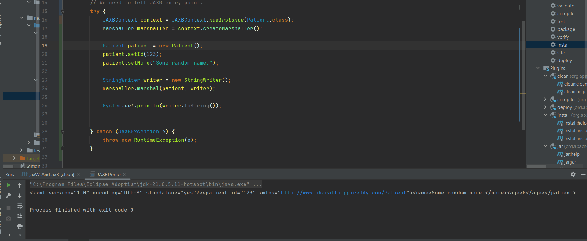
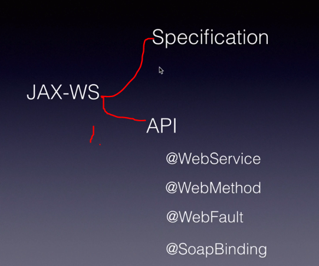
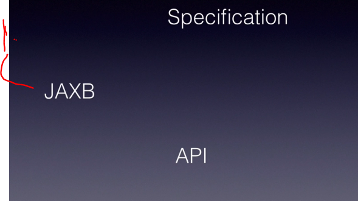
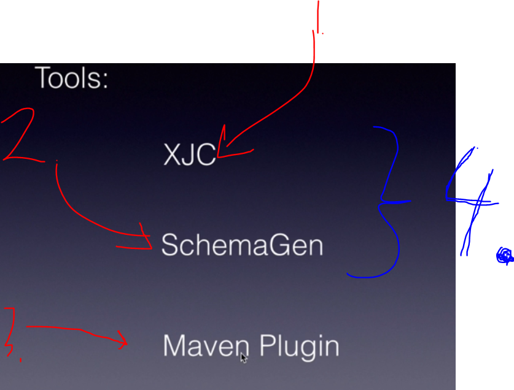
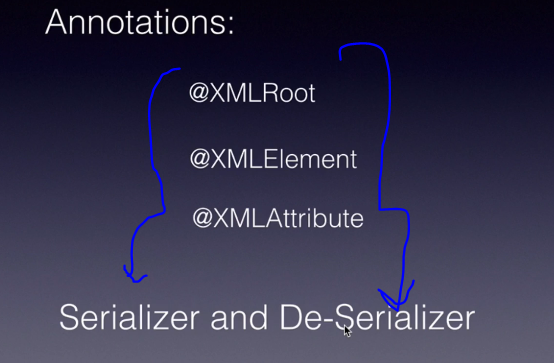

# Section 07: JAX-WS AND JAXB.

JAX-WS AND JAXB.

# What I learned.

# JAXB Introduction.

<p align="center">
        
</p>

> Yes, **Spring-WS** and **JAX-WS** are **different** approaches to building web services in Java, though both can deal with SOAP messages.

1. `JAX-WS` **J**ava **A**PI for **X**ML **W**eb **S**ervices.
    - Standard is for Web Service for Java XML.
        - **Oracle** has written **rules** and **standards** for web services.
2. **Specifications** are for the **Web Service Engines** to implement their **JAX-WS**.
3. As developers, we mark our **API**, with these **JAX-WS** annotations.

<p align="center">
        
</p>

1. Most fundamental annotation of **JAX-WS**.

<p align="center">
        
</p>

1. **Binding** controls **how**, the **SOAP message** goes into wire!
    - Default is `document\literal`, since it allows **validating** the **entire** SOAP message.

- Insert example here:

2. **Wrappers** control how the **Java** objects get converted into SOAP messages.

- Insert examples here:

# JAXB Introduction.

<p align="center">
        
</p>

1. **JAXB** stands for **J**ava **A**rchitecture **X**ML **B**inding.
   - It proves the mapping, **XML** schema to **Java** classes.
2. **JAXB** is similar what **Hibernate** is for SQL.
   - Developer will interact with the **Hibernate** rather than the **SQL** itself.

> [!IMPORTANT]
> `JAXB` provides us with **three** main tools.

<p align="center">
        
</p>

1. **XJC** stands for **X**ML to **J**ava **C**ompiler. 
   - Turns **XSD** to **Java** classes.

- **XML** = data. Example:

```
<Person>
    <Name>John</Name>
    <Age>30</Age>
</Person>
```

- **XSD** = schema (rules). Example:

```
<xs:element name="Person">
    <xs:complexType>
        <xs:sequence>
            <xs:element name="Name" type="xs:string"/>
            <xs:element name="Age" type="xs:int"/>
        </xs:sequence>
    </xs:complexType>
</xs:element>
```

2. **Schemagen** is for generating an XML Schema (XSD) from annotated Java.

3. **Runtime API** refers to the set of classes and interfaces you use at runtime to `marshal`, `unmarshal`, and `manipulate` XML/Java objects, as opposed to the tools like **xjc** or **schemagen** which are **compile-time** utilities.

<p align="center">
        
</p>

1. **Runtime API** consisting of the **Marshall**, **UNMarshall** and **Annotations**
   - Annotation if we hand code the **Beans**, in the ***Code First** approach!

<p align="center">
        
</p>

1. **CXF** uses the reference of **JAXB** documentation.

# JAXB Tools and Plugins.

- Most of these tools are included into the **JDK** 
inside!

- Inside the **SDK** there is tool which are common example:

<p align="center">
        
</p>

1. `schemagen`.
    - Generates **Schemas**(`.xsd`) from **Java**(`.java`) code.
2. `xjc` **X**ML **J**ava **C**ompiler.
    -  To make **Java** classes from the **XML**.

- We will not be **directly** using these. We will use the **plugins** top of these.

- There will be many implementations of **JABX** plugins.
  - We will be using! [maven-jaxb2-plugin](https://mvnrepository.com/artifact/org.jvnet.jaxb2.maven2/maven-jaxb2-plugin).

# Steps to Generate Stubs from XML Schema.

<p align="center">
        
</p>

- Here is the **X**ML **S**chema **D**efinition (**XSD**) of **Employee.xsd**:

````
<?xml version="1.0" encoding="UTF-8"?>
<schema xmlns="http://www.w3.org/2001/XMLSchema"
    targetNamespace="http://www.journaldev.com/com/journaldev/employee/data"
    xmlns:empns="http://www.journaldev.com/com/journaldev/employee/data"
    elementFormDefault="qualified">
 
    <element name="empRequest" type="empns:EmpRequest"></element>
    <element name="empResponse" type="empns:EmpResponse"></element>
 
    <complexType name="EmpRequest">
        <sequence>
            <element name="id" type="int" minOccurs="0" maxOccurs="1" />
            <element name="name" type="string" minOccurs="0" maxOccurs="1" />
        </sequence>
    </complexType>
     
    <complexType name="EmpResponse">
        <sequence>
            <element name="id" type="int" minOccurs="1" maxOccurs="1" />
            <element name="name" type="string" minOccurs="1" maxOccurs="1" />
            <element name="role" type="string" minOccurs="1" maxOccurs="unbounded" />
            <element name="gender" type="string" minOccurs="1" maxOccurs="1" />
            <element name="salary" type="string" minOccurs="1" maxOccurs="1" />
        </sequence>
    </complexType>
</schema>

````

- Here is the **X**ML **S**chema **D**efinition (**XSD**) of **Patient.xsd**:

````
<?xml version="1.0" encoding="UTF-8"?>
<schema xmlns="http://www.w3.org/2001/XMLSchema" targetNamespace="http://www.bharatthippireddy.com/Patient"
	xmlns:tns="http://www.bharatthippireddy.com/Patient"
	elementFormDefault="qualified">

	<element name="patient" type="tns:Patient" />

	<complexType name="Patient">
		<sequence>
			<element name="name" type="tns:String15Chars" />
			<element name="age" type="int" />
			<element name="dob" type="date" />
			<element name="email" type="string" maxOccurs="unbounded" />
			<element name="gender" type="tns:Gender" />
			<element name="phone" type="string" />
			<element name="payment" type="tns:PaymentType" />
		</sequence>

		<attribute name="id" type="tns:ID" />
	</complexType>

	<complexType name="PaymentType">
		<choice>
			<element name="cash" type="int" />
			<element name="insurance" type="tns:Insurance" />
		</choice>
	</complexType>

	<complexType name="Insurance">
		<all>
			<element name="provider" type="string" />
			<element name="limit" type="int" />
		</all>

	</complexType>

	<simpleType name="ID">
		<restriction base="int">
			<pattern value="[0-9]*"></pattern>
		</restriction>
	</simpleType>

	<simpleType name="String15Chars">
		<restriction base="string">
			<maxLength value="15" />
		</restriction>
	</simpleType>

	<simpleType name="Gender">
		<restriction base="string">
			<enumeration value="M" />
			<enumeration value="F" />
		</restriction>
	</simpleType>
</schema>
````

# Generate the Stubs.

- We configure **build values** here.

````
<build>
...
</build>
````

- We will be **configuring** the **maven-jaxb2-plugin** 

````
            <plugin>
                <groupId>org.jvnet.jaxb2.maven2</groupId>
                <artifactId>maven-jaxb2-plugin</artifactId>
                <version>0.15.3</version>
                <executions>
                    <execution>
                        <goals>
                            <goal>generate</goal>
                        </goals>
                    </execution>
                </executions>

                <configuration>
                    <schemaDirectory>${project.basedir}/src/main/xsd</schemaDirectory>
                    <schemaIncludes>
                        <include>Patient.xsd</include>
                    </schemaIncludes>
                    <bindingDirectory>${project.basedir}/src/main/xsd</bindingDirectory>
                    <bindingIncludes>
                        <include>global.xjb</include>
                    </bindingIncludes>
                    <generateDirectory>${project.basedir}/src/generated</generateDirectory>
                </configuration>
            </plugin>
        </plugins>
````

- We will be running the plugin: `jaxb2:generate`. This is for **generating** stubs.

<p align="center">
        
</p>

<p align="center">
        
</p>

1. You can see the configuration paths for the `maven-jaxb2-plugin`.

# Customize Generated Code Using Binding File.

- We can customize the **stub** generation process.
    - This can be modified thought **XJB** - **X**ML **J**ava **B**inding.

<p align="center">
        
</p>

1. Look for `.xjb` binding files in the folder `src/main/xsd` and include the following additional file `global.xjb` to the **XSD** → **Java code** generation process.

````
<bindingIncludes>
    <include>global.xjb</include>
</bindingIncludes>
````

- Our `global.xjb` file below: 

````
<?xml version="1.0" encoding="UTF-8" standalone="yes"?>
<jaxb:bindings version="2.0"
  xmlns:jaxb="http://java.sun.com/xml/ns/jaxb"
  xmlns:xjc="http://java.sun.com/xml/ns/jaxb/xjc"
  xmlns:xs="http://www.w3.org/2001/XMLSchema"
  jaxb:extensionBindingPrefixes="xjc">
   
 <jaxb:globalBindings>
    <xjc:simple />
    <xjc:serializable uid="-1" />
    <jaxb:javaType name="java.util.Calendar" xmlType="xs:dateTime"
      parseMethod="javax.xml.bind.DatatypeConverter.parseDateTime"
      printMethod="javax.xml.bind.DatatypeConverter.printDateTime" />
  </jaxb:globalBindings>
</jaxb:bindings>
````

- This file is used during **XSD** → **Java code** generation!
    - `</jaxb:globalBindings> ... </jaxb:globalBindings>` We are telling here the convention configurations.
        - Example If encounter in **XML** `xmlType="xs:dateTime"` use in **Java** code `name="java.util.Calendar"`.
        - Another example `<xjc:serializable uid="-1"/>` tells to use `private final static long serialVersionUID = -1L;` in **Java code** for **stubs**.

# Stubs Walk Through.

<details>
<summary id="IDE problem" open="false"> <b>Patien</b> in <b>XSD</b>  <code>Patient.xsd</code></summary>
<?xml version="1.0" encoding="UTF-8"?>
<schema xmlns="http://www.w3.org/2001/XMLSchema" targetNamespace="http://www.bharatthippireddy.com/Patient"
	xmlns:tns="http://www.bharatthippireddy.com/Patient"
	elementFormDefault="qualified">

	<element name="patient" type="tns:Patient" />

	<complexType name="Patient">
		<sequence>
			<element name="name" type="tns:String15Chars" />
			<element name="age" type="int" />
			<element name="dob" type="date" />
			<element name="email" type="string" maxOccurs="unbounded" />
			<element name="gender" type="tns:Gender" />
			<element name="phone" type="string" />
			<element name="payment" type="tns:PaymentType" />
		</sequence>

		<attribute name="id" type="tns:ID" />
	</complexType>

	<complexType name="PaymentType">
		<choice>
			<element name="cash" type="int" />
			<element name="insurance" type="tns:Insurance" />
		</choice>
	</complexType>

	<complexType name="Insurance">
		<all>
			<element name="provider" type="string" />
			<element name="limit" type="int" />
		</all>

	</complexType>

	<simpleType name="ID">
		<restriction base="int">
			<pattern value="[0-9]*"></pattern>
		</restriction>
	</simpleType>

	<simpleType name="String15Chars">
		<restriction base="string">
			<maxLength value="15" />
		</restriction>
	</simpleType>

	<simpleType name="Gender">
		<restriction base="string">
			<enumeration value="M" />
			<enumeration value="F" />

		</restriction>
	</simpleType>
</schema>
</details>

<details>
<summary id="IDE problem" open="false"> <b>Patient</b> in <b>Java</b>  <code>Patient.java</code></summary>

````
//
// This file was generated by the Eclipse Implementation of JAXB, v2.3.7 
// See https://eclipse-ee4j.github.io/jaxb-ri 
// Any modifications to this file will be lost upon recompilation of the source schema. 
// Generated on: 2025.11.20 at 11:29:56 PM EET 
//


package com.bharatthippireddy.patient;

import java.io.Serializable;
import java.util.ArrayList;
import java.util.List;
import javax.xml.bind.annotation.XmlAccessType;
import javax.xml.bind.annotation.XmlAccessorType;
import javax.xml.bind.annotation.XmlAttribute;
import javax.xml.bind.annotation.XmlElement;
import javax.xml.bind.annotation.XmlRootElement;
import javax.xml.bind.annotation.XmlSchemaType;
import javax.xml.bind.annotation.XmlType;
import javax.xml.datatype.XMLGregorianCalendar;


/**
 * <p>Java class for Patient complex type.
 * 
 * <p>The following schema fragment specifies the expected content contained within this class.
 * 
 * <pre>
 * &lt;complexType name="Patient"&gt;
 *   &lt;complexContent&gt;
 *     &lt;restriction base="{http://www.w3.org/2001/XMLSchema}anyType"&gt;
 *       &lt;sequence&gt;
 *         &lt;element name="name" type="{http://www.bharatthippireddy.com/Patient}String15Chars"/&gt;
 *         &lt;element name="age" type="{http://www.w3.org/2001/XMLSchema}int"/&gt;
 *         &lt;element name="dob" type="{http://www.w3.org/2001/XMLSchema}date"/&gt;
 *         &lt;element name="email" type="{http://www.w3.org/2001/XMLSchema}string" maxOccurs="unbounded"/&gt;
 *         &lt;element name="gender" type="{http://www.bharatthippireddy.com/Patient}Gender"/&gt;
 *         &lt;element name="phone" type="{http://www.w3.org/2001/XMLSchema}string"/&gt;
 *         &lt;element name="payment" type="{http://www.bharatthippireddy.com/Patient}PaymentType"/&gt;
 *       &lt;/sequence&gt;
 *       &lt;attribute name="id" type="{http://www.bharatthippireddy.com/Patient}ID" /&gt;
 *     &lt;/restriction&gt;
 *   &lt;/complexContent&gt;
 * &lt;/complexType&gt;
 * </pre>
 * 
 * 
 */
@XmlAccessorType(XmlAccessType.FIELD)
@XmlType(name = "Patient", propOrder = {
    "name",
    "age",
    "dob",
    "emails",
    "gender",
    "phone",
    "payment"
})
@XmlRootElement(name = "patient")
public class Patient
    implements Serializable
{

    private final static long serialVersionUID = -1L;
    @XmlElement(required = true)
    protected String name;
    protected int age;
    @XmlElement(required = true)
    @XmlSchemaType(name = "date")
    protected XMLGregorianCalendar dob;
    @XmlElement(name = "email", required = true)
    protected List<String> emails;
    @XmlElement(required = true)
    @XmlSchemaType(name = "string")
    protected Gender gender;
    @XmlElement(required = true)
    protected String phone;
    @XmlElement(required = true)
    protected PaymentType payment;
    @XmlAttribute(name = "id")
    protected Integer id;

    /**
     * Gets the value of the name property.
     * 
     * @return
     *     possible object is
     *     {@link String }
     *     
     */
    public String getName() {
        return name;
    }

    /**
     * Sets the value of the name property.
     * 
     * @param value
     *     allowed object is
     *     {@link String }
     *     
     */
    public void setName(String value) {
        this.name = value;
    }

    /**
     * Gets the value of the age property.
     * 
     */
    public int getAge() {
        return age;
    }

    /**
     * Sets the value of the age property.
     * 
     */
    public void setAge(int value) {
        this.age = value;
    }

    /**
     * Gets the value of the dob property.
     * 
     * @return
     *     possible object is
     *     {@link XMLGregorianCalendar }
     *     
     */
    public XMLGregorianCalendar getDob() {
        return dob;
    }

    /**
     * Sets the value of the dob property.
     * 
     * @param value
     *     allowed object is
     *     {@link XMLGregorianCalendar }
     *     
     */
    public void setDob(XMLGregorianCalendar value) {
        this.dob = value;
    }

    /**
     * Gets the value of the emails property.
     * 
     * <p>
     * This accessor method returns a reference to the live list,
     * not a snapshot. Therefore any modification you make to the
     * returned list will be present inside the JAXB object.
     * This is why there is not a <CODE>set</CODE> method for the emails property.
     * 
     * <p>
     * For example, to add a new item, do as follows:
     * <pre>
     *    getEmails().add(newItem);
     * </pre>
     * 
     * 
     * <p>
     * Objects of the following type(s) are allowed in the list
     * {@link String }
     * 
     * 
     */
    public List<String> getEmails() {
        if (emails == null) {
            emails = new ArrayList<String>();
        }
        return this.emails;
    }

    /**
     * Gets the value of the gender property.
     * 
     * @return
     *     possible object is
     *     {@link Gender }
     *     
     */
    public Gender getGender() {
        return gender;
    }

    /**
     * Sets the value of the gender property.
     * 
     * @param value
     *     allowed object is
     *     {@link Gender }
     *     
     */
    public void setGender(Gender value) {
        this.gender = value;
    }

    /**
     * Gets the value of the phone property.
     * 
     * @return
     *     possible object is
     *     {@link String }
     *     
     */
    public String getPhone() {
        return phone;
    }

    /**
     * Sets the value of the phone property.
     * 
     * @param value
     *     allowed object is
     *     {@link String }
     *     
     */
    public void setPhone(String value) {
        this.phone = value;
    }

    /**
     * Gets the value of the payment property.
     * 
     * @return
     *     possible object is
     *     {@link PaymentType }
     *     
     */
    public PaymentType getPayment() {
        return payment;
    }

    /**
     * Sets the value of the payment property.
     * 
     * @param value
     *     allowed object is
     *     {@link PaymentType }
     *     
     */
    public void setPayment(PaymentType value) {
        this.payment = value;
    }

    /**
     * Gets the value of the id property.
     * 
     * @return
     *     possible object is
     *     {@link Integer }
     *     
     */
    public Integer getId() {
        return id;
    }

    /**
     * Sets the value of the id property.
     * 
     * @param value
     *     allowed object is
     *     {@link Integer }
     *     
     */
    public void setId(Integer value) {
        this.id = value;
    }
}
````
</schema>
</details>


- Here you can see the: 
    - **XSD**: `<element name="age" type="int"/>`.
    - **Java**: `protected int age;`.

- If we will be converting **Java** classes back to **XSD**. In **Java** classes there is different **JAXB annotations** for helping in the conversion, example:
    -  One example `@XmlRootElement(name = "patient")` for letting the generator know, how to convert it back.
        - This is indicating the root element of the **XML** object.

- Other example of the in which level the **XML** generation will be taking place `@XmlAccessorType(XmlAccessType.FIELD)`.

````
@XmlAccessorType(XmlAccessType.FIELD)
public class Patient {
    private String name;
    private int age;

    public String getName() { return "Ignored!"; }
}
````

- The **XML** will be:

````
<Patient>
    <name>Actual Field Value</name>
    <age>30</age>
</Patient>
````

- In other hand the getter level `PROPERTY-level access (XmlAccessType.PROPERTY)`.

````
@XmlAccessorType(XmlAccessType.PROPERTY)
public class Patient {
    private String name = "Hidden";
    private int age = 25;

    @XmlElement
    public String getName() { return "Computed Name"; }

    @XmlElement
    public int getAge() { return age; }
}
````

- The **XML** will be:

````
<Patient>
    <name>Computed Name</name>
    <age>25</age>
</Patient>
````

- When the **Java** is generated to the **XML**, the following is used:

````
@XmlType(name = "Patient", propOrder = {
    "name",
    "age",
    "dob",
    "emails",
    "gender",
    "phone",
    "payment"
})
````

- The following field will be used when the `unmarshalling` **/** `marshalling` will take place.
    - In **Java** format, also in **XML**.

````
@XmlElement(required = true)
@XmlSchemaType(name = "string")
protected Gender gender
````

- The following will telling that the `id` in **Java**, will be **Attribute** in **XML**:

````
@XmlAttribute(name = "id")
protected Integer id;`
````

- Example in **XML** below, where you can see the `id="123"`:

````
<patient id="123">
    <name>Alice</name>
    <gender>FEMALE</gender>
</patient>
````

- `package-info.java` will be used, if we will be creating the Java docs.

- The `ObjectFactory.java` will be used if there is **Data Structure**, which does not **map** to **particular field**!
    - This **usually** is rarely used.

# Marshalling and Unmarshalling.

- **Marshalling** is the process of turning **Java** object into **XML**.

- **Unmarshalling** is the process of turning **XML** into **Java** object.

- `JAXB` can:
    - **marshal** (**convert object** → **XML**).
    - **unmarshal** (**XML** → **object**).

- `JAXB` needs to know the classes involved, that are involved in **serialization** and **deserialization** process. This is done with following:
    - We will be **marshalling** and **unmarshalling** `Patient.class`.

````
        // We need to tell JAXB entry point.
        try {
            JAXBContext context = JAXBContext.newInstance(Patient.class);
            Marshaller marshaller = context.createMarshaller();
        } catch (JAXBException e) {
            throw new RuntimeException(e);
        }
````

- We create **Marshaller**.
    - This is created from the **Marhaller** context. `Marshaller marshaller = context.createMarshaller();`.

````
        // We need to tell JAXB entry point.
        try {
            JAXBContext context = JAXBContext.newInstance(Patient.class);
            
        } catch (JAXBException e) {
            throw new RuntimeException(e);
        }
````

- Then we are going to **Marhall** the **Java** Object into **XML**.

````
    StringWriter writer = new StringWriter();
    marshaller.marshal(patient, writer);
````

- **Marshalling API**s often require a `Writer` or `OutputStream` to write the serialized data.
    - `StringWriter` is perfect because:
        1. **In-memory storage**:
            - You don’t want to write to a file yet; you just need a String.
        2. **Implements Writer**:
            - JAXB’s Marshaller or other serializers expect a Writer object. 
        3. **Easy to retrieve the result**:
            - After marshalling, you can get the string with `toString()`.

- Then we are writing that content to a `String`.

````
    System.out.println(writer.toString());
````

<p align="center">
        
</p>

- The output:

````
<?xml version="1.0" encoding="UTF-8" standalone="yes"?><patient id="123" xmlns="http://www.bharatthippireddy.com/Patient"><name>Some random name.</name><age>0</age></patient>
````

- You can see the different fields: `age` and `name` as **XML**.

- We are getting **Java Object** that represents the **XML**.

````
Object unmarshal = unmarshaller.unmarshal(new StringReader(writer.toString()));
````

- And print it: `System.out.println(unmarshal.getName());`:

````
Some random name.
````

- Full example below:

````
package org.java.jaxWSjaxB;

import com.bharatthippireddy.patient.Patient;

import javax.xml.bind.JAXBContext;
import javax.xml.bind.JAXBException;
import javax.xml.bind.Marshaller;
import javax.xml.bind.Unmarshaller;
import java.io.StringReader;
import java.io.StringWriter;

public class JAXBDemo {

    public static void main(String[] args){

        // We need to tell JAXB entry point.
        try {

            // Marshalling.
            JAXBContext context = JAXBContext.newInstance(Patient.class);
            Marshaller marshaller = context.createMarshaller();

            Patient patient = new Patient();
            patient.setId(123);
            patient.setName("Some random name.");

            StringWriter writer = new StringWriter();
            marshaller.marshal(patient, writer);

            System.out.println(writer.toString());

            // Unmarshalling.
            Unmarshaller unmarshaller = context.createUnmarshaller();

            var unmarshal = (Patient)unmarshaller.unmarshal(new StringReader(writer.toString()));
            System.out.println(unmarshal.getName());

        } catch (JAXBException e) {
            throw new RuntimeException(e);
        }
    }
}
````

# JAX-WS Summary.

<p align="center">
        
</p>

1. `JAX-WS` provides specification and API from **Oracle**.

# JAXB Summary.

<p align="center">
        
</p>

1. **JAXB** can be used for **serialize** to the **Java objects** and back to the **XML**.

<p align="center">
        
</p>

1. **XJC** can be used for convert the **XML Schema** files to have **Java classes**
    - **XSD** to **Java** file.

2. We can use this for generating **Schema** files, from the **Java classes**.

3. We can use the **Maven plugin** instead of the executing these **tools separately**.

4. **XJC** and the **SchemaGen** ships with the **Java JDK** after **Java 6**.

<p align="center">
        
</p>

1. After these annotations, we can **serialize** and **deserialize** these classes.