# Section 07: JAX-WS AND JAXB.

JAX-WS AND JAXB.

# What I learned.

# JAXB Introduction.

<p align="center">
        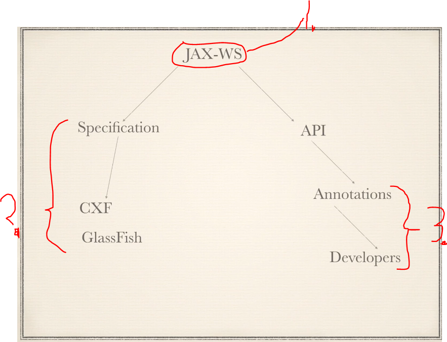
</p>

> Yes, **Spring-WS** and **JAX-WS** are **different** approaches to building web services in Java, though both can deal with SOAP messages.

1. `JAX-WS` **J**ava **A**PI for **X**ML **W**eb **S**ervices.
    - Standard is for Web Service for Java XML.
        - **Oracle** has written **rules** and **standards** for web services.
2. **Specifications** are for the **Web Service Engines** to implement their **JAX-WS**.
3. As developers, we mark our **API**, with these **JAX-WS** annotations.

<p align="center">
        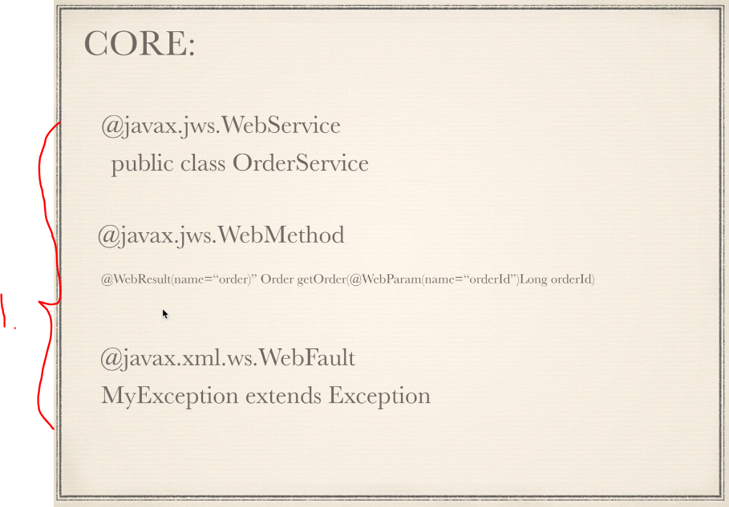
</p>

1. Most fundamental annotation of **JAX-WS**.

<p align="center">
        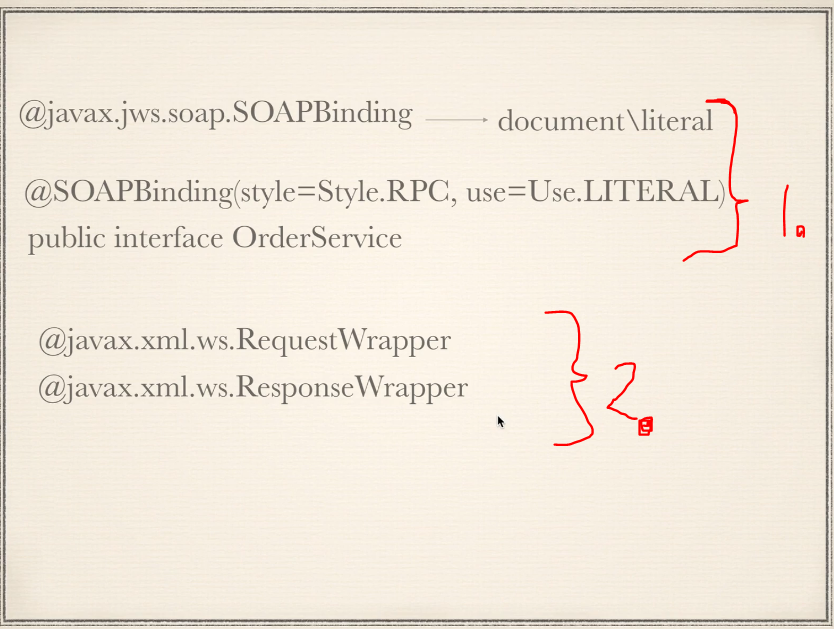
</p>

1. **Binding** controls **how**, the **SOAP message** goes into wire!
    - Default is `document\literal`, since it allows **validating** the **entire** SOAP message.

- Insert example here:

2. **Wrappers** control how the **Java** objects get converted into SOAP messages.

- Insert examples here:

# JAXB Introduction.

<p align="center">
        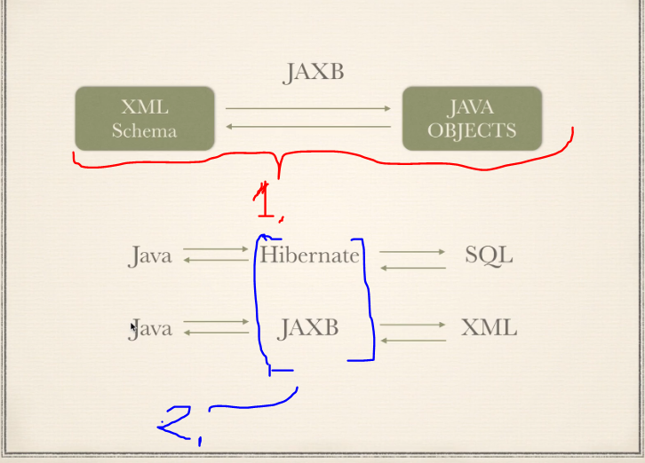
</p>

1. **JAXB** stands for **J**ava **A**rchitecture **X**ML **B**inding.
   - It proves the mapping, **XML** schema to **Java** classes.
2. **JAXB** is similar what **Hibernate** is for SQL.
   - Developer will interact with the **Hibernate** rather than the **SQL** itself.

> [!IMPORTANT]
> `JAXB` provides us with **three** main tools.

<p align="center">
        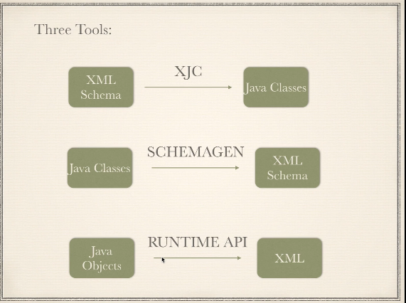
</p>

1. **XJC** stands for **X**ML to **J**ava **C**ompiler. 
   - Turns **XSD** to **Java** classes.

- **XML** = data. Example:

```
<Person>
    <Name>John</Name>
    <Age>30</Age>
</Person>
```

- **XSD** = schema (rules). Example:

```
<xs:element name="Person">
    <xs:complexType>
        <xs:sequence>
            <xs:element name="Name" type="xs:string"/>
            <xs:element name="Age" type="xs:int"/>
        </xs:sequence>
    </xs:complexType>
</xs:element>
```

2. **Schemagen** is for generating an XML Schema (XSD) from annotated Java.

3. **Runtime API** refers to the set of classes and interfaces you use at runtime to `marshal`, `unmarshal`, and `manipulate` XML/Java objects, as opposed to the tools like **xjc** or **schemagen** which are **compile-time** utilities.

<p align="center">
        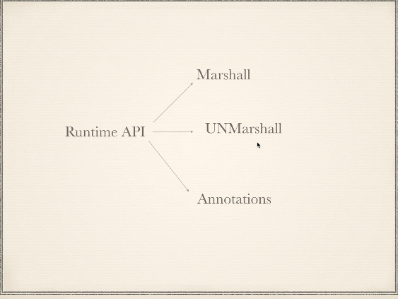
</p>

1. **Runtime API** consisting of the **Marshall**, **UNMarshall** and **Annotations**
   - Annotation if we hand code the **Beans**, in the ***Code First** approach!

<p align="center">
        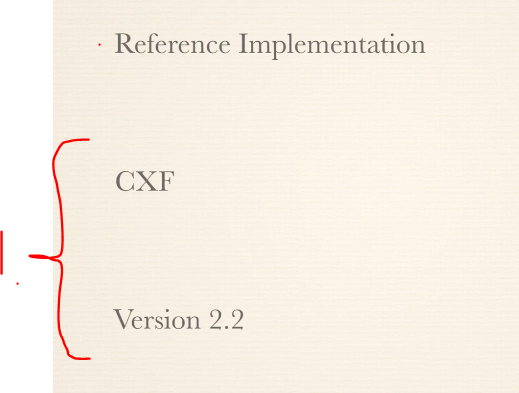
</p>

1. **CXF** uses the reference of **JAXB** documentation.

# JAXB Tools and Plugins.

- Most of these tools are included into the **JDK** 
inside!

- Inside the **SDK** there is tool which are common example:

<p align="center">
        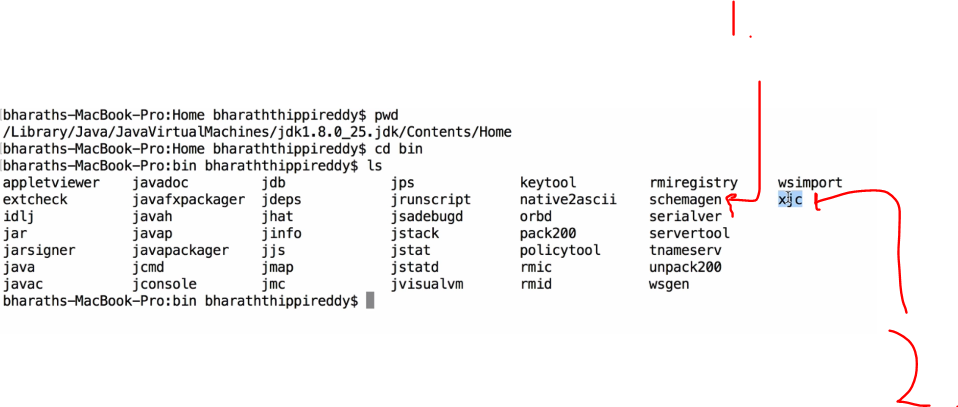
</p>

1. `schemagen`.
    - Generates schemas form Java code.
2. `xjc` **X**ML **J**ava **C**ompiler.
    -  To make **Java** classes from the **XML**.

- We will not be **directly** using these. We will use the **plugins** top of these.

- There will be many implementations of **JABX** plugins.
  - We will be using! [maven-jaxb2-plugin](https://mvnrepository.com/artifact/org.jvnet.jaxb2.maven2/maven-jaxb2-plugin).

# Steps to Generate Stubs from XML Schema.

<p align="center">
        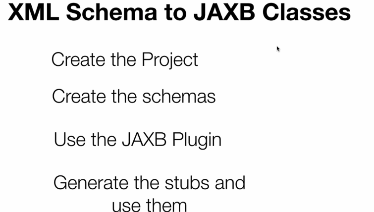
</p>

- Here is the **X**ML **S**chema **D**efinition (**XSD**) of **Employee.xsd**:

````
<?xml version="1.0" encoding="UTF-8"?>
<schema xmlns="http://www.w3.org/2001/XMLSchema"
    targetNamespace="http://www.journaldev.com/com/journaldev/employee/data"
    xmlns:empns="http://www.journaldev.com/com/journaldev/employee/data"
    elementFormDefault="qualified">
 
    <element name="empRequest" type="empns:EmpRequest"></element>
    <element name="empResponse" type="empns:EmpResponse"></element>
 
    <complexType name="EmpRequest">
        <sequence>
            <element name="id" type="int" minOccurs="0" maxOccurs="1" />
            <element name="name" type="string" minOccurs="0" maxOccurs="1" />
        </sequence>
    </complexType>
     
    <complexType name="EmpResponse">
        <sequence>
            <element name="id" type="int" minOccurs="1" maxOccurs="1" />
            <element name="name" type="string" minOccurs="1" maxOccurs="1" />
            <element name="role" type="string" minOccurs="1" maxOccurs="unbounded" />
            <element name="gender" type="string" minOccurs="1" maxOccurs="1" />
            <element name="salary" type="string" minOccurs="1" maxOccurs="1" />
        </sequence>
    </complexType>
</schema>

````

- Here is the **X**ML **S**chema **D**efinition (**XSD**) of **Patient.xsd**:

````
<?xml version="1.0" encoding="UTF-8"?>
<schema xmlns="http://www.w3.org/2001/XMLSchema" targetNamespace="http://www.bharatthippireddy.com/Patient"
	xmlns:tns="http://www.bharatthippireddy.com/Patient"
	elementFormDefault="qualified">

	<element name="patient" type="tns:Patient" />

	<complexType name="Patient">
		<sequence>
			<element name="name" type="tns:String15Chars" />
			<element name="age" type="int" />
			<element name="dob" type="date" />
			<element name="email" type="string" maxOccurs="unbounded" />
			<element name="gender" type="tns:Gender" />
			<element name="phone" type="string" />
			<element name="payment" type="tns:PaymentType" />
		</sequence>

		<attribute name="id" type="tns:ID" />
	</complexType>

	<complexType name="PaymentType">
		<choice>
			<element name="cash" type="int" />
			<element name="insurance" type="tns:Insurance" />
		</choice>
	</complexType>

	<complexType name="Insurance">
		<all>
			<element name="provider" type="string" />
			<element name="limit" type="int" />
		</all>

	</complexType>

	<simpleType name="ID">
		<restriction base="int">
			<pattern value="[0-9]*"></pattern>
		</restriction>
	</simpleType>

	<simpleType name="String15Chars">
		<restriction base="string">
			<maxLength value="15" />
		</restriction>
	</simpleType>

	<simpleType name="Gender">
		<restriction base="string">
			<enumeration value="M" />
			<enumeration value="F" />
		</restriction>
	</simpleType>
</schema>
````

# Generate the Stubs.

- We configure **build values** here.

````
<build>
...
</build>
````

- We will be **configuring** the **maven-jaxb2-plugin** 

````
            <plugin>
                <groupId>org.jvnet.jaxb2.maven2</groupId>
                <artifactId>maven-jaxb2-plugin</artifactId>
                <version>0.15.3</version>
                <executions>
                    <execution>
                        <goals>
                            <goal>generate</goal>
                        </goals>
                    </execution>
                </executions>

                <configuration>
                    <schemaDirectory>${project.basedir}/src/main/xsd</schemaDirectory>
                    <schemaIncludes>
                        <include>Patient.xsd</include>
                    </schemaIncludes>
                    <bindingDirectory>${project.basedir}/src/main/xsd</bindingDirectory>
                    <bindingIncludes>
                        <include>global.xjb</include>
                    </bindingIncludes>
                    <generateDirectory>${project.basedir}/src/generated</generateDirectory>
                </configuration>
            </plugin>
        </plugins>
````

- We will be running the plugin: `jaxb2:generate`. This is for **generating** stubs.

<p align="center">
        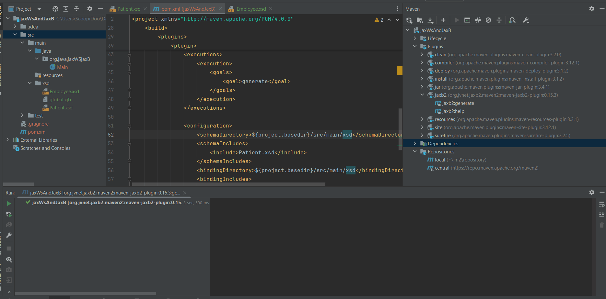
</p>

<p align="center">
        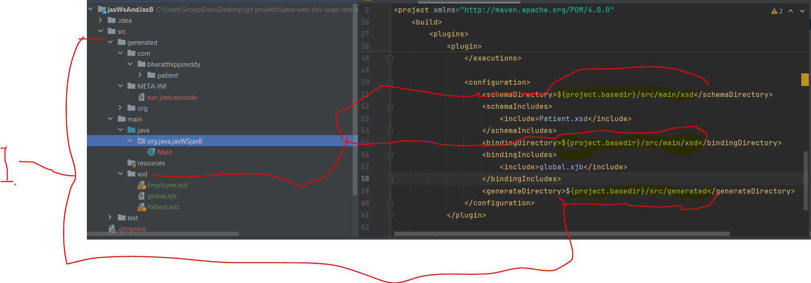
</p>

1. You can see the configuration paths for the `maven-jaxb2-plugin`.

# Customize Generated Code Using Binding File.

- We can customize the **stub** generation process.
    - This can be modified thought **XJB** - **X**ML **J**ava **B**inding.

<p align="center">
        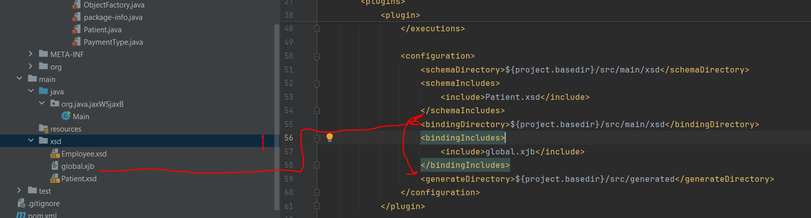
</p>

1. Look for `.xjb` binding files in the folder `src/main/xsd` and include the following additional file `global.xjb` to the **XSD** → **Java code** generation process.

````
<bindingIncludes>
    <include>global.xjb</include>
</bindingIncludes>
````

- Our `global.xjb` file below: 

````
<?xml version="1.0" encoding="UTF-8" standalone="yes"?>
<jaxb:bindings version="2.0"
  xmlns:jaxb="http://java.sun.com/xml/ns/jaxb"
  xmlns:xjc="http://java.sun.com/xml/ns/jaxb/xjc"
  xmlns:xs="http://www.w3.org/2001/XMLSchema"
  jaxb:extensionBindingPrefixes="xjc">
   
 <jaxb:globalBindings>
    <xjc:simple />
    <xjc:serializable uid="-1" />
    <jaxb:javaType name="java.util.Calendar" xmlType="xs:dateTime"
      parseMethod="javax.xml.bind.DatatypeConverter.parseDateTime"
      printMethod="javax.xml.bind.DatatypeConverter.printDateTime" />
  </jaxb:globalBindings>
</jaxb:bindings>
````

- This file is used during **XSD** → **Java code** generation!
    - `</jaxb:globalBindings> ... </jaxb:globalBindings>` We are telling here the convention configurations.
        - Example If encounter in **XML** `xmlType="xs:dateTime"` use in **Java** code `name="java.util.Calendar"`.
        - Another example `<xjc:serializable uid="-1"/>` tells to use `private final static long serialVersionUID = -1L;` in **Java code** for **stubs**.

# Stubs Walk Through.

# Generating Java Classes from XML Schema.

# Marshalling and Unmarshalling.

# Marshalling and Unmarshalling (Quiz).

# JAX-WS Summary.

# JAXB Summary.
