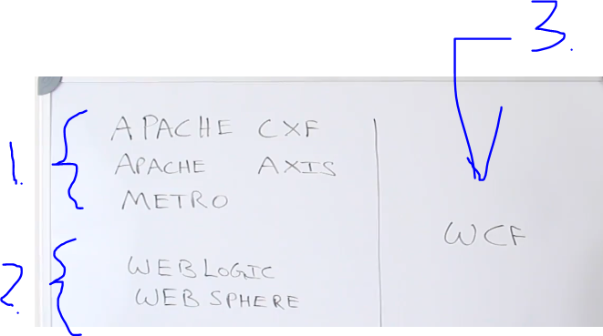
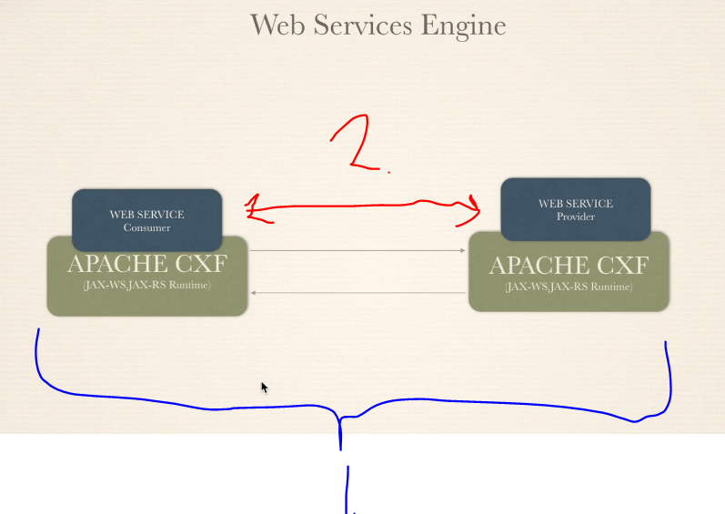
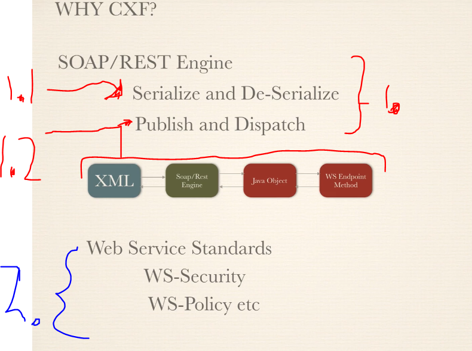
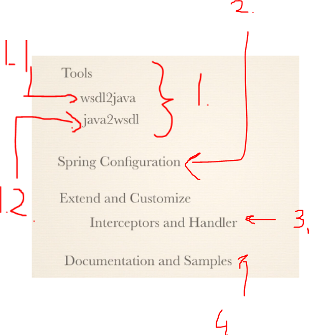
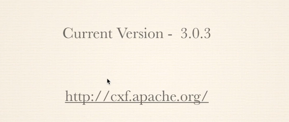
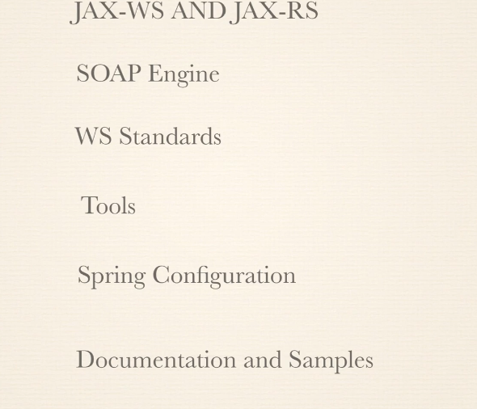
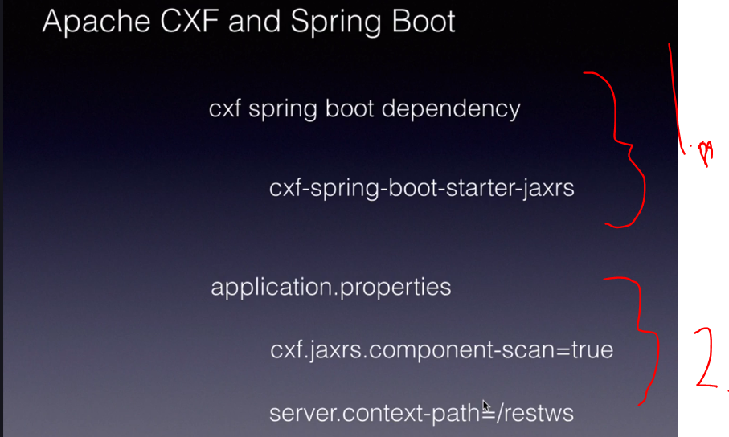
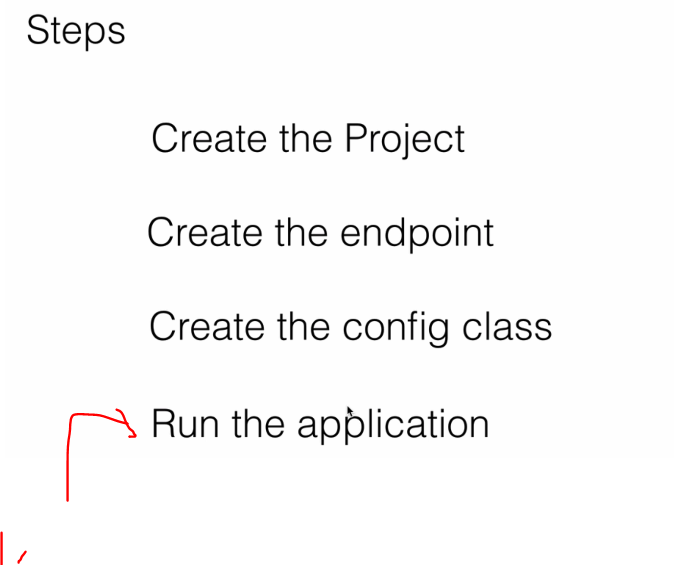
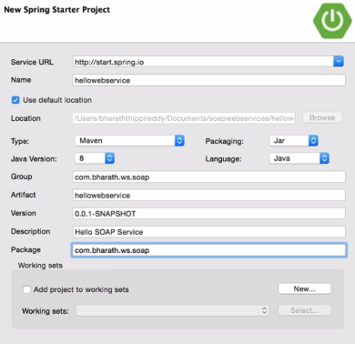

# Section 08: Apache CXF.

Apache CXF.

# What I learned.

<p align="center">
        
</p>

1. **Java SOAP frameworks**.

2. **Java EE application servers**
3. **WCF** (Microsoft
    ⬇️
    **W**indows 
    **C**ommunication 
    **F**oundation).

- All of these, are implementing their **own version** of the **stack**.

# Apache CXF Overview.

<p align="center">
        
</p>

1. **Apache CXF** is popular in web service **engine** in the Java world, because it implements the **JAX-WS** and **JAX-RS**.

2. We can implement the Web Service **Consumers** and Web Service **Producers**

<p align="center">
        
</p>

1. **CFX** comes with the **SOAP/REST** Engine. 
    - `1.1` It serializes/deserializes messages into **Java objects** and **XML**. 
    - `1.2` **XML** comes in → The **engine takes it in** → Coverts it into **Java Object** → Sends it to appropriate web service endpoint → Takes the result and converts it to back to the appropriate Object type. → Returns it back to the **client**
2. We just **configure** the application to have these following **standards**.

<p align="center">
        
</p>

1. Tools for Develop **Provider** And **Publishers**. We can **automate** these with the **Maven Plugins** or the **Ant Task**.
    - `1.1` The `wsdl2java` is to make the **WSDL** to **Java** classes.
        - Example command to **WSDL2Java**: `wsdl2java -d output_directory -p com.example.client http://example.com/service?wsdl`.
    - `1.2` We can also do **code first**, with the `java2wsdl`
2. It's easy to **configure** CFX using **Spring** configurations.
3. We can modify both **Handlers** and **Interceptors** in **Apache CXF**.
4. There are a lot of documentation and samples from **Apache CFX**.


- The latest version was, when the course was:

<p align="center">
        
</p>

- Summary of chapter: 

<p align="center">
        
</p>

# CXF and Spring Boot.

<p align="center">
        
</p>

1. We just add this **dependency** to the **POM** to Spring project.
2. To publish the endpoints, we just open these using the configuration.

# Spring Boot.

- This will be briefly touched.

# Using Spring Boot 2.X.

- Check the latest starter to use [check from here](https://mvnrepository.com/artifact/org.springframework.boot/spring-boot-starter).

- todo this loppuun


# Create the SOAP project.

<p align="center">
        
</p>

1. We will see the **WSDL** file created.

<p align="center">
        
</p>

- You can add the **dependency** for the **CFX** `cxf-spring-boot-starter-jaxws`.
        - Dependency [CXF MVN](https://mvnrepository.com/artifact/org.apache.cxf/cxf-spring-boot-starter-jaxws).

- The latest, which was when I did these notes, were `4.0.3`.

````
<dependency>
    <groupId>org.apache.cxf</groupId>
    <artifactId>cxf-spring-boot-starter-jaxws</artifactId>
    <version>4.0.3</version>
</dependency>
````

- The latest, which was when I did these notes, were `4.0.0`.
        - add here the link mvn
````

    <!-- https://mvnrepository.com/artifact/org.springframework.boot/spring-boot-starter -->
        <dependency>
            <groupId>org.springframework.boot</groupId>
            <artifactId>spring-boot-starter</artifactId>
            <version>4.0.0</version>
        </dependency>
````

- The latest, which was when I did these notes, were `4.0.0`.
        - add here the link mvn
````
        <!-- https://mvnrepository.com/artifact/org.springframework.boot/spring-boot-starter-test -->
        <dependency>
            <groupId>org.springframework.boot</groupId>
            <artifactId>spring-boot-starter-test</artifactId>
            <version>4.0.0</version>
            <scope>test</scope>
        </dependency>
````

# Upgrade.

# Create the endpoint.

# Create the configuration class.

# Run the application.

# Change the web application context.

# Test using SoapUI.

# Enable Logging Feature.

# Change the Context Property.
