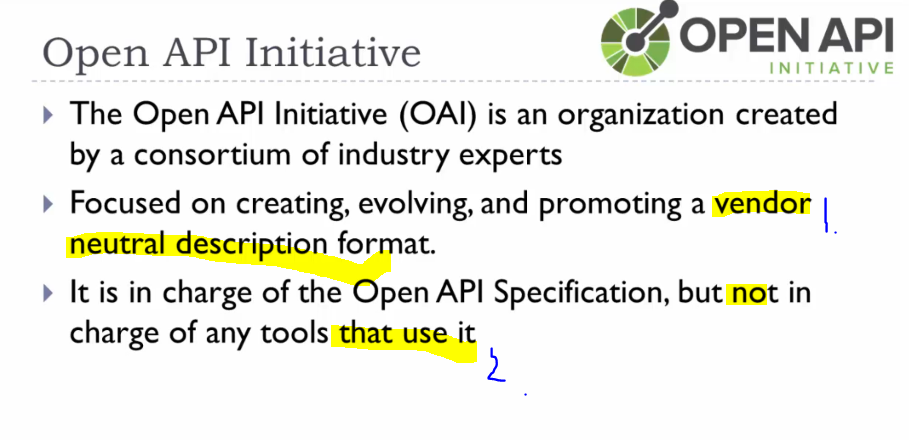

# Section 1: Introduction.

# What I learned. 

# 1. Introduction.


1. **Swagger** and **Open API** are definitions for describing **API**.


1. There are many types of **API:s**. We deal in course with **Web API:s**.
    - These are handled with **Swagger** and **OPEN API**.


- Web API:s work with request and response.


1. With **request** and **response**, the **STATE** is being transferred!
    - Hence, **representational state transfer**.


1. You can **define API** before making it.
    - This can be share to the other team.
2. We can generate some dummy code before.


1. **Swagger** is nowadays collection of tools that use the API Specification.
2. Many people still use the old name **Swagger** for OAS. 



1. OPEN API is vendor for neutral the development of the description API format
2. This is **tool natural**.


1. One of interesting tool for **developers** is API code generator called **CodeGen** tool.


# 2. API Definition.


1. In **API Definition** file has also, authorization and authentication.


1. **Host** is the part the **domain part**. Example `api.example.com`.

2. **Base path** is the **URL** which is shared in specific **URL**. 


1. For **POST** and **PUT**, you can put the schema on the body for describing body structure.


1. **Even** response can also have the **schema** for the response body.


1. In API context, the Security means **authorization** and **authentication**. Some most popular are:
    - None.
    - Basic Auth.
    - API key. [API key in Spring](https://www.baeldung.com/spring-boot-api-key-secret).
        - [API key wiki](https://en.wikipedia.org/wiki/API_key).
    - OAuth.


1. We can add **description** for the **API Definition**. [Description with Swagger](https://www.baeldung.com/swagger-set-example-description).


1. One of common scenario is the where get the API documentation.
    - Not just for the **Developers** and also for **documentation writers**.

# 3. YAML.


- We can use **YAML** or the **JSON** for the structure data.


1. Before this was like **HTML**.
    - Later it changed to meaning to the markup language, later this is for **data**.
2. Minimizes character, it uses indentation.


- YAML is having **key:value** pairs.


1. **Don't** use **tabs** in **YAML** for the indentation. Rather than use **spaces**.
2. You can see the indentation here.
3. The brackets are for the JSON.


1. The **context** is defining the types in **YAML**.


1. Item called `cart`.
2. **Two** items in the list.


1. **Line breaks** will be preserved.
2. **Line breaks** will **not** be preserved.


1. **Schemas** are not part of **YAML**, but **OAS** uses references for **schemas**.
    - We can check [ref](https://swagger.io/docs/specification/v3_0/using-ref/).


1. You can **point** one point of the file with `$ref`.


# Assignment 1: YAML.

- You can use the [LINT tool](https://www.yamllint.com/).

```
# Two spaces are recomended

title: Wizard's Choice
author: Delight Games

sections:
- id: intro
content:
  - |
    So this is some cool adventure stuff.
    This is for multi-line adventure.
  - Chapter second comes after.

choices:
  - description: This will make you hide behind the rock.
    id: hiding
  - description: This will makes you to run behind the rock.
    id: running
  - description: This  make you to jump top of the rock.
    id: jumping
```

- The teachers answer: [Teachers answer](http://sdkbridge.com/swagger/Exercise1Answer.yaml).