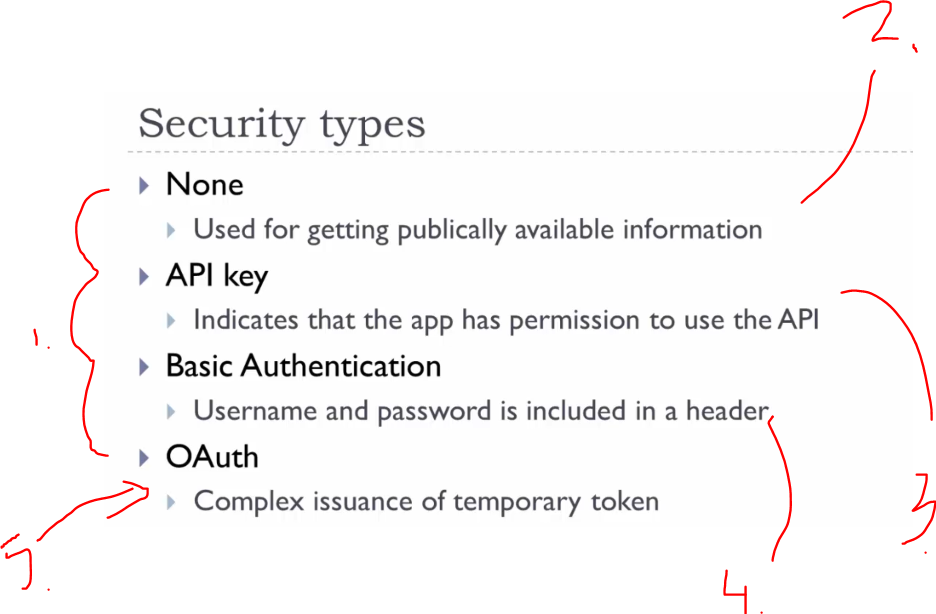
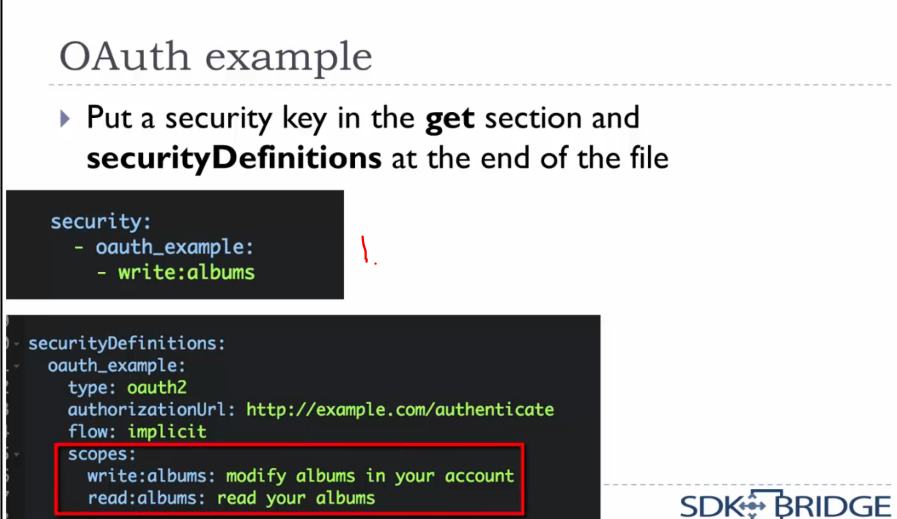

# 02 Open API Specification.

Open API Specification.

# What I learned.

# 4. Notes about OAS 3 and the Swagger editor.

- This is the newer [editor](https://editor.swagger.io/).

# 5. Open API Specification Basics.


- We are going to make **OAS** file, **O**pen API **S**pecification **F**ile.


1. Before it came **OAS** specification this was called **Swagger**. This is also called **Swagger key**.
2. The attributes for documentation file.


1. You define different paths into the file and under this one came all the other operations, such as **GET** **POST** ... etc. 
2. There is **path parameters** specified.


1. Request for this address. 
2. Get having such OAS file. Usually **path** variables are required.


1. **Headers** are part of OAS file and treated as parameters.
    - These are defined here if they are not **non**-standard.
2. `Access-level` is here as example. 

- Documentation is added using **description** key.

- Swagger Editor provided to make **OAS** file.

# Assignment 2: Open API Specification Basics.


- My answer:

```
# Every Open API file needs this.
swagger: '2.0'

# Document metadata.
info:
  version: "0.3.0"
  title: Music API
  
# URL data.
host: api.muzicplayz.com
basePath: /v3
schemes:
  - https

# Endpoints.
paths:
  # Photo albums 
  /playlist:
    # Get one or more albums.
    get:
      # Query Parameters
      parameters:
        # Number of the playlist to return.
        - name: limit
          in: query
          required: false
          type: Integer
        # Index of returned playlist.
        - name: offset
          in: query
          required: false
          type: Integer
        # Playlist is returned, whose name contains this string.
        - name: search
          in: query
          required: false
          type: String
        
      # Incomplete response (to finish later).
      responses:
        # Response code.
        200:
          description: Successful response
  # Playlist, for spesic ID.
  /playlist/{id}:
    delete:
      # Query Parameters
      parameters:
        # Number of the playlist to return.
        - name: playlist-id
          in: path
          type: Integer
          
          responses:
            # Response code.
            200:
              description: Successful response
    
```

- My teacher answer:

```
# Every Open API file needs this
swagger: '2.0'

# Document metadata
info:
  version: "0.3.0"
  title: Music API
  
# URL data
host: api.muzicplayz.com
basePath: /v3
schemes:
  - https

# Endpoints
paths:
  # Playlists
  /playlist:
    # Get one or more playlists
    get:
      # Query parameters
      parameters:
        # Number to return
        - name: limit
          in: query
          required: false
          type: integer
          
        # Number to skip
        - name: offset
          in: query
          required: false
          type: integer
          
        # Search term
        - name: search
          in: query
          required: false
          type: string
          
      # Incomplete response (to finish later)
      responses:
        # Response code
        200:
          description: Successful response
   
  # Playlists
  /playlist/{playlist-id}:    
    # Delete a playlist 
    delete:
      # Path parameter
      parameters:
        # Playlist id
        - name: playlist-id
          in: path
          required: true
          type: string
          
       # Incomplete response (to finish later)
      responses:
        # Response code
        200:
          description: Successful response
          
```

# 6. Schemas.


1. **Custom headers** are treaded as parameters.
2. Some custom header.

- **Scehemas** define **Request** and **Response bodies**.


1. For **OAS** schema is based of **JSON Schema**, this is defined [from](https://json-schema.org/)

2. This defines following structure.


1. This is referring to the other place on the document.
    - Here you can see the definition and usage to the other file.


1. You can see the `$ref` for **schema**. 


1. Example of using `$ref` for **Request Body**.


- You can also add other than **key-value** pairs.


1. You can add other objects. 


1. Furthermore, you can use **$ref** with the **schema array**.


1. For **404** and **200** responses, the **schemas** are different.
    - **Success 200** message has array of response.


1. Response for **success 200 message**.
2. You can see **array** of responses.


1. We can combine multiple object with `allOf`.
    - This can be used for **multiple properties** from **different schemas**.


- These are not used so often.

1. You can also define **custom headers**.
    - You can include these and responses onto **OAS** file.

- Form data can be also defined.


- With this one we define **form data** for **OAS**.

# Assignment 3: Schemas.

> Models in **swagger** files are defining **data structure**.


- My answer for the task, **Music service**:

```
# Every Open API file needs this
swagger: '2.0'

# Document metadata
info:
  version: "0.0.1"
  title: Music Service
  
# URL data
host: api.muzicplayz.com
basePath: /v3
# Or shold we use '/playlist' for in  part of URL
schemes:
  - https

# Endpoints
paths:
  # Playlists, We can use same path for both.
  /playlist:
    # Get one or more playlists
    get:
      # Query parameters
      parameters:
        # Number to return
        - name: limit
          in: query
          required: false
          type: integer
          
        # Number to skip
        - name: offset
          in: query
          required: false
          type: integer
          
        # Search term
        - name: search
          in: query
          required: false
          type: string
          
      # Incomplete response (to finish later)
      responses:
        # Response code
        200:
          description: Successful response
    # Create a new playlist
    post:
      # Body 
      parameters:
        - name: newPlaylist
          in: body
          required: true
          schema: 
            $ref: '#/definitions/newPlaylist'

      # Incomplete response (to finish later)
      responses:
        # Response code
        200:
          description: Successful response
  # Playlists, with spesific ID.
  /playlist/{playlist-id}:
    # Delete a playlist 
    delete:
      # Path parameter
      parameters:
        # Playlist id
        - name: playlist-id
          in: path
          required: true
          type: string
          
       # Incomplete response (to finish later)
      responses:
        # Response code
        200:
          description: Successful response

    # Return a playlist.
    get:
      # Path parameter
      parameters:
        # Playlist id
        - name: playlist-id
          in: path
          required: true
          type: string
          
      responses:
        # Response code
        200:
          description: Successful response
          schema:
            $ref: '#/definitions/playlistWithSongs'


definitions:
  
  # Playlist with song info
  
  playlistWithSongs:
    properties:
      id:
        type: integer
      name:
        type: string
      songs:
        type: array
        items:
          $ref: '#/definitions/song'

  # For creating new playlist
  newPlaylist:
    properties:
      name:
        type: string
      songIds:
        type: array
        items:
          type: integer
  
    required:
      - name
      
  # Information about the song.
  song:
    properties:
    id:
      type: integer
    title:
      type: string
    artist:
      type: string
```

- My teachers answer:

```
# Every Open API file needs this
swagger: '2.0'

# Document metadata
info:
  version: "0.3.0"
  title: Music API
  
# URL data
host: api.muzicplayz.com
basePath: /v3
schemes:
  - https

# Endpoints
paths:
  # Playlists
  /playlist:
    # Get one or more playlists
    get:
      # Query parameters
      parameters:
        # Number to return
        - name: limit
          in: query
          required: false
          type: integer
          
        # Number to skip
        - name: offset
          in: query
          required: false
          type: integer
          
        # Search term
        - name: search
          in: query
          required: false
          type: string
          
      # Incomplete response (to finish later)
      responses:
        # Response code
        200:
          description: Successful response
          
    # Create a new playlist
    post:
      # Body 
      parameters:
        - name: newPlaylist
          in: body
          required: true
          schema: 
            $ref: '#/definitions/newPlaylist'

      # Incomplete response (to finish later)
      responses:
        # Response code
        200:
          description: Successful response
   
  # Playlists
  /playlist/{playlist-id}:    
    # Delete a playlist 
    delete:
      # Path parameter
      parameters:
        # Playlist id
        - name: playlist-id
          in: path
          required: true
          type: string
          
       # Incomplete response (to finish later)
      responses:
        # Response code
        200:
          description: Successful response
          
    # Return a playlist  
    get:
      # Path parameter
      parameters:
        # Playlist id
        - name: playlist-id
          in: path
          required: true
          type: string
          
      responses:
        # Response code
        200:
          description: Successful response
          schema:
            $ref: '#/definitions/playlistWithSongs'

definitions:
  # New play list
  newPlaylist:
    properties:
      name:
        type: string
      songIds:
        type: array
        items: 
          type: integer
    required:
      - name

  # Playlist with song info    
  playlistWithSongs:
    properties:
      id:
        type: integer
      name:
        type: string
      songs:
        type: array
        items: 
          $ref: '#/definitions/song'
          
  # Song info
  song:
    properties:
      id:
        type: integer
      title:
        type: string      
      artist:
        type: string          
               
```

# 7. Open API Specification Continued.


- **Open API specification** handles **Authorization** and the **Authentication**.
  - In **OAS** `2.0` this will in `securityDefinitions` section.



1. There are 4 types.
2. When using this, the **API** is considered to be **public**.
3. When using this one, the **app** is considered to have **permissions** to use API.
4. **Standard**, but not very secure.
5. This is **a complex way** to use **username** and **password** uses **tokens** instead.
  - If **token** gets stolen, it can **expire quickly**.


1. Where the **key** is in.
  - In **header** or in **query parameters**.


1. You can same here.


1. There is no data needed.


- For **OAuth** this will be too complex to explain.


1. You add **OAuth** scopes here.



1. **Scopes** goes here.


1. Your **OAS** should define every return **schema** for potential return code.


1. Error code with **schema**.
2. Error code schema in **definition**.


1. You can define **types** for the **consumer** and **producer** in **AOS**.


# Assignment 4: Open API Specification Continued.

```

- Todo

```


# 8. Documentation.


- Autogenerated documentation example.
  - **Swagger** generates from **OAS** file.


- You can modify inside online editor.

- You can also use **Markdown** for the description value.
  - Bold, italic, images ...

# Assignment 5: Documentation.

```

- Todo. 

```