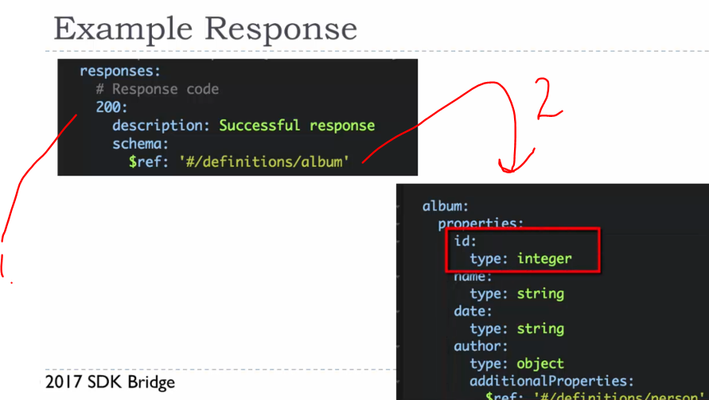
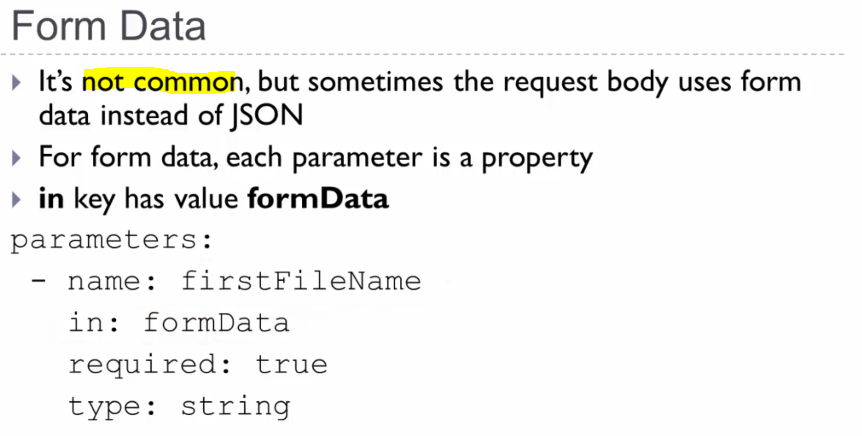

# 02 Open API Specification.

Open API Specification.

# What I learned.

# 4. Notes about OAS 3 and the Swagger editor.

- This is the newer [editor](https://editor.swagger.io/).

# 5. Open API Specification Basics.

- We are going to make **OAS** file, **O**pen API **S**pecification **F**ile.

1. Before it came **OAS** specification this was called **Swagger**. This is also called **Swagger key**.
2. The attributes for documentation file.

1. You define different paths into the file and under this one came all the other operations, such as **GET** **POST** ... etc. 
2. There is **path parameters** specified.

1. Request for this address. 
2. Get having such OAS file. Usually **path** variables are required.

1. **Headers** are part of OAS file and treated as parameters.
    - These are defined here if they are not **non**-standard.
2. `Access-level` is here as example. 

- Documentation is added using **description** key.

- Swagger Editor provided to make **OAS** file.

# Assignment 2: Open API Specification Basics

- Todo.

# 6. Schemas.

- **Scehemas** define **Request** and **Response bodies**.

1. For **OAS** schema is based of **JSON Schema**, this is defined [from](https://json-schema.org/)

2. This defines following structure.

1. This is referring to the other place on the document.
    - Here you can see the definition and usage to the other file.

1. You can see the `$ref` for **schema**. 

1. Example of using `$ref` for **Request Body**.

- You can also add other than **key-value** pairs.

1. You can add other objects. 

1. Furthermore, you can use **$ref** with the **schema array**.

1. For **404** and **200** responses, the **schemas** are different.
    - **Success 200** message has array of response.

1. Response for **success 200 message**.
2. You can see **array** of responses.

1. We can combine multiple object with `allOf`.
    - This can be used for **multiple properties** from **different schemas**.

- These are not used so often.

1. You can also define **custom headers**.
    - You can include these and responses onto **OAS** file.

- Form data can be also defined.

- With this one we define **form data** for **OAS**.

# Assignment 3: Schemas

