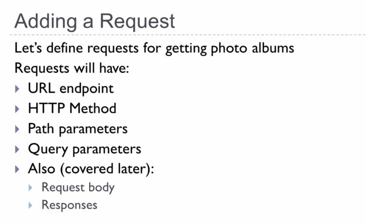

# 02 Open API Specification.

Open API Specification.

# What I learned.

# 4. Notes about OAS 3 and the Swagger editor.

- This is the newer [editor](https://editor.swagger.io/).

# 5. Open API Specification Basics.

- We are going to make **OAS** file, **O**pen API **S**pecification **F**ile.

1. Before it came **OAS** specification this was called **Swagger**. This is also called **Swagger key**.
2. The attributes for documentation file.

1. You define different paths into the file and under this one came all the other operations, such as **GET** **POST** ... etc. 
2. There is **path parameters** spesified.

1. Request for this address. 
2. Get having such OAS file. Usually **path** variables are required.

1. **Headers** are part of OAS file and treated as parameters.
    - These are defined here if they are not **non**-standard.
2. `Access-level` is here as example. 

- Documentation is added using **description** key.

- Swagger Editor provided to make **OAS** file.

# Assignment 2: Open API Specification Basics