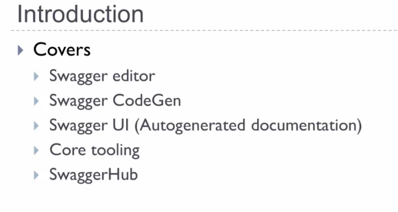
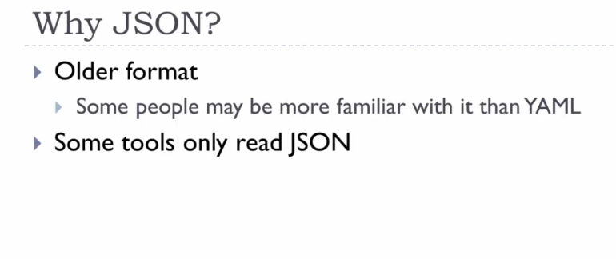
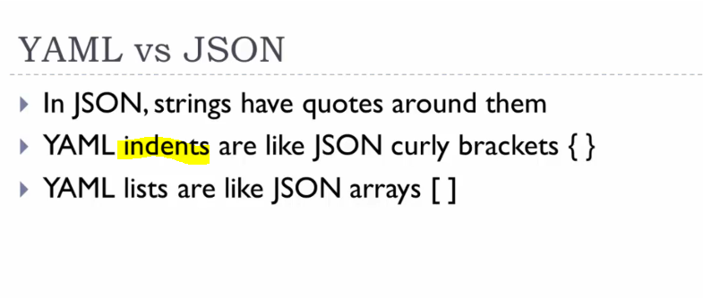
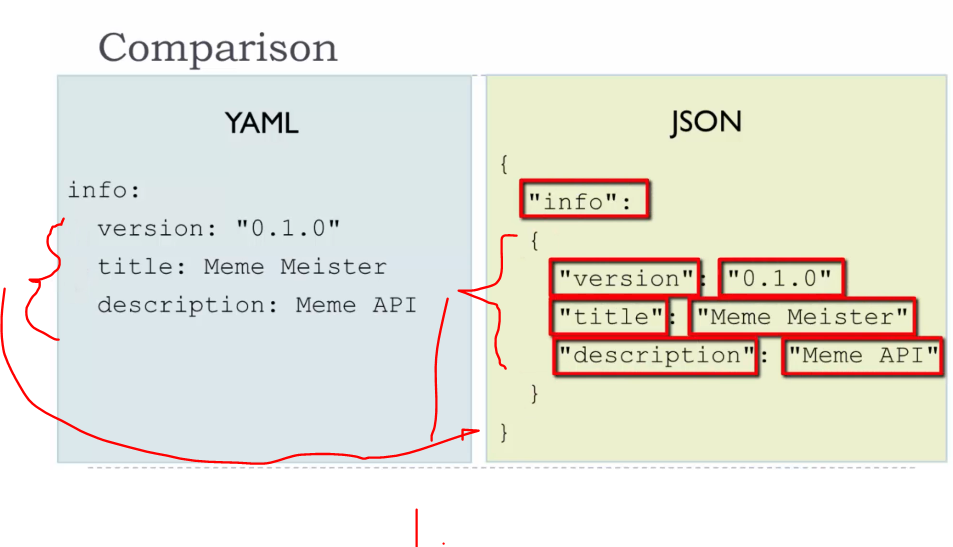
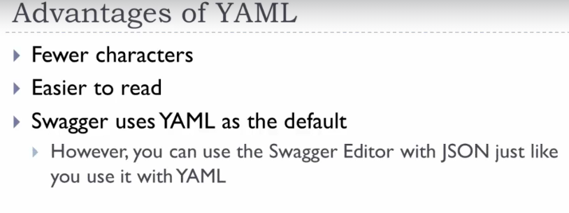

# 03 Tools and Alternatives.

Tools and Alternatives.

# What I learned.

# 9. Swagger Tools.



- **Swagger Editor**, syntax etc...
- **Swagger Codegen**
    - Take **OAS** and generators **SDK**:s out of the file.
- **Swagger UI** auto generated UI documentation etc...

- You can **host** these tools on your own platform.
- **Paid** is **SwaggerHub**, these are hosted somewhere else.

# Assignment 6: SwaggerHub.

```

```

# 10. JSON.

- **OAS** file can be created with `yaml` or `json`.



1. **JSON** is older format.



- Remember **yaml** has indentation.



1. You can have same indentation, but with `{}`.

- There will be many other syntax things, but you need to check the documentation.
    - [Link](https://yaml.org/).



1. **Swagger** uses `yaml` by default.


# Assignment 7: Put It All Together.