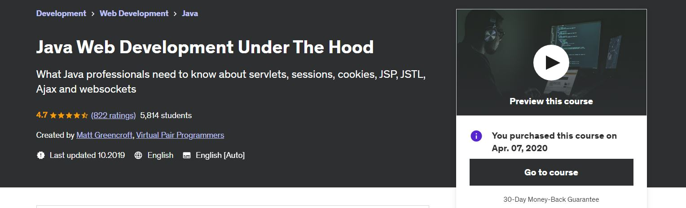
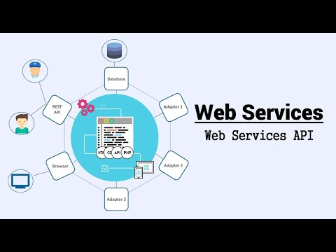
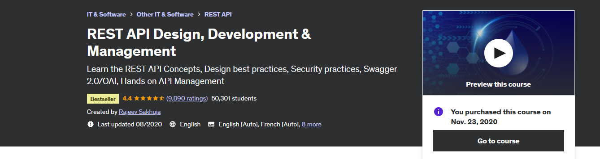

# Java Web Development Under The Hood

These are fundamentals for any **professional** Java developer to understand, even the old concepts, these can become handy in legacy projects! These concepts will come to you eventually regardless which Java framework you will decide to work with.

All course material from Java Web Development Under The Hood by **Matt Greencroft** from legendary **Virtual Pair Programmers**.

Contains my own notes to better learning experience with some course content. 

[The Course at Udemy](https://www.udemy.com/course/java-web-development-under-the-hood)

[Homepage of Maker](https://www.in28minutes.com/)

[Github of project](https://github.com/in28minutes/MockitoTutorialForBeginners)

If the content sparked :fire: your interest, please consider buying the course and start learning :book:

This repository is made with **Eclipse**, therefore it will include configuration files which are related to this IDE this approach will be favored for now. ⚙️

 

<!-- 
Linkedin puts this shit front, when clicking from private mode x(. Need to put this to make jump working every case
?trk=public_profile_see-credential 
-->

Insert certificate here when completed

**Note: The material provided in this repository is only for helping those who may get stuck at any point of time in the course. It is very advised that no one should just copy the solutions(violation of Honor Code) presented here.**

## Progress/Curriculum

- [x] [Section 1: Module 1](#) - Module 1 ✔️
- [ ] [Section 2](#) - Introduction  
- [ ] [Section 3](#) - Servlets
- [ ] [Section 4](#) -
- [ ] [Section 5](#) -
- [ ] [Section 6](#) -
- [ ] [Section 7](#) -
- [ ] [Section 8](#) -
- [ ] [Section 9](#) -
- [ ] [Section 10](#) -
- [ ] [Section 11](#) -
- [ ] [Section 12](#) -
- [ ] [Section 13](#) -
- [ ] [Section 14](#) -
- [ ] [Section 15](#) -
- [ ] [Section 16](#) -
- [ ] [Section 17](#) -
- [ ] [Section 18](#) -
- [ ] [Section 19](#) -
- [ ] [Section 20](#) -
- [ ] [Section 21](#) -

# SOAP Web Services by Java Brains

All course material from SOAP Web Services by **Java Brains** with little bit of mixing new stuff, since this is old tutorial and many relevant technologies were deprecated or disappeared at time when i proceeded thought this. Comment section rocks! Contains my additional notes and some extra videos to make it more content rich experience. We be using **JAX-WS** standard and Java for this.

[Original Channel](https://www.youtube.com/@Java.Brains)

[Source](https://www.youtube.com/playlist?list=PLe8LZCtW06l-JJDOb4PQ2TiAdMRtPKxKV)

If the content sparked :fire: your interest, please consider starting the course and start learning :book:

This repository is made with **Eclipse**, therefore it will include configuration files which are related to this IDE this approach will be favored for now. ⚙️

 

<!-- 
Linkedin puts this shit front, when clicking from private mode x(. Need to put this to make jump working every case
?trk=public_profile_see-credential 
-->

**Note: The material provided in this repository is only for helping those who may get stuck at any point of time in the course. It is very advised that no one should just copy the solutions(violation of Honor Code) presented here.**

## Progress/Curriculum

- [x] [01](https://github.com/developersCradle/java-web-development-under-the-hood/tree/main/SOAPWebServices/Section%2001) - SOAP Web Services - Introduction To Web Services ✔️
- [x] [02](https://github.com/developersCradle/java-web-development-under-the-hood/tree/main/SOAPWebServices/Section%2002) - SOAP Web Services - Web Service Jargon ✔️
- [x] [03](https://github.com/developersCradle/java-web-development-under-the-hood/tree/main/SOAPWebServices/Section%2003) - SOAP Web Services - Writing a Web service Client: Stub generation ✔️ 
- [x] [04](https://github.com/developersCradle/java-web-development-under-the-hood/tree/main/SOAPWebServices/Section%2004) - SOAP Web Services - Writing a Web service Client: Calling the Service ✔️
- [x] [05](https://github.com/developersCradle/rest-api-design-development-management/tree/main/SOAPWebServices/Section%2005) - SOAP Web Services - Setting up Java EE 7 SDK ✔️
- [x] [06](https://github.com/developersCradle/rest-api-design-development-management/tree/main/SOAPWebServices/Section%2006) - SOAP Web Services - Writing a Web Service: Eclipse setup ✔️
- [x] [07](https://github.com/developersCradle/java-web-dev-soap-rest-api/tree/main/SOAPWebServices/Section%2007) - SOAP Web Services - Writing a Web Service: Code and Deploy ✔️
- [x] [08](https://github.com/developersCradle/java-web-dev-soap-rest-api/tree/main/SOAPWebServices/Section%2008) - SOAP Web Services - Adding Input Arguments ✔️
- [x] [09](https://github.com/developersCradle/java-web-dev-soap-rest-api/tree/main/SOAPWebServices/Section%2009) - SOAP Web Services - Service First and Contract First Web Services ✔️
- [x] [10](https://github.com/developersCradle/java-web-dev-soap-rest-api/tree/main/SOAPWebServices/Section%2010) - SOAP Web Services - Understanding the WSDL ✔️
- [x] [11](https://github.com/developersCradle/java-web-dev-soap-rest-api/tree/main/SOAPWebServices/Section%2011) - SOAP Web Services - Customizing the WSDL ✔️
- [x] [12](https://github.com/developersCradle/java-web-dev-soap-rest-api/tree/main/SOAPWebServices/Section%2012) - SOAP Web Services - Schema Types and Binding Styles ✔️
- [x] [13](https://github.com/developersCradle/java-web-dev-soap-rest-api/tree/main/SOAPWebServices/Section%2013) - SOAP Web Services - Service Interface and Custom Types ✔️
- [x] [14](https://github.com/developersCradle/java-web-dev-soap-rest-api/tree/main/SOAPWebServices/Section%2014) - SOAP Web Services - Using JAXB Annotations Part 1 ✔️
- [x] [15](https://github.com/developersCradle/java-web-dev-soap-rest-api/tree/main/SOAPWebServices/Section%2015) - SOAP Web Services - Using JAXB Annotations Part 2 ✔️
- [x] [16](https://github.com/developersCradle/java-web-dev-soap-rest-api/tree/main/SOAPWebServices/Section%2016) - SOAP Web Services - Handling Faults ✔️
- [x] [17](https://github.com/developersCradle/java-web-dev-soap-rest-api/tree/main/SOAPWebServices/Section%2017) - SOAP Web Services - Using SoapUI ✔️
- [x] [18](https://github.com/developersCradle/java-web-dev-soap-rest-api/tree/main/SOAPWebServices/Section%2018) - SOAP Web Services - Using Web Service Explorer ✔️
- [x] [19](https://github.com/developersCradle/java-web-dev-soap-rest-api/tree/main/SOAPWebServices/Section%2019) - SOAP Web Services - Using Endpoint ✔️
- [x] [20](https://github.com/developersCradle/java-web-dev-soap-rest-api/tree/main/SOAPWebServices/Section%2020) - SOAP Web Services - wsimport Revisited ✔️

### Additional stuff

- [ ] SOAP with [Spring](https://www.youtube.com/watch?v=ceSqN3CWd14)

## REST API Design, Development & Management

This repository is trying to be one place quest for understanding REST API Design/Development. Contains my own notes with some course material.
This course servers as start, but later might add even more resources.

Learn the REST API Concepts, Design best practices, Security practices, Swagger 2.0/OAI, Hands-on API Management by

All course material from REST API Design, Development & Management by Rajeev Sakhuja. 

If the content sparked :fire: your interest, please consider buying the course and start learning :book:

[The Course at Udemy](https://www.udemy.com/course/rest-api/)   

Official [answers](https://github.com/acloudfan/REST-API-Course)

<!-- 
Linkedin puts this shit front, when clicking from private mode x(. Need to put this to make jump working every case
?trk=public_profile_see-credential 
-->

Insert certificate here when completed

**Note: The material provided in this repository is only for helping those who may get stuck at any point of time in the course. It is very advised that no one should just copy the solutions(violation of Honor Code) presented here.**

## Progress

- [x] [Section 01](https://github.com/developersCradle/rest-api-design-development-management/tree/main/RestApiDesignDevelopementAndManagement/Section%2001) - Setting the stage ✔️
- [x] [Section 02](https://github.com/developersCradle/rest-api-design-development-management/tree/main/RestApiDesignDevelopementAndManagement/Section%2002) - Evolution of RESTful services. ✔️
- [x] [Section 03](https://github.com/developersCradle/rest-api-design-development-management/tree/main/RestApiDesignDevelopementAndManagement/Section%2003) - REST API Architectural Constraints. ✔️
- [x] [Section 04](https://github.com/developersCradle/rest-api-design-development-management/tree/main/RestApiDesignDevelopementAndManagement/Section%2004) - Designing REST API ✔️
- [x] [Section 05](https://github.com/developersCradle/rest-api-design-development-management/tree/main/RestApiDesignDevelopementAndManagement/Section%2005) - REST API Error Handling Patterns ✔️
- [x] [Section 06](https://github.com/developersCradle/rest-api-design-development-management/tree/main/RestApiDesignDevelopementAndManagement/Section%2006) - REST API Handling Change - Versioning Patterns ✔️
- [x] [Section 07](https://github.com/developersCradle/rest-api-design-development-management/tree/main/RestApiDesignDevelopementAndManagement/Section%2007) - REST API Cache Control Patterns
- [x] [Section 08](https://github.com/developersCradle/rest-api-design-development-management/tree/main/RestApiDesignDevelopementAndManagement/Section%2008) - REST API Response Data Handling Patterns ✔️
- [ ] [Section 09](https://github.com/developersCradle/rest-api-design-development-management/tree/main/RestApiDesignDevelopementAndManagement/Section%2009) - REST API Security 
- [x] [Section 10](https://github.com/developersCradle/rest-api-design-development-management/tree/main/RestApiDesignDevelopementAndManagement/Section%2010) - REST API Specifications using Swagger 2.0 / OAI
- [ ] [Section 11](https://github.com/developersCradle/rest-api-design-development-management/tree/main/RestApiDesignDevelopementAndManagement/Section%2011) - API Management
- [ ] [Section 12](https://github.com/developersCradle/rest-api-design-development-management/tree/main/RestApiDesignDevelopementAndManagement/Section%2012) - Goodbye & All the Best

### Additional stuff

- [x] [Profile API - LinkedIn](https://learn.microsoft.com/en-us/linkedin/shared/integrations/people/profile-api).
- [ ] [Crash Course on API design](https://www.youtube.com/watch?v=6WGxVttWaXE&list=WL&index=94).
- [ ] Do RPC call with **GWT**.
- [ ] Write some mockup **Swagger API** documentation.
- [ ] Read thought [RFC2616](https://datatracker.ietf.org/doc/html/rfc2616) - Hypertext Transfer Protocol -- HTTP/1.1
- [ ] Read thought [RFC7617](https://datatracker.ietf.org/doc/html/rfc7617) - Basic Auth.

- [ ] Do some partial response test with **GraphQL**.