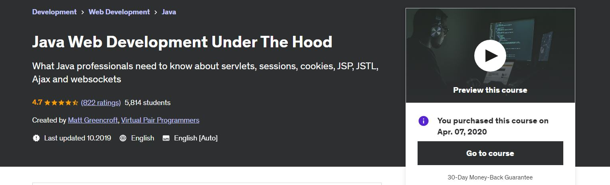
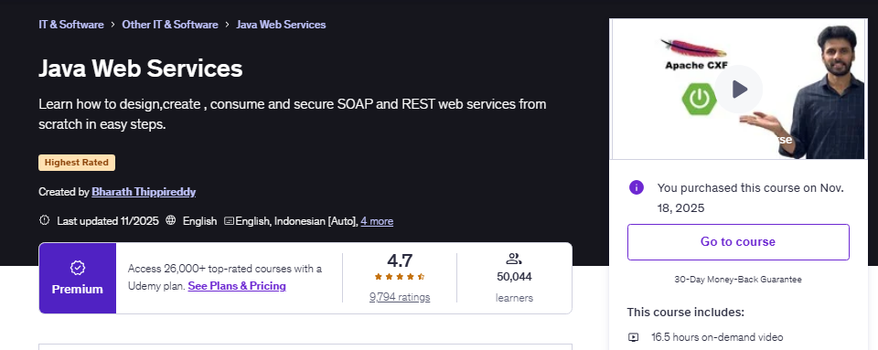
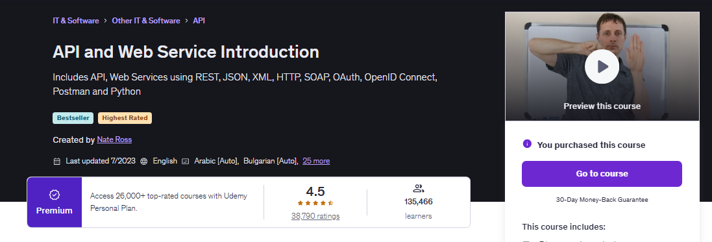
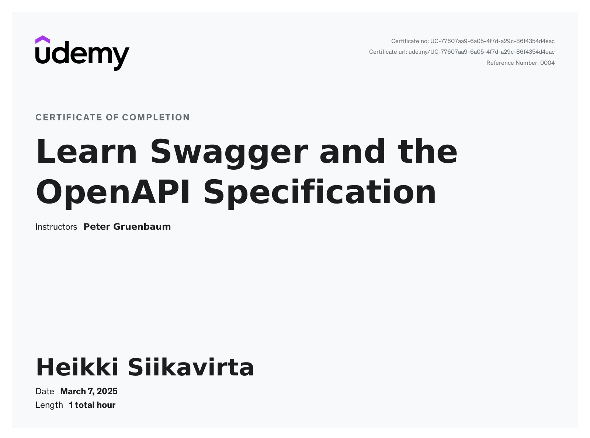

    
    <text>Attempt to study <b>Web Services</b>, <b>Rest API Design</b> and <b>related topics</b>!</text>

    

    

These are fundamentals for any **professional** Java developer to understand, even the old concepts, these can become handy in legacy projects! These concepts will come to you eventually regardless which Java framework you will decide to work with.

All course material from Java Web Development Under The Hood by **Matt Greencroft** from legendary **Virtual Pair Programmers** ©.

Contains my own notes to better learning experience with some course content. 

[The Course at Udemy](https://www.udemy.com/course/java-web-development-under-the-hood).

[Homepage of Maker](https://www.in28minutes.com/).

[GitHub of project](https://github.com/in28minutes/MockitoTutorialForBeginners).

If the content sparked :fire: your interest, please consider buying the course and start learning :book:.

This repository is made with **Eclipse**, therefore it will include configuration files which are related to this IDE this approach will be favored for now. ⚙️

 

<!-- 
Linkedin puts this shit front, when clicking from private mode x(. Need to put this to make jump working every case
?trk=public_profile_see-credential 
-->

    Insert certificate here when completed

**Note: The material provided in this repository is only for helping those who may get stuck at any point of time in the course. It is very advised that no one should just copy the solutions(violation of Honor Code) presented here.**

#### Progress/Curriculum.

- [ ] [Section 01](#) - Module 1.
- [ ] [Section 02](#) - Introduction.
- [ ] [Section 03](#) - Servlets.
- [ ] [Section 04](#) - Servlet Exercise.
- [ ] [Section 05](#) - Handling forms.
- [ ] [Section 06](#) - GET and POST.
- [ ] [Section 07](#) - POST-REDIRECT-GET.
- [ ] [Section 08](#) - Sessions and Cookies.
- [ ] [Section 09](#) - Servlet Security.
- [ ] [Section 10](#) - Module 2.
- [ ] [Section 11](#) - Servlet Annotations.
- [ ] [Section 12](#) - Servlet Filters.
- [ ] [Section 13](#) - JSP Introduction.
- [ ] [Section 14](#) - Further JSP.
- [ ] [Section 15](#) - MVC.
- [ ] [Section 16](#) - JSTL.
- [ ] [Section 17](#) - AJAX.
- [ ] [Section 18](#) - Asynchronous Servlets.
- [ ] [Section 19](#) - Websockets part 1 - Server to client.
- [ ] [Section 20](#) - Websockets part 2 - Client to server.
- [ ] [Section 21](#) - Goodbye.

    

    

All course material from Java Web Services by **Bharath Thippireddy**.

All course material from Java Web Services by **Bharath Thippireddy**.

A  ll course material from Java Web Services by <b>Bharath Thippireddy</b>.

Test 

All course material from Java Web Services by <strong>Bharath Thippireddy</strong>.

Contains my own notes with some course material to enforce learning experience.

> While debugging a legacy system with a particularly nasty bug. There was something interesting happening: during the `JAXB` **marshalling**/**unmarshalling** process, a character was mysteriously changing.
> 
> That small detail turned out to be the key to diagnosing the entire issue. It was a great reminder that in complex systems, subtle transformations—especially in serialization workflows—can have big impacts. ~ *DevelopersCradle*

This repository is made with  with **Eclipse** hotkeys. This is why it will include configuration files which are related to this IDE this approach will be favored for now. ⚙️

[Original Channel](https://www.bharaththippireddy.com/).

[Source](https://www.udemy.com/course/java-web-services/).

If the content sparked :fire: your interest, please consider starting the course and start learning :book:.

<!-- 
Linkedin puts this shit front, when clicking from private mode x(. Need to put this to make jump working every case
?trk=public_profile_see-credential 
-->

    Insert Cert here

**Note: The material provided in this repository is only for helping those who may get stuck at any point of time in the course. It is very advised that no one should just copy the solutions(violation of Honor Code) presented here.**

#### Progress/Curriculum.

- [ ] [Section 01](#) - Software Setup and Notes.
- [ ] [Section 02](#) - Completed Projects and Troubleshooting.
- [ ] [Section 03](#) - Web Services - The Big Picture.
- [ ] [Section 04](#) - XML and XML Schema Definition and JSON.
- [ ] [Section 05](#) - SOAP Web Services Concepts.
- [ ] [Section 06](https://github.com/developersCradle/java-web-dev-soap-rest-api/tree/main/Java%20Web%20Services/Section%2006#section-06-soap-web-services-design-and-implementation) - SOAP Web Services Design and Implementation.
- [x] [Section 07](https://github.com/developersCradle/java-web-dev-soap-rest-api/tree/main/Java%20Web%20Services/Section%2007#section-07-jax-ws-and-jaxb) - JAX-WS AND JAXB. ✔️
- [ ] [Section 08](https://github.com/developersCradle/java-web-dev-soap-rest-api/tree/main/Java%20Web%20Services/Section%2008#section-08-apache-cxf) - Apache CXF.
- [ ] [Section 09](#) - Developing Top Down Web Services.
- [ ] [Section 10](#) - Java SOAP Client.
- [ ] [Section 11](#) - Developing Bottom Up Web Services.
- [ ] [Section 12](#) - WS Standards.
- [ ] [Section 13](#) - User Name Token Profile Client.
- [ ] [Section 14](#) - MTOM.
- [ ] [Section 15](#) - JAX-WS Handlers.
- [ ] [Section 16](#) - SOAP Faults.
- [ ] [Section 17](#) - REST Web Services Concepts.
- [ ] [Section 18](#) - RESTFul Design and Implementation.
- [ ] [Section 19](#) - Configuring JSON Support.
- [ ] [Section 20](#) - REST Error Handling.
- [ ] [Section 21](#) - JAX-RS Client API - Creating Java REST Clients.
- [ ] [Section 22](#) - JAX-RS Injection.
- [ ] [Section 23](#) - Asynchronous REST.
- [ ] [Section 24](#) - REST and Spring Security.
- [ ] [Section 25](#) - OAuth Concepts.
- [ ] [Section 26](#) - REST Attachments.
- [ ] [Section 27](#) - Jersey Quick Start.
- [ ] [Section 28](#) - REST Using Spring Boot Web.
- [ ] [Section 29](#) - REST and Database CRUD Operations.
- [ ] [Section 30](#) - CRUD Using Spring Boot.
- [ ] [Section 31](#) - Clinical Data Reporting Project.
- [ ] [Section 32](#) - Develop React Front End.
- [ ] [Section 33](#) - Deploy to AWS.
- [ ] [Section 34](#) - Dockerize the Clinical App.
- [ ] [Section 35](#) - CRUD Operations Using SOAP.
- [ ] [Section 36](#) - Interview Help and Wrap Up.

#### Additional stuff.

- [ ] Go thought `JAXB` and soap related for now.
- [ ] Read additional [JAXB](https://www.baeldung.com/jaxb?utm_source=chatgpt.com).

        

    

All course material from SOAP Web Services by **Java Brains** © with little bit of mixing new stuff, since this is old tutorial and many relevant technologies were deprecated or disappeared at time when I proceeded thought this. Comment section rocks! Contains my additional notes and some extra videos to make it more content rich experience. We be using **JAX-WS** standard and Java for this.

[Original Channel](https://www.youtube.com/@Java.Brains).

[Source](https://www.youtube.com/playlist?list=PLe8LZCtW06l-JJDOb4PQ2TiAdMRtPKxKV).

If the content sparked :fire: your interest, please consider starting the course and start learning :book:.

This repository is made with **Eclipse**, therefore it will include configuration files which are related to this IDE this approach will be favored for now. ⚙️

 

<!-- 
Linkedin puts this shit front, when clicking from private mode x(. Need to put this to make jump working every case
?trk=public_profile_see-credential 
-->

<!-- Todo change the id when not lazy-->

    

**Note: The material provided in this repository is only for helping those who may get stuck at any point of time in the course. It is very advised that no one should just copy the solutions(violation of Honor Code) presented here.**

#### Progress/Curriculum.

- [x] [Section 01](https://github.com/developersCradle/java-web-dev-soap-rest-api/tree/main/SOAP%20Web%20Services/Section%2001#soap-web-services-01---introduction-to-web-services) - SOAP Web Services - Introduction To Web Services. ✔️
- [x] [Section 02](https://github.com/developersCradle/java-web-dev-soap-rest-api/tree/main/SOAP%20Web%20Services/Section%2002#soap-web-services-02---web-service-jargon) - SOAP Web Services - Web Service Jargon. ✔️
- [x] [Section 03](https://github.com/developersCradle/java-web-dev-soap-rest-api/tree/main/SOAP%20Web%20Services/Section%2003#soap-web-services-03---writing-a-web-service-client-stub-generation) - SOAP Web Services - Writing a Web service Client: Stub generation. ✔️ 
- [x] [Section 04](https://github.com/developersCradle/java-web-dev-soap-rest-api/tree/main/SOAP%20Web%20Services/Section%2004#soap-web-services-04---writing-a-web-service-client-calling-the-service) - SOAP Web Services - Writing a Web service Client: Calling the Service. ✔️
- [x] [Section 05](https://github.com/developersCradle/java-web-dev-soap-rest-api/tree/main/SOAP%20Web%20Services/Section%2005#soap-web-services-05---setting-up-java-ee-7-sdk5) - SOAP Web Services - Setting up Java EE 7 SDK. ✔️
- [x] [Section 06](https://github.com/developersCradle/java-web-dev-soap-rest-api/tree/main/SOAP%20Web%20Services/Section%2006#soap-web-services-06---writing-a-web-service-eclipse-setup) - SOAP Web Services - Writing a Web Service: Eclipse setup. ✔️
- [x] [Section 07](https://github.com/developersCradle/java-web-dev-soap-rest-api/tree/main/SOAP%20Web%20Services/Section%2007#soap-web-services-07---writing-a-web-service-client-stub-generation) - SOAP Web Services - Writing a Web Service: Code and Deploy. ✔️
- [x] [Section 08](https://github.com/developersCradle/java-web-dev-soap-rest-api/blob/main/SOAP%20Web%20Services/Section%2008/README.md#soap-web-services-08---adding-input-arguments) - SOAP Web Services - Adding Input Arguments. ✔️
- [x] [Section 09](https://github.com/developersCradle/java-web-dev-soap-rest-api/tree/main/SOAP%20Web%20Services/Section%2009#soap-web-services-09---service-first-and-contract-first-web-services) - SOAP Web Services - Service First and Contract First Web Services. ✔️
- [x] [Section 10](https://github.com/developersCradle/java-web-dev-soap-rest-api/tree/main/SOAP%20Web%20Services/Section%2010#soap-web-services-10---understanding-the-wsdl) - SOAP Web Services - Understanding the WSDL. ✔️
- [x] [Section 11](https://github.com/developersCradle/java-web-dev-soap-rest-api/tree/main/SOAP%20Web%20Services/Section%2011#soap-web-services-11---customizing-the-wsdl) - SOAP Web Services - Customizing the WSDL. ✔️
- [x] [Section 12](https://github.com/developersCradle/java-web-dev-soap-rest-api/tree/main/SOAP%20Web%20Services/Section%2012#soap-web-services-12---schema-types-and-binding-styles) - SOAP Web Services - Schema Types and Binding Styles. ✔️
- [x] [Section 13](https://github.com/developersCradle/java-web-dev-soap-rest-api/tree/main/SOAP%20Web%20Services/Section%2013#soap-web-services-13---service-interface-and-custom-types) - SOAP Web Services - Service Interface and Custom Types. ✔️
- [x] [Section 14](https://github.com/developersCradle/java-web-dev-soap-rest-api/tree/main/SOAP%20Web%20Services/Section%2014#soap-web-services-14---using-jaxb-annotations-part-1) - SOAP Web Services - Using JAXB Annotations Part 1. ✔️
- [x] [Section 15](https://github.com/developersCradle/java-web-dev-soap-rest-api/tree/main/SOAP%20Web%20Services/Section%2015#soap-web-services-15---using-jaxb-annotations-part-2) - SOAP Web Services - Using JAXB Annotations Part 2. ✔️
- [x] [Section 16](https://github.com/developersCradle/java-web-dev-soap-rest-api/blob/main/SOAP%20Web%20Services/Section%2016/README.md#soap-web-services-16---handling-faults) - SOAP Web Services - Handling Faults. ✔️
- [x] [Section 17](https://github.com/developersCradle/java-web-dev-soap-rest-api/blob/main/SOAP%20Web%20Services/Section%2017/README.md#soap-web-services-17---using-soapui) - SOAP Web Services - Using SoapUI. ✔️
- [x] [Section 18](https://github.com/developersCradle/java-web-dev-soap-rest-api/tree/main/SOAP%20Web%20Services/Section%2018#soap-web-services-18---using-web-service-explorer) - SOAP Web Services - Using Web Service Explorer. ✔️
- [x] [Section 19](https://github.com/developersCradle/java-web-dev-soap-rest-api/tree/main/SOAP%20Web%20Services/Section%2019#soap-web-services-19---using-endpoint) - SOAP Web Services - Using Endpoint. ✔️
- [x] [Section 20](https://github.com/developersCradle/java-web-dev-soap-rest-api/tree/main/SOAP%20Web%20Services/Section%2020#soap-web-services-20---wsimport-revisited) - SOAP Web Services - wsimport Revisited. ✔️

#### Additional stuff.

- [ ] SOAP with [Spring](https://www.youtube.com/watch?v=ceSqN3CWd14).

    

    

This repository is trying to be one place quest for understanding REST API Design/Development. Contains my own notes with some course material.
This course servers as start, but later might add even more resources.

Learn the REST API Concepts, Design best practices, Security practices, Swagger 2.0/OAI, Hands-on API Management by **Rajeev Sakhuja** ©.

[The Course at Udemy](https://www.udemy.com/course/rest-api/).   

Official [answers](https://github.com/acloudfan/REST-API-Course).

If the content sparked :fire: your interest, please consider buying the course and start learning :book:.

<!-- 
Linkedin puts this shit front, when clicking from private mode x(. Need to put this to make jump working every case
?trk=public_profile_see-credential 
-->

<!-- Todo change the id when not lazy-->

    

**Note: The material provided in this repository is only for helping those who may get stuck at any point of time in the course. It is very advised that no one should just copy the solutions(violation of Honor Code) presented here.**

#### Progress/Curriculum.

- [x] [Section 01](https://github.com/developersCradle/java-web-dev-soap-rest-api/tree/main/RestApiDesignDevelopementAndManagement/Section%2001#section-01---setting-the-stage) - Setting the stage. ✔️
- [x] [Section 02](https://github.com/developersCradle/java-web-dev-soap-rest-api/tree/main/RestApiDesignDevelopementAndManagement/Section%2002#6-what-is-an-api) - Evolution of RESTful services. ✔️
- [x] [Section 03](https://github.com/developersCradle/java-web-dev-soap-rest-api/tree/main/RestApiDesignDevelopementAndManagement/Section%2003#section-03---rest-api-architectural-constraints) - REST API Architectural Constraints. ✔️
- [x] [Section 04](https://github.com/developersCradle/java-web-dev-soap-rest-api/tree/main/RestApiDesignDevelopementAndManagement/Section%2004#section-04---designing-rest-api) - Designing REST API. ✔️
- [x] [Section 05](https://github.com/developersCradle/java-web-dev-soap-rest-api/tree/main/RestApiDesignDevelopementAndManagement/Section%2005#section-5-rest-api-error-handling-patterns) - REST API Error Handling Patterns. ✔️
- [x] [Section 06](https://github.com/developersCradle/java-web-dev-soap-rest-api/tree/main/RestApiDesignDevelopementAndManagement/Section%2006#section-06---rest-api-handling-change---versioning) - REST API Handling Change - Versioning Patterns. ✔️
- [x] [Section 07](https://github.com/developersCradle/java-web-dev-soap-rest-api/tree/main/RestApiDesignDevelopementAndManagement/Section%2007#section-07---rest-api-cache-control-patterns) - REST API Cache Control Patterns. ✔️
- [x] [Section 08](https://github.com/developersCradle/java-web-dev-soap-rest-api/tree/main/RestApiDesignDevelopementAndManagement/Section%2008#section-08---rest-api-response-data-handling-patterns) - REST API Response Data Handling Patterns. ✔️
- [x] [Section 09](https://github.com/developersCradle/java-web-dev-soap-rest-api/tree/main/RestApiDesignDevelopementAndManagement/Section%2009#section-09---rest-api-security) - REST API Security. 
- [x] [Section 10](https://github.com/developersCradle/java-web-dev-soap-rest-api/tree/main/RestApiDesignDevelopementAndManagement/Section%2010#section-10---rest-api-specifications-using-swagger-20--oai) - REST API Specifications using Swagger 2.0 / OAI. ✔️
- [x] [Section 11](https://github.com/developersCradle/java-web-dev-soap-rest-api/tree/main/RestApiDesignDevelopementAndManagement/Section%2011#section-11---api-management) - API Management. ✔️
- [x] [Section 12](https://github.com/developersCradle/java-web-dev-soap-rest-api/tree/main/RestApiDesignDevelopementAndManagement/Section%2012#section-12---goodbye--all-the-best) - Goodbye & All the Best. ✔️

#### Additional stuff.

- [ ] Check trough typos, and texture meaning, when have time.
    - Change the Folder naming.
    - Left to the chapter 6.
- [x] Read thought [Profile API - LinkedIn](https://learn.microsoft.com/en-us/linkedin/shared/integrations/people/profile-api). ✔️
- [x] Read thought [SpotifyAPI](https://developer.spotify.com/). ✔️
    - [ ] Read thought [SpotifyAPI OAuth2.0](https://developer.spotify.com/documentation/web-api/concepts/authorization).
- [ ] Snack to consume :) [Crash Course on API design](https://www.youtube.com/watch?v=6WGxVttWaXE&list=WL&index=94).
- [x] Write some mockup **Swagger API** documentation. [Link to .YAML](https://github.com/developersCradle/java-web-dev-soap-rest-api/blob/main/Learn%20Swagger%20and%20the%20OpenAPI%20Specification/Section%2002/Assigment%2003/schemas.yaml). ✔️
- [ ] Read thought [RFC2616](https://datatracker.ietf.org/doc/html/rfc2616) - Hypertext Transfer Protocol -- HTTP/1.1.
- [ ] Read thought [RFC7617](https://datatracker.ietf.org/doc/html/rfc7617) - Basic Auth.
- [ ] Read thought [RFC7519](https://datatracker.ietf.org/doc/html/rfc7519) - JSON Web Token (JWT).
- [ ] Read thought [RFC6749](https://www.rfc-editor.org/rfc/rfc6749.html) - OAuth 2.0 (OAuth2).
- [ ] Do JWT also in [Spring](https://www.youtube.com/watch?v=KxqlJblhzfI).
- [ ] Do RPC call with **GWT**.
- [ ] Do some partial response test with **GraphQL**.

    

    

Contains my own notes to better learning experience with some course content.

API and Web Service Introduction **Nate Ross** ©.

[The Course at Udemy](https://www.udemy.com/course/api-and-web-service-introduction/?couponCode=2021PM20).

[Homepage of Maker](https://ezlearn.tech/).

If the content sparked :fire: your interest, please consider buying the course and start learning :book:.

<!-- 
Linkedin puts this shit front, when clicking from private mode x(. Need to put this to make jump working every case
?trk=public_profile_see-credential 
-->

    

**Note: The material provided in this repository is only for helping those who may get stuck at any point of time in the course. It is very advised that no one should just copy the solutions(violation of Honor Code) presented here.**

#### Progress/Curriculum.

- [x] [Section 01](https://github.com/developersCradle/java-web-dev-soap-rest-api/tree/main/API%20and%20Web%20Service%20Introduction/Section%2001#section-01-introduction) - Introduction. ✔️
- [x] [Section 02](https://github.com/developersCradle/java-web-dev-soap-rest-api/tree/main/API%20and%20Web%20Service%20Introduction/Section%2002#section-02-api) - API. ✔️
- [x] [Section 03](https://github.com/developersCradle/java-web-dev-soap-rest-api/tree/main/API%20and%20Web%20Service%20Introduction/Section%2003#section-03-web-services) - Web Services. ✔️
- [x] [Section 04](https://github.com/developersCradle/java-web-dev-soap-rest-api/tree/main/API%20and%20Web%20Service%20Introduction/Section%2004#section-04-http) - HTTP. ✔️
- [x] [Section 05](https://github.com/developersCradle/java-web-dev-soap-rest-api/blob/main/API%20and%20Web%20Service%20Introduction/Section%2005/README.md#section-05-xml) - XML. ✔️
- [x] [Section 06](https://github.com/developersCradle/java-web-dev-soap-rest-api/tree/main/API%20and%20Web%20Service%20Introduction/Section%2006#section-06-json) - JSON. ✔️
- [x] [Section 07](https://github.com/developersCradle/java-web-dev-soap-rest-api/tree/main/API%20and%20Web%20Service%20Introduction/Section%2007#section-07-soap) - SOAP. ✔️
- [x] [Section 08](https://github.com/developersCradle/java-web-dev-soap-rest-api/tree/main/API%20and%20Web%20Service%20Introduction/Section%2008#section-08-rest) - REST. ✔️
- [x] [Section 09](https://github.com/developersCradle/java-web-dev-soap-rest-api/tree/main/API%20and%20Web%20Service%20Introduction/Section%2009#section-09-api-access) - API Access. ✔️
- [x] [Section 10](https://github.com/developersCradle/java-web-dev-soap-rest-api/tree/main/API%20and%20Web%20Service%20Introduction/Section%2010#section-10-api-examples) - API Examples. ✔️
- [x] [Section 11](https://github.com/developersCradle/java-web-dev-soap-rest-api/tree/main/API%20and%20Web%20Service%20Introduction/Section%2011#section-11-extras) - Extras. ✔️
- [x] [Section 12](#) - Conclusion. ✔️

#### Additional stuff.

- [ ] Test try example from [GeoIPService](http://wsgeoip.lavasoft.com/ipservice.asmx). Many of **SOAP** endpoints are deprecated :(.
- [ ] Do the app **X** (not **Twitter**). 
    - Try to make using [X SDK](https://docs.x.com/x-api/tools-and-libraries/overview#java).
- [ ] Do example with the [Webhook](https://www.youtube.com/watch?v=tshKOgRLYn0).

     

     

API Definition Files, Tools, and Documentation (**OAS 2.0**) **Peter Gruenbaum** ©.

Contains my own notes with some course material to enforce learning experience.

> Sometimes inspiration from someone else is enough. I’m happy to share that I’ve obtained a new certification: Learn Swagger and the OpenAPI. ~ *DevelopersCradle*

This repository is made with  with **Eclipse** hotkeys. This is why it will include configuration files which are related to this IDE this approach will be favored for now. ⚙️

[The Course at Udemy](https://www.udemy.com/course/learn-swagger-and-the-open-api-specification/).   

[Homepage of Maker](https://sdkbridge.com/).

If the content sparked :fire: your interest, please consider buying the course and start learning :book:.

<!-- 
Linkedin puts this shit front, when clicking from private mode x(. Need to put this to make jump working every case
?trk=public_profile_see-credential 
-->

     

**Note: The material provided in this repository is only for helping those who may get stuck at any point of time in the course. It is very advised that no one should just copy the solutions(violation of Honor Code) presented here.**

#### Progress/Curriculum.

- [x] [Section 01](https://github.com/developersCradle/java-web-dev-soap-rest-api/tree/main/Learn%20Swagger%20and%20the%20OpenAPI%20Specification/Section%2001#section-1-introduction) - Introduction. ✔️
- [x] [Section 02](https://github.com/developersCradle/java-web-dev-soap-rest-api/tree/main/Learn%20Swagger%20and%20the%20OpenAPI%20Specification/Section%2002#02-open-api-specification) - Open API Specification. ✔️ 
- [x] [Section 03](https://github.com/developersCradle/java-web-dev-soap-rest-api/tree/main/Learn%20Swagger%20and%20the%20OpenAPI%20Specification/Section%2003#03-tools-and-alternatives) - Tools and Alternatives. ✔️

#### Additional stuff.

- [x] Review `$ref` from **OAS**. ✔️
- [ ] Host the swagger exercise on the GitHub pages [Example page of hosting](https://github.com/peter-evans/swagger-github-pages?tab=readme-ov-file).
    - Did not get this working at the moment. Can do in future again :)
- [ ] Review the [OAS 3.0](https://blog.restcase.com/6-most-significant-changes-in-oas-3-0/) after finishing this one.

    

Contains my own notes with some course material.

Learn API Technical Writing: JSON and XML for Writers **Peter Gruenbaum** ©.

[The Course at Udemy](https://www.udemy.com/course/api-documentation-1-json-and-xml/).

[Homepage of Maker](https://sdkbridge.com/).

If the content sparked :fire: your interest, please consider buying the course and start learning :book:.

<!-- 
Linkedin puts this shit front, when clicking from private mode x(. Need to put this to make jump working every case
?trk=public_profile_see-credential 
-->

    Insert certificate here when completed

**Note: The material provided in this repository is only for helping those who may get stuck at any point of time in the course. It is very advised that no one should just copy the solutions(violation of Honor Code) presented here.**

#### Progress/Curriculum.

- [ ] [Section 01](https://github.com/developersCradle/java-web-dev-soap-rest-api/tree/main/Learn%20API%20Technical%20Writing%20JSON%20and%20XML%20for%20Writers/Section%2001#section-1-introduction) - Introduction.
- [ ] [Section 02](https://github.com/developersCradle/java-web-dev-soap-rest-api/tree/main/Learn%20API%20Technical%20Writing%20JSON%20and%20XML%20for%20Writers/Section%2002#section-2-json) - JSON.
- [ ] [Section 03](#) - XML.
- [ ] [Section 04](#) - Final Words.

#### Additional stuff.

- [ ] Some task here.
