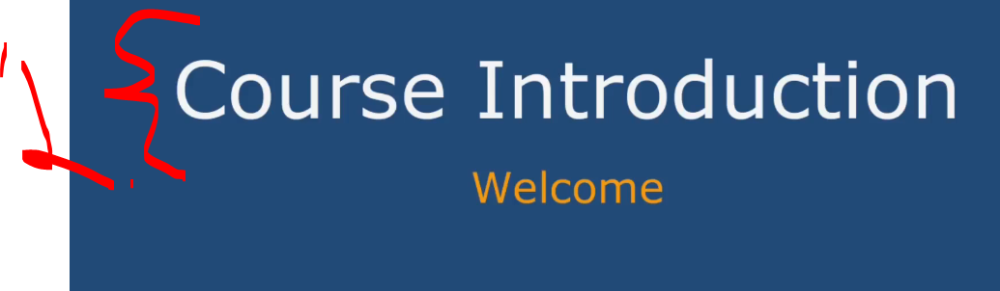
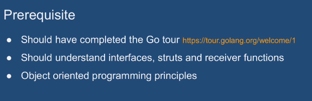
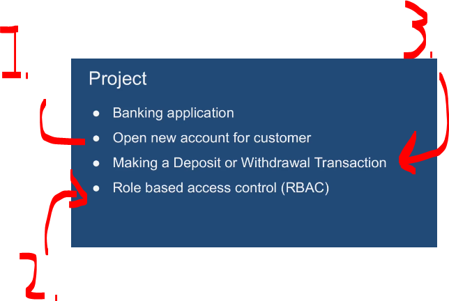
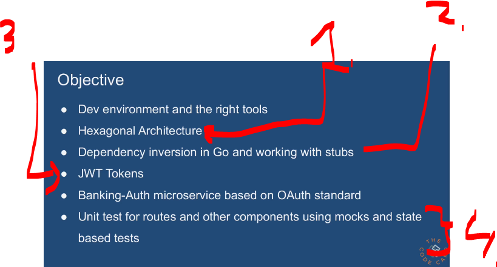
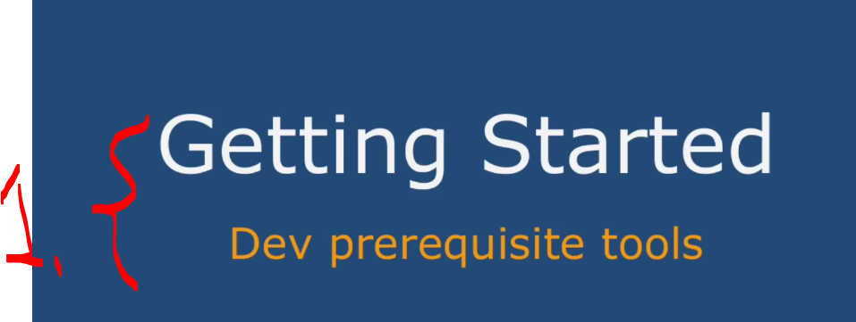

# Section 01: Introduction. 

Introduction.

# What I Learned.

# Welcome to the course.

<div align="center">
    
</div>

1. We will be building bank based REST application!

<div align="center">
    
</div>

- One should be at least:
    - Basic understanding of **Golang**.

<div align="center">
    
</div>

1. We can open bank account!
2. The **security** will be implemented based on the **role**.
    - *RBAC*!
        - **R**ole.
        - **B**ased.
        - **A**ccount.
        - **C**ontrol.
3. Person can withdraw money from the account.

<div align="center">
    
</div>

1. We will be utilizing the **Hexagon Architecture**. See following comparison:
    - **MVC** (**M**odel-**V**iew-**C**ontroller)
        - **Architectural pattern** (but more like a “presentation architecture”).
    - **Hexagonal Architecture** (Ports & Adapters)
        - **Architectural pattern**.
2. With help of **Hexagonal Architecture** we can achieve next:
    - We will be utilizing the dependency inversion with the **stubs**.
3. Auth based **API**.
4. We will be testing **routes** and **other components**. Notice the **state based testing**

| Concept                 | Type          | What it tests                        |
| ----------------------- | ------------- | ------------------------------------ |
| **State-based testing** | Testing style | Verifies final state/output          |
| **Unit testing**        | Testing level | Tests one small unit of code         |
| **Integration testing** | Testing level | Tests interaction between components |

# Links & resources.

````
Links & resources
Complete code is available at

Banking             https://github.com/ashishjuyal/banking
Banking-Auth   https://github.com/ashishjuyal/banking-auth
Banking-lib       https://github.com/ashishjuyal/banking-lib

Database SQL
https://github.com/ashishjuyal/banking/blob/master/resources/database.sql

Database docker-compose file
https://github.com/ashishjuyal/banking/tree/master/resources/docker

Keyboard shortcuts for IntelliJ-IDEA
https://www.youtube.com/watch?v=QYO5_riePOQ&feature=youtu.be

Postman
https://www.postman.com/downloads/

cURL / cURL for windows
https://curl.haxx.se/download.html
https://curl.haxx.se/windows/

DBeaver
They also have a community edition https://dbeaver.io/download/

Go download & install
https://golang.org/doc/install

Go Tour
https://tour.golang.org/welcome/1
````

# Getting started.

<div align="center">
    
</div>

1. We will be using these tools.

- We can do this later if want.

