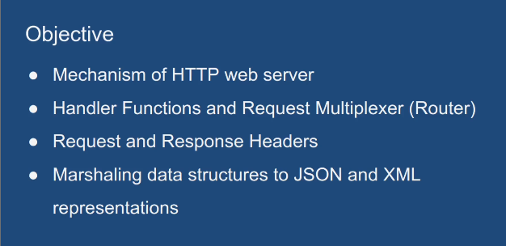
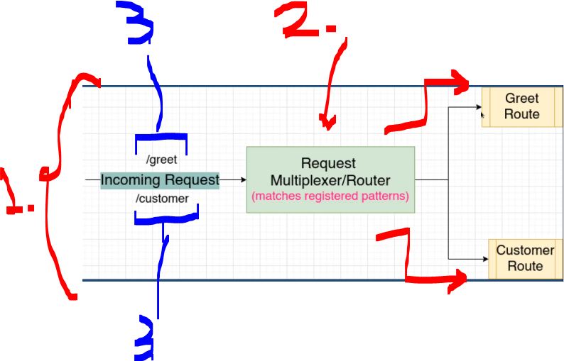

# Section 02: Router Basics. 

Router Basics.

# What I Learned.

# Hello World.

<div align="center">
    
</div>

1. We will be starting with **Hello World** endpoint.

<div align="center">
    
</div>

1.
2.
3.

<div align="center">
    
</div>

1. **HTTP Server**.
2. **Multiplexer** takes care matching the request to the **appropriate route**! 
3. This resource has endpoints called `/greet` and `/customer` these are **routes**!


- Our implementation of simple **HTTP** server:


- **HTTP** server running:


<details>
<summary id="The factorial thread" open="true"> <b>oijooijoi!</b> </summary>


````Go
package main

import (
	"fmt"
	"log"
	"net/http"
)

//TIP <p>To run your code, right-click the code and select <b>Run</b>.</p> <p>Alternatively, click
// the <icon src="AllIcons.Actions.Execute"/> icon in the gutter and select the <b>Run</b> menu item from here.</p>

func main() {

	// Defines routes.
	http.HandleFunc("/greet", greet)

	// Starting the server!
	log.Fatal(http.ListenAndServe("localhost:8080", nil))
}

func greet(writer http.ResponseWriter, request *http.Request) {
	fmt.Fprint(writer, "Hello World")
}
````
</details>

# JSON Encoding.

# XML Encoding.

# Refactoring & Go modules.

# gorilla/mux.

# Assignment Build a time API.