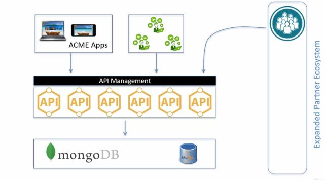
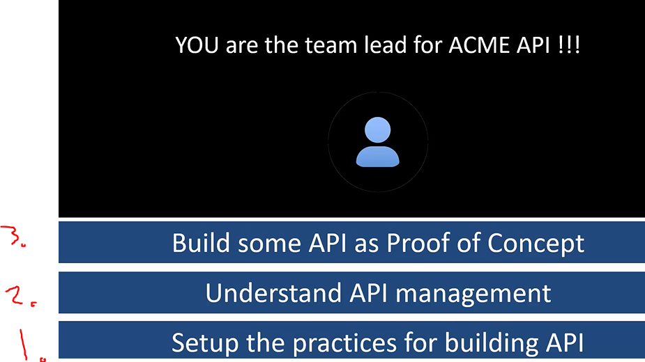
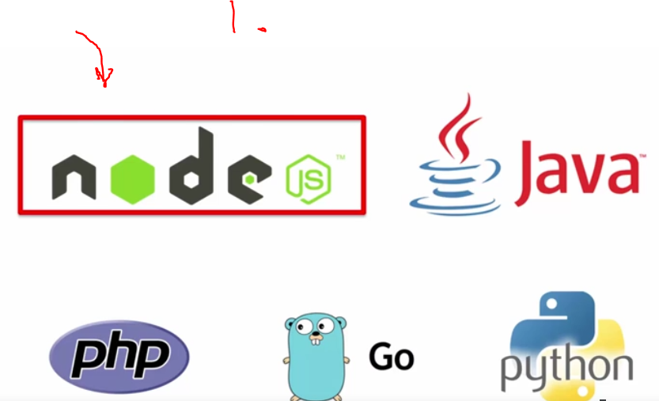
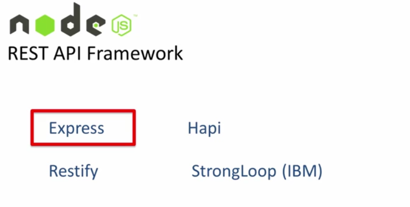
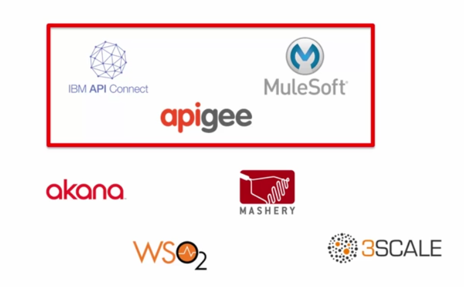

# Section 01 - Setting the stage.

Setting the stage.

# What I Learned.

- For pulling submodules I used:
    - `git submodule update --init --recursive`.

# Introduction to the Author and the Course.

- Get you hand dirty.

# ACME Travels - Case study.

- Case ACME new plan.

    

- When API is deployed, do you need API management platform?

    

- There three tasks which you need to accomplish. **Let's build Cool API’S**.

# Tools for Design, Development, Testing and Management or REST API.

    

1. Node is simple and many packages.

    

- Express is fastest and easiest to create REST API’s.

    

- Testing REST API’s.
    - Will be using POSTMAN.

- Mongolab for not installing MongoDB.

    

- There is many API management tools, we will be using these three.
