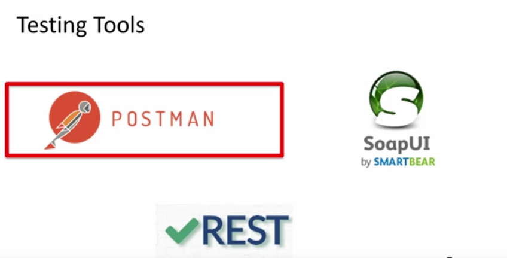

# Section 01 - Setting the stage.

# What I Learned.

- For pulling submodules i used `git submodule update --init --recursive`.

# 1. Introduction to the Author and the Course.

- Get you hand dirty.

# 3. ACME Travels - Case study.

- Case ACME new plan.

- When API is deployed, do you need API management platform?

- There three tasks which you need to accomplish. **Let's build Cool API’S**.

# 4. Tools for Design, Development, Testing and Management or REST API.

1. Node is simple and many packages.

- Express is fastest and easiest to create REST API’s.

- Testing REST API’s.
    - Will be using POSTMAN.

- Mongolab for not installing MongoDB.

- There is many API management tools, we will be using these three.
