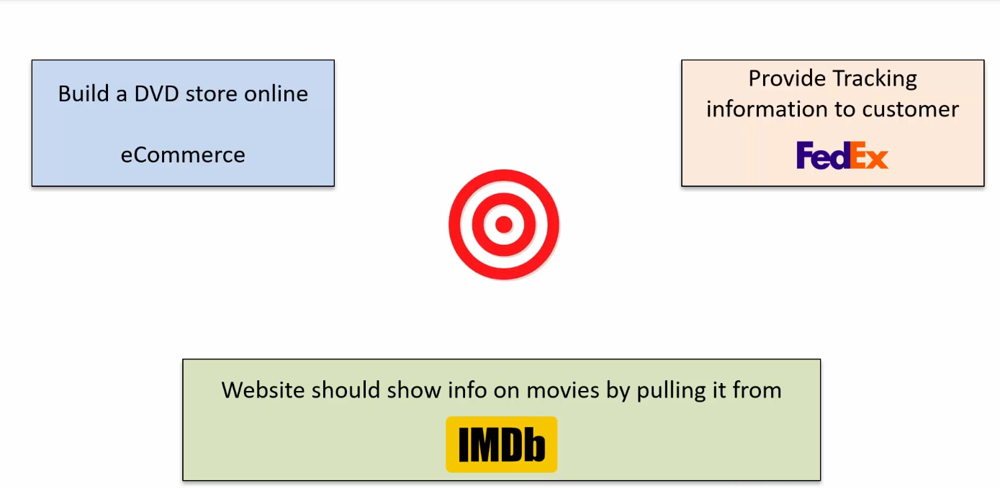
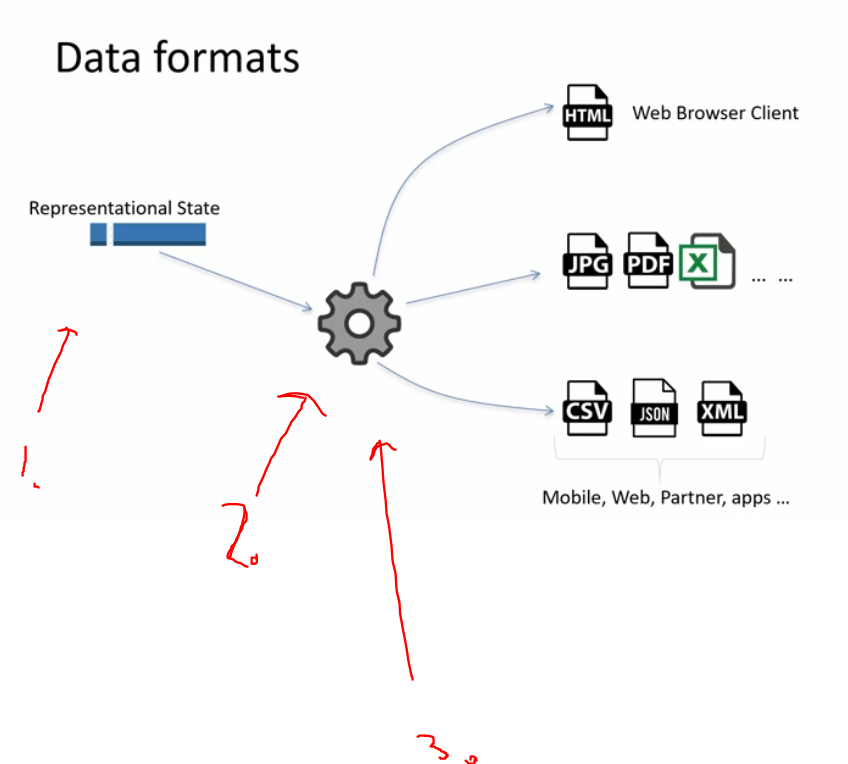
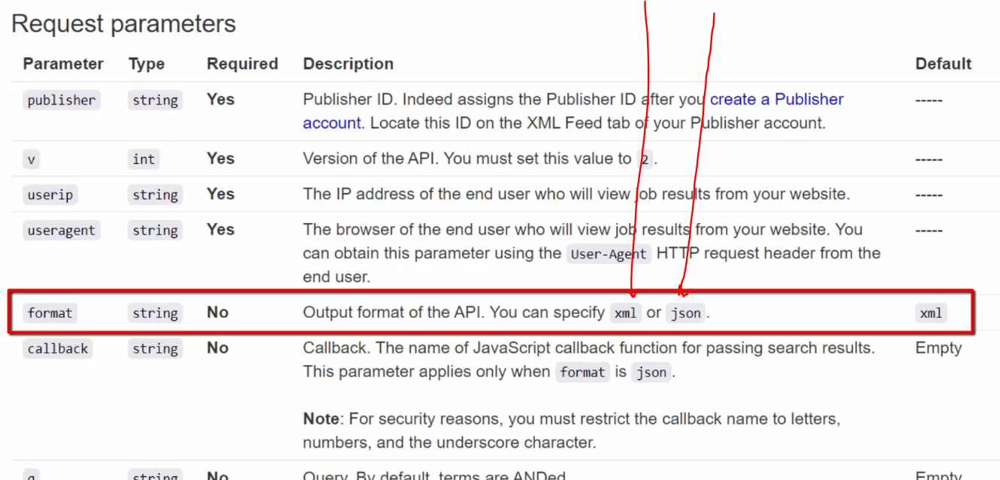

# Section 02: Evolution of RESTful services.

Evolution of RESTful services.

# What I Learned.

# What is an API.

# Evolving movie database(IMDB).

    

- Old days used to just browse into webpage and look for information.

- Later FedEx released web tracking feature with ID, at the time this was super cool!

    

- **Web Scraping** was used since it could parse `<html>` and later save it to database.
    - **FYI** Many developers were using this technique! Web Scraping.

    

1. `PHP` based website will receive HTTP request to website.
2. After receiving request, Web Scraper was **invoked()**.
3. HTTP `GET` was invoked form Web Scraper.
4. Response had tracking information about the movie.

- This case was not end of trouble. There were many problems head.

    

- It shows **Web Scraping** is not easy to maintain! Different stuff can be easily changed!

- Later FedEx released HTTP/XML RPC for tracking!
    - XML based.

- This introduced API to developers!

    

- API has well-defined Contract between consumer & provider. Meaning this case **Contract = XML Request/Response structure**.
    - Meaning our case stuff will not change randomly like in our `<html>` scrapper example.

- APIs are expected to use by machine.

    

- After 2013 JSON have grown popularity. Nowadays, it's the first choice for API developers.

# Evolution of REST/JSON API.

    

- Code here creates process when executed.
    - No network activity.

    

1. On the **servers** side there is function that client can **invoke()**.

2. Using **RPC** mechanism, client can invoke method as it was in local.

- API is **RPC** mechanism.

    

1. 1991 **CORBA** was first practical RPC mechanic.
2. 1998 **SOAP** was introduced.
- These both were heavily dependent on message format and hard to use. These RPC mechanics were build for enterprise solutions **not** for internet.

    

- Today HTTP REST is **De-facto** standard for API.

    

1. REST API are not locked to any specific type.
    - For example like **SOAP** is locked into using **XML** format.
- Almost **all** modern API use **REST/JSON**.

    

1. XML was ment for computer consumption. 
2. **SOAP** standards was always changing, meaning API needed to implement new version often.

- [REST](https://fi.wikipedia.org/wiki/REST). 

    

# Introduction to RESTful API.

    

1. Each of instance have their own values.
2. Query happening to database.
3. Representational State is returned.

- This is called **REST**.

    

1. This Representational State can be in any format.
2. This can be converted to **ANY** format.
    - For example HTML for browsers.
3. Now if you convert this node to REST API point, this will represent RESTful API from data point perspective.

> REST API not tied to **any specific Data Format** ~ Rajeev

    

1. Client asks form RESTful API Job resource as **XML**.
2. Returned as **XML** resource.

    

- REST client can also ask it as **JSON** format.
    - Point here is, many formats can be returned.

    

- As you can see RESTful API provides are providing parameter to specify the format. 

    

- All modern API use HTTP:// Protocol for RESTful communication.
    - We call such `HTTP REST API`.

- **REST** style communication is not tied to **HTTP**. You could use other protocols as well.

# Private, Public and Partner API.

    

1. Private or Internal consumer. From same organization.
    - Used by development team, inside organization.
2. Outside of organization.
    - Public domain application users.
    - **Not trusted** users, some security is needed for these APIs’s.
3. Partner, trusted by provider.
    - Only trusted users.

- ! There is no difference how these APIs are **implemented**.
    - Only difference how these are **managed**.

    

- How API security are implemented.

    

1. With trusted Developers trust is not too much needed. Basic Auth and Proprietary schemes are common to use. 

2. For these users. Security is main concern. Key/Secret and OAuth are often used.

- How carry out API documentation for public.

    

- How access requests are managed.

    

1. Requesting access to these APIs’s with emails and tickets are commonly used by partners and internal developers.

2. For public developers It's common to have some Developer portal process. It's recommended to expose API provisioning workflow in **Developer portal**.

- How SLA are taken care of (SLA= **S**ervice **L**evel **A**greement).
- Example from API perspective.

    

1. SLA promises API to be up and working for 99.99% of the time.
2. Promises maximum 20 call/sec for API consumer.
3. Provides email support for consumer.
4. Different levels for API’s.
5. Provider needs to monitor the API.performance to keep up promise what SLA promised in first place. 

# Example REST API Walkthrough.

- Examples used from this link [Ticketmaster](https://developer.ticketmaster.com/partners/).

    

- Here is example of **Public API** in **Ticketmaster**.

    

- Here is example of **partner contract** API in **Ticketmaster**.

    

- Here is example of **SLA management** in **Ticketmaster**.
    - Rate Limit, 5 request per second.

# API Value Chain.

- API makes **value** by exposing data to outside and inside organization.

    

1. **TheWeatherCompany** holds a lot of weather data **FedEx** provides a lot of packages information.
2. **NetFlix** exposes movies services to TV manufacturers.  
3. **FaceBook** data from users.

- So what value company gets for exposing this data to outside world.

    

- There is two main ways companies benefits from exposing data.

    

1. From Direct Value.
2. Indirect Benefits, for competitive edge.

- These assets are exposed to:

    

 

    

1. **Asset** or **Data** which is going to provide.
2. Data is provided thought **Applications**.
3. Makes asset easy access to developers.
4. Make delightful experience for asset for end customer.
5. For things to app developer.
6. For making the best API, we need to follow these rules!

