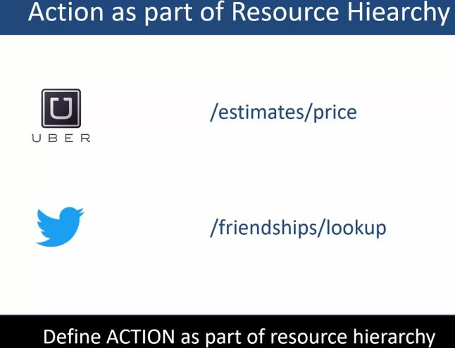

# Section 04 - Designing REST API.

Designing REST API.

# What I Learned.

# API Endpoint URL.

    

1. Base URL. 
2. Grouping Name (optional).
3. Version of API.
4. REST resource ID (Action is operated to here).

- Example of Base URL for API’s.

    

- **DO NOT** user your WWW subdomain for API.

- For example **ticket master** uses sub-domain for API:s `developer.ticketmaster.com` [TicketMasterAPI](https://developer.ticketmaster.com/). While ticket master **WWW** [website](https://www.ticketmaster.com/) is `https://www.ticketmaster.com/`.

    

- **if option** go for dedicated domain.  

    

- Product is also called `packages`.

- Multiple API in big companies with multiple teams.

    

-  You can logically group **API:s** under resources. 

1. If you work for smaller organization you were you don't have many teams → package is not required! 

- Example Ticket Master Grouping.

    

- **Version** of API.

    

1. Your API can have many versions of the API’s
2. Customer can take use of API at their own time schedule.
3. Version it the past was optional, because there were other ways to manage versioning. 

    

1. If you don't provide ID. It can be operated on **Array of resources**.
    - **If** in other hand `{id}` is specified. I can be operated in **specific resource**.

2. If you **GET** on specific ID you will get specific property.

    

- If you **GET** here **multiple properties** are returned.

    

1. This domain represents root URL.

    

# Practices for Resource Names, Actions & Associations.

    

- Naming of API of different companies.

1. Multiple resources.
2. Single resource.
3. To identify resources we use **nouns**.
    - We could say `getNames` or `getPeople`, but this does not follow REST practices. 
4. Use plurals not singulars. Idea is follow patters, which many companies are following → **Plural**.

    

- What if action is not CRUD operation action `search`.

- API exposes **action**.

    

1. Spotify exposes.

    

- Some companies exposing action in Resource.

    

    

1. **Resources** can have relationships like normal things have. Order has Items.
2. Find exact person with specific **ID** and get specific flower with **ID**.

- Example of **E trade** portal.

    

1. List transactions of this `accountID`.

    

1. Avoid deep nesting, you could make sub-query.

    

# Walk through: Setup the API URI for ACME API.

# User case: ACME API.

    

1. End user experience brings most customer value. 

- Domain will be `https://api.acme.com`
- `https://domain/`<del>`product`</del>`/version`.
    - No need for **product path**, since it does not have too many resources.
- Version since its first version, it will be `/v1`.
- Root URL of our user case will be `https://api.acme.com/v1`.

    

1. For getting many resources.
2. For getting specific resource.

    

1. Exposing destination as endpoint. This is not only case, to book travel **Destination** **Price** **Number of Day** are expected as well. 
2. We will expose prove an **Action** on search. Parameters are provided in query parameters.

    

1. Customer can upload pictures.
2. Customer can review the travel package from ACME travels.
3. Get single picture form specific.
4. Get all photographs from specific vacation package. 
5. Delete review from specific vacation and specific review ID.

    

# HTTP API Request flow and HTTP Status Code.

- API call flow.

    

    

- HTTP methods need to define request body and header.

    

- Contract between client and server.

1. Request header needs to defined when making request.
2. In response Header also needs to be defined. HTTP status code is also returned.

    

 

    

    

# Implementing REST API CRUD operations.

- When planning **HTTP Verbs** for CRUD, here is some which you should be aware of.

    

# POST, Request.

- What kind of information is needed for `HTTP POST` from `Requestor` perspective.

    

1. Endpoint, meaning.
2. If you want vacation package. This will be the URL. 
3. If Resource is sub-resource for example review the URL will look like this.
4. Request Body will have the data of Resource.

# POST, Response.

    

1. Request CODE must return in **header**.
2. API implementation can do either one of two things.

# GET, Request.

    

1. If client is asking is many or one resource.

- Query Parameters are optional.
- Headers are optional.
- Request body is optional.

# GET, Response.

    

# HTTP PUT/PATCH, Request, For Updating the Resource.

- You could use **PUT** or **PATCH**.
    - **PUT** When all attributes are updated.
    - **PATCH** When **SOME** attributes of the resource are updated.
        - Patch may be more performant for large size objects.
    - Both are good to have!

    

# HTTP PUT/PATCH, Response, For Updating the Resource.

- This can be implemented in many ways.

    

# HTTP DELETE, Request, For Deleting the Resource.

    

- Body is not needed.

# HTTP DELETE, Response, For Deleting the Resource.

    

- Can I use POST for updating?
    - Yes you can. For example twitter use GET & POST for all their API!!!
- **These are some guidelines, which are commonly adopted** 

    

1. Twitter API uses **POST** for updating partially their resources. **PATCH** would be here the best, but twitter.
    - They own way, no harm done if you follow this consistently.

# API Data Format Setup.

- For supporting multiple Data Formats API needs to decide what kind of output is given. This can be done in multiple ways. 

1. Example using **Query Parameters**
    - Example using MSNBC API.

    

- Example from API is asking for **Query String**.

    

2. Second example using **HTTP Headers**.
    - Example PayPal is using.

    

- Example below from PayPal. Setting data in header.

    

3. Third example using **Resource format suffix**.
    - Example is using **The Weather Chanel**.

    

- Example below from The Weather Channel API.

    

# API codes for returning query status.

    

1. Return 200 if API request was fine, and you could process request successfully.

2. Return 415 if requestor gave unsupported type in request.

3. If errors return 5xx.

4. Always set `Content-Type: application/json`.

    

# Setup the Demo/Test environment.

    

- To connect cluster db.
1. Protocol of usage.
2. Cluster name.

- API which returns **non resource** and follows by REST rules, is **not** defined as.

- Example project from [GitHubRestAPICourseV2](https://github.com/acloudfan/REST-API-Course-V2).