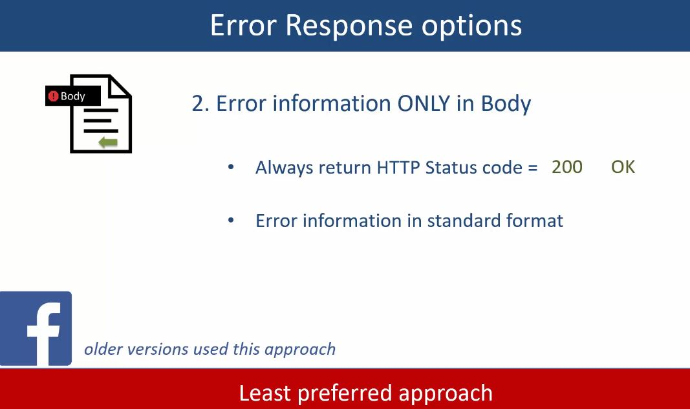

# Section 5: REST API Error Handling Patterns.

REST API Error Handling Patterns.

# What I Learned

# REST API Error Handling Practices.

    

1. Client can have own error code format.
2. This code format needs to be **Standardized** across API.

    

1. Client send request to server.
2. Gets back response.
3. API implementation how error is sended to back to REST client.

- This one option to implement **Header** information.

    

2. This can have **Custom Header** information about error.

 

    

1. Example API using additional field to store error message. 

    

1. Older version of fb used to use this.

- This one does not ailing HTTP standard so well. Should not be used!

    

1. Error information is in **Header + Body**.
2. Error code is key factor here, is the **message in body** or is the **error**.

- This is preferred approach of most nowadays!

    

 

    

1. Development team should use API codes **consistently!**

- Here high-end example. 

    

- Here low-end example.

    

 

    

# Application Error Handling Patterns.

    

- You could want to save error logs into db.
    - This common practice.

    

1. Developers needs to see what is wrong? **"Actionable"**. 
    - Example. API return **required field.** So developer can take action on it!
2. If you uses **ERROR**, use consistent style.

- Some way to make error meaningful.

    

 

    

- Like **HTTP status code**, API:s should have their **own status codes**!
    - These can be used by API clients.

- User case for Error.

    

- Error List, in our case.

    

- Some errors here.

    

- Example case from PayPal.

    

- **Response Envelope** is schema for error messages.

    

- In this there are **two** parts.

- If **Status** is Error
    - There is no payload.

- Expedia uses this.

    

