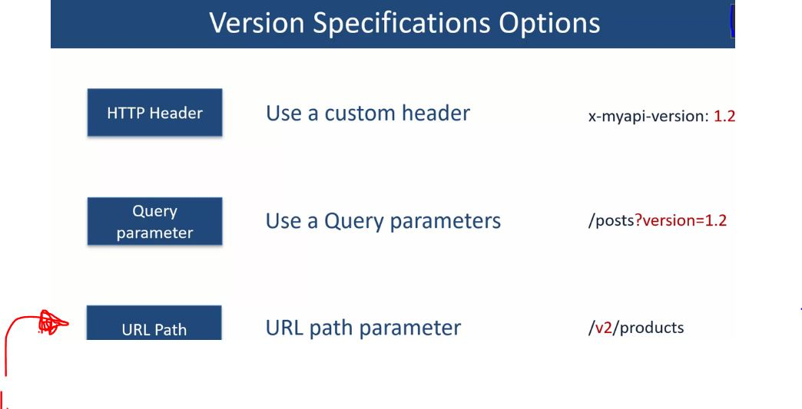
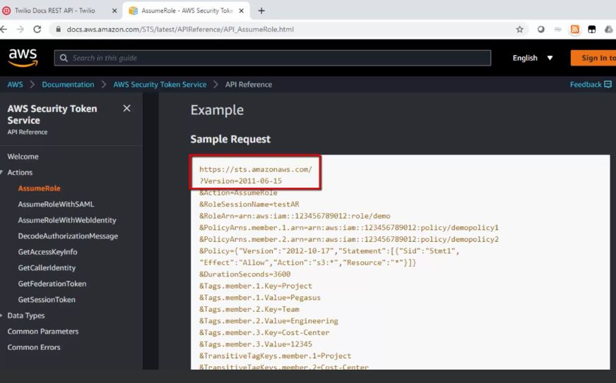

# Section 06 - REST API Handling Change - Versioning 

# What I Learned

# 32. Handling changes to API

1. Changing API will **impact external** user as well as **internal users**. 

1. When calling original API `/deals` user get back array of results.

1. Since this is changed, this will not brake API. **Non Breaking Change**.

- This code change will break the API. **Breaking Change**.

1. We need to change code with this change.

1. These changes will not changes application.
2. These changes will make **Breaking Change**. 

1. Back end tech also can also be **Breaking** or **Non-breaking**.
2. If database field **length** changes to more higher characters. API developer can just change restrictions to return from db.
3. Application will need to add extra variable.

1.  API should be changed once per 6 month if needed.

# 33. Versioning the API

1. This is different than source versioning.

2. API designer needs to decide on these aspects.

- Consumer should able to connect any version of these API:s.
    - There is **three ways** to do these.
    - **HTTP Header**, **Query parameter** and **Url Path**

1. This the most popular way to specify versioning!

- There is other versioning formats.

- In here we specify with **URL Path** with **Date**.

- In here we specify with **Query Parameter** and **Date**.

 

- When doing query we provide **Date** as **Query Parameter**. 

 

1. You can see the versioning.

- **URL Path** and **Number** with The Movie Db.

- Other example.

 

# 34. Walk through : ACME API Versioning

 

1. **v1** and **v2** versioning is being used.

1.  When new version of API is released, old one is marked as **deprecated**.
    - No more **new subscription** to te deprecated one by new developers.
    - New users are given access to new version only.
2. in **Q3** version-1 is deprecated.
3. Developer can choose multiple version of API.

 

