# Section 09 - REST API Security

# What I Learned

# 42. REST API Security - Introduction

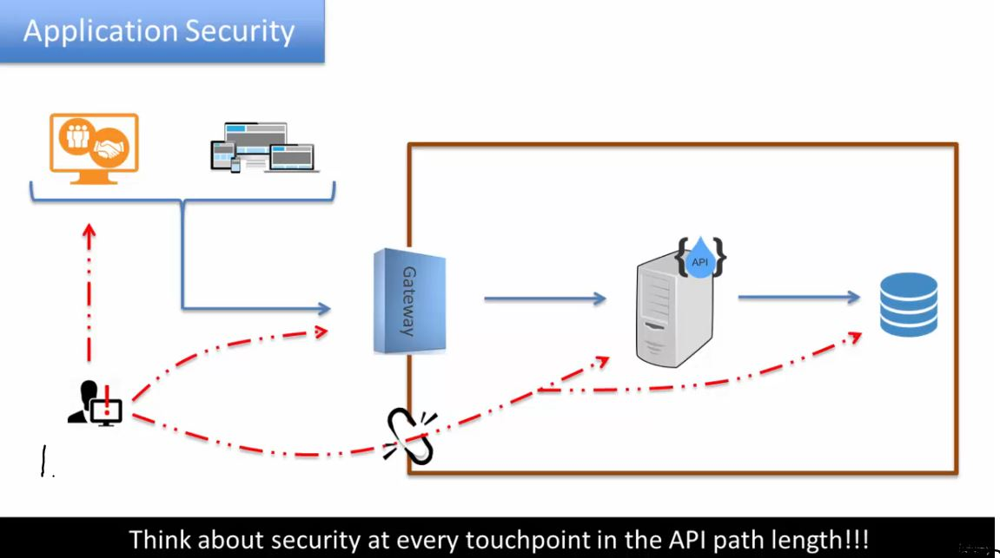

1. Attack can attack any of these points!

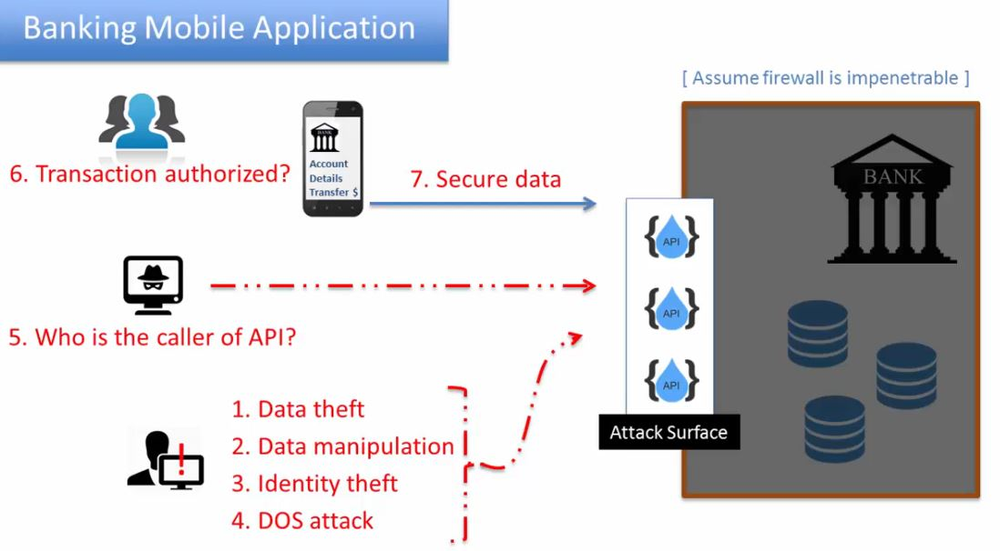

1. Attacker can steal these one.
2. Attacker can fake API calls.
3. We need to have some users authenticated by customer.
4. Data itself needs to be secured.

- We need think about authentication. Most common ways:
    - Basic auth.
    - Token auth.
    - Key secret based auth.

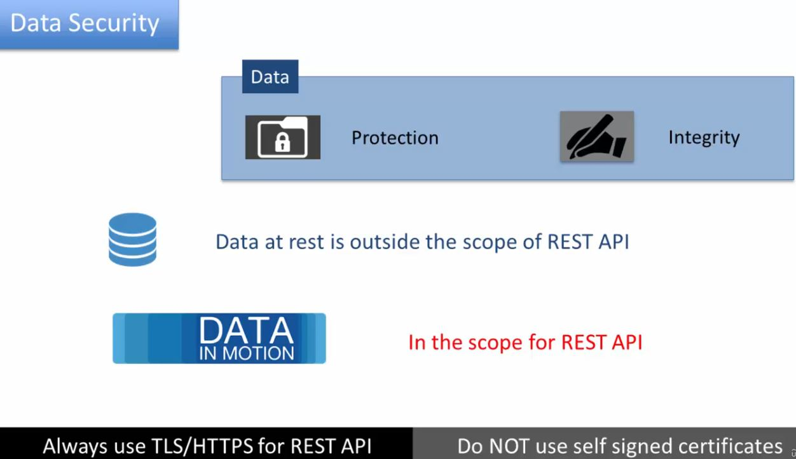

1. Data in db, in REST. is out of scope of this. This needs to communication with other stake holders.
2. Who ever uses your REST API is in this scope. **ALWAYS** use **TLS/HTTPS** for **REST API**.

 

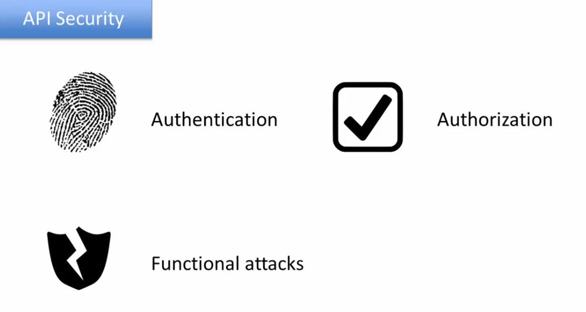

# 43. Securing API with Basic Authentication

- **Basic is authentication** is the most **basic** authenticating.
    - It is included with HTTP standard.

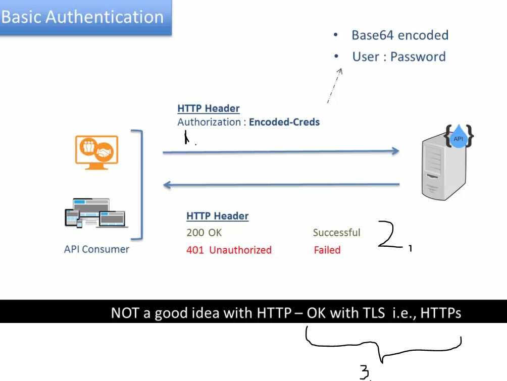

1. **Password** and **User** is sended to the server in header.
2. Server will answer with status codes.
3. **Basic authentication** should be used with **TLS** or **HTTPs**. NOT with **HTTP**.

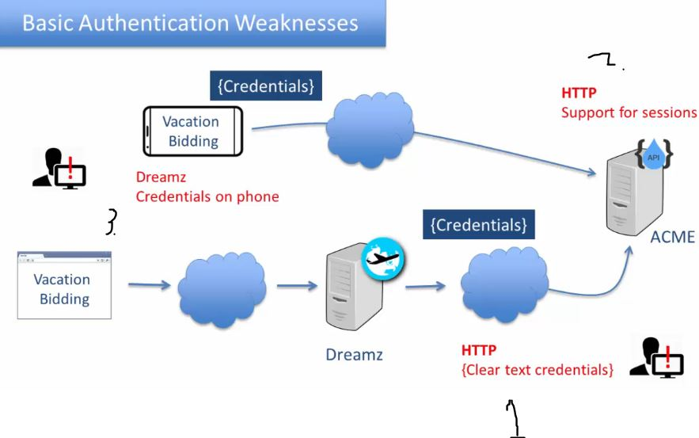

1. If password is sended in unsecure channel **HTTP** by 3rd party route.
2. Using of **sessions** is not best REST practices and credentials is needed to send with every request.
3. If there is 3rd party platform, the credentials needed to hardcode in mobile app.

- [Security](https://github.com/acloudfan/REST-API-Course-Security)
- [JWT](https://github.com/acloudfan/REST-API-Course-Security/tree/tokens)

- We be using plugin in Node.js

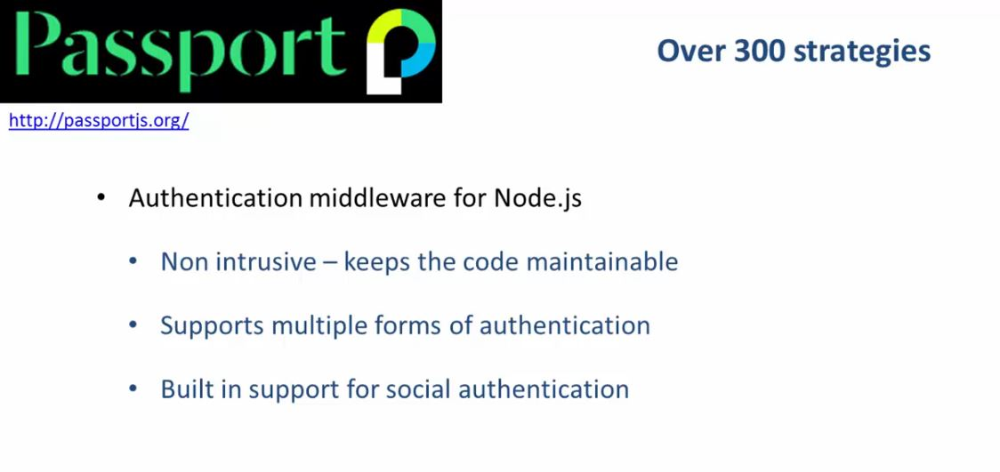

 

1. You can see how **Basic Auth** works.

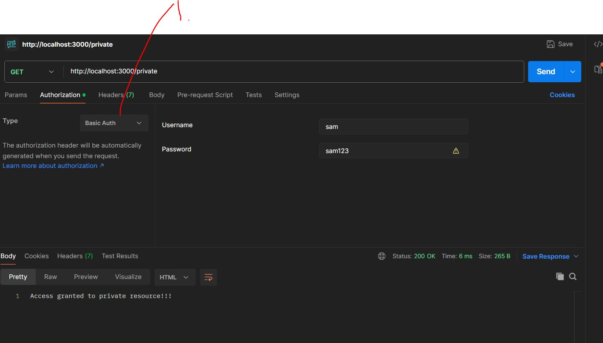

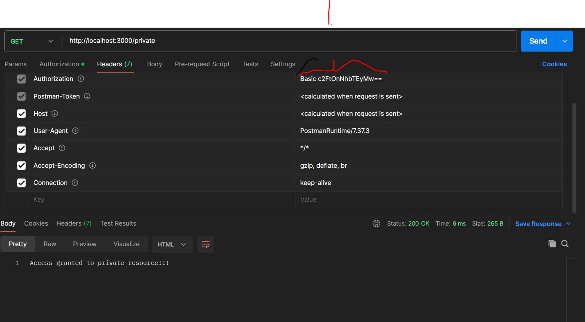

1. Select **Basic Auth**.

- As you can see **credentials** are stored in **Base64** format inside **Authorization** header.

 

- **Base64** can be easily decoded.

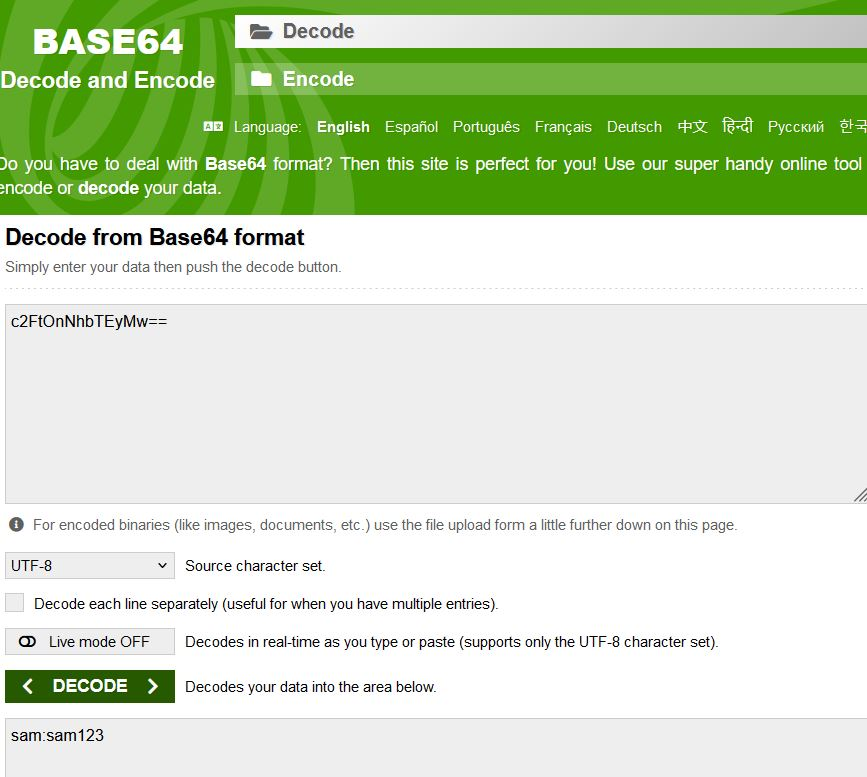

 

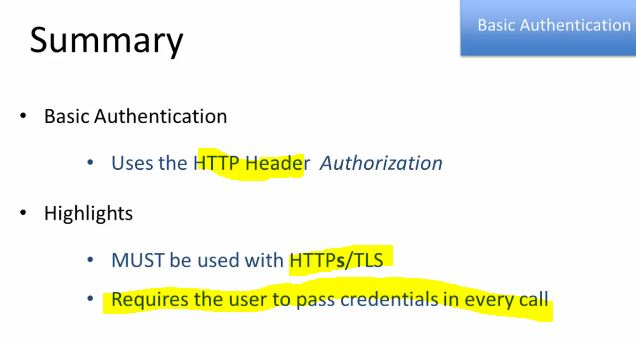

- To fix sending credentials every request. We need to use **Session**, but this is not **REST**.

# 44. Securing API with Tokens & JWT

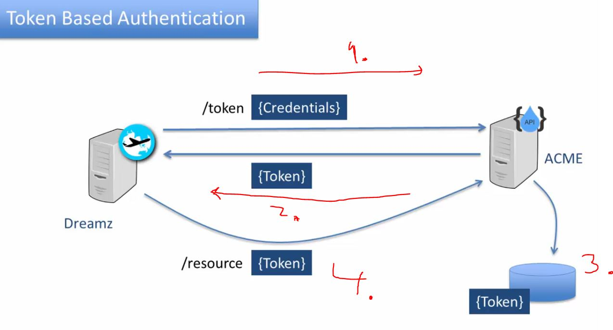

1. Invoke `/token` endpoint with credential.
3. Issuing token, its saved in storage.
2. ACME will send token back to **Dreamz**.
4. Token is needed to use when using ACME from now one.

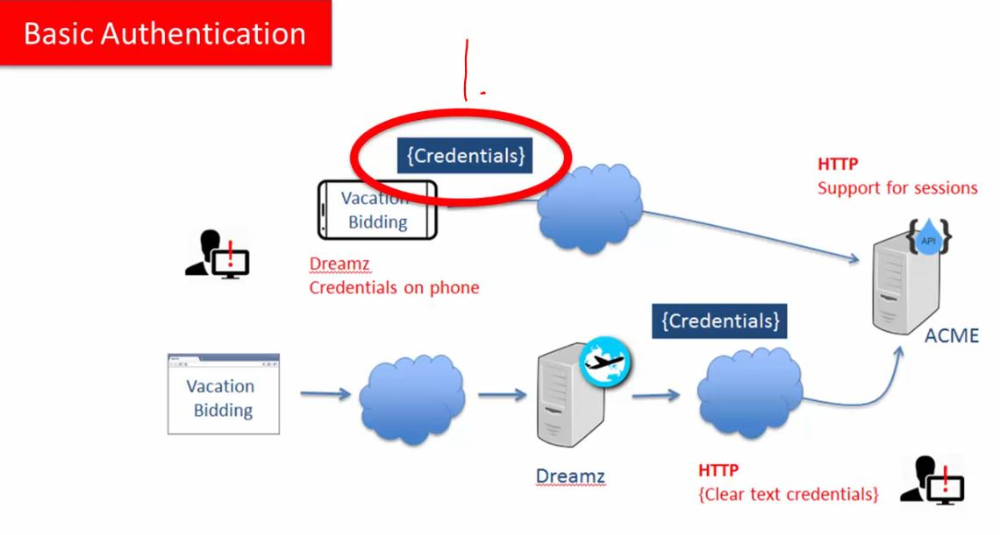

1. If using **Basic Authentication**, the credentials is needed to store in mobile app.

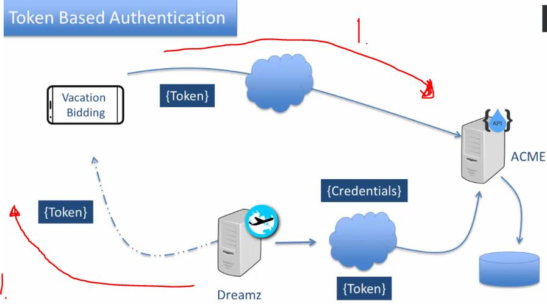

1. Tokens are passed around, not credentials.

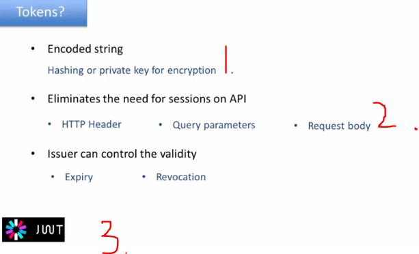

1. Token goes thought hashing/encoding.
2. Token can be sended in different places.
3. There is many token standard, but most famous one is <b>JWT</b>.
    - Multiple sites are using <b>token based authentication.</b> Like Facebook, Twitter/X and LinkedIn.

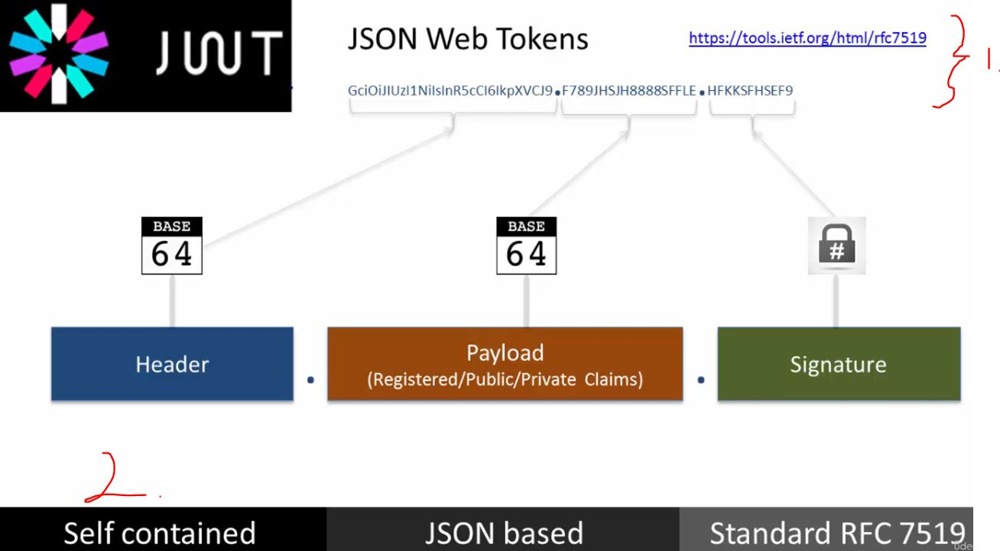

1. JSON web token format.
2. **Self contained** information about user and token is collected inside here.

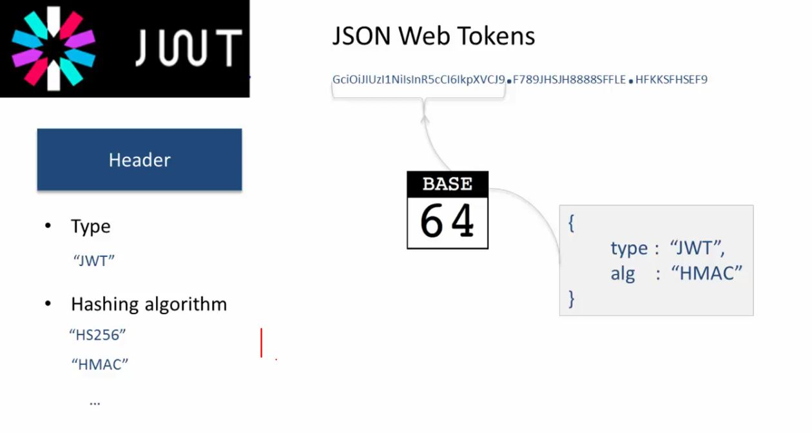

1. There can be multiple **Hashing algorithm**.

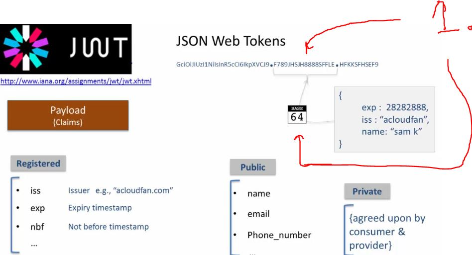

1. Payload here, it get **base64 encoded**.

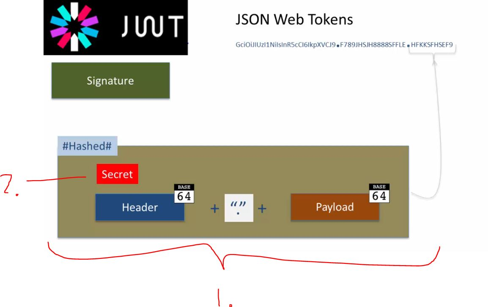

1. Secret is created with following.
2. After this, this is **hashed** with secret. 
3. Output is this part.