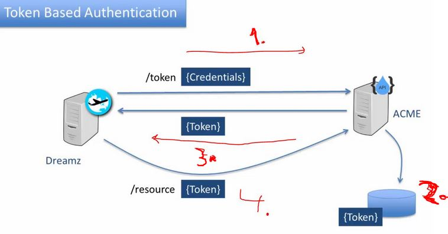

# Section 09 - REST API Security

# What I Learned

# 42. REST API Security - Introduction


1. Attack can attack any of these points!


1. Attacker can steal these one.
2. Attacker can fake API calls.
3. We need to have some users authenticated by customer.
4. Data itself needs to be secured.

- We need think about authentication. Most common ways:
    - Basic auth.
    - Token auth.
    - Key secret based auth.


1. Data in db, in REST. is out of scope of this. This needs to communication with other stake holders.
2. Who ever uses your REST API is in this scope. **ALWAYS** use **TLS/HTTPS** for **REST API**.

<br>


# 43. Securing API with Basic Authentication

- **Basic is authentication** is the most **basic** authenticating.
    - It is included with HTTP standard.


1. **Password** and **User** is sended to the server in header.
2. Server will answer with status codes.
3. **Basic authentication** should be used with **TLS** or **HTTPs**. NOT with **HTTP**.


1. If password is sended in unsecure channel **HTTP** by 3rd party route.
2. Using of **sessions** is not best REST practices and credentials is needed to send with every request.
3. If there is 3rd party platform, the credentials needed to hardcode in mobile app.

- [Security](https://github.com/acloudfan/REST-API-Course-Security)
- [JWT](https://github.com/acloudfan/REST-API-Course-Security/tree/tokens)

- We be using plugin in Node.js.


<br>


1. Select **Basic Auth**.


1. You can see how **Basic Auth** works.

- As you can see **credentials** are stored in **Base64** format inside **Authorization** header.

<br>

- **Base64** can be easily decoded.


<br>


- To fix sending credentials every request. We need to use **Session**, but this is not **REST**.

# 44. Securing API with Tokens & JWT



1. Invoke `/token` endpoint with credential.
3. Issuing token, its saved in storage.
2. ACME will send token back to **Dreamz**.
4. Token is needed to use when using ACME from now one.


1. If using **Basic Authentication**, the credentials is needed to store in mobile app.


1. Tokens are passed around, not credentials.


1. Token goes thought hashing/encoding.
2. Token can be sended in different places.
3. There is many token standard, but most famous one is <b>JWT</b>.
    - Multiple sites are using <b>token based authentication.</b> Like Facebook, Twitter/X and LinkedIn.


1. JSON web token format.
2. **Self contained** information about user and token is collected inside here.


1. There can be multiple **Hashing algorithm**.


1. Payload here, it get **base64 encoded**.


1. Secret is created with following.
2. After this, this is **hashed** with secret. 
3. Output is this part.


1. `/token` is invoked, where credentials are invoked in body.
2. Saved in token store.
3. Caller will call `/private` endpoint with **token**. This then **validated** with token store.

- There is multiple packages for **JWT**.

- Creating token and saving it in servers side if user is valid.

```
var jwt = require("jwt-simple");
var moment = require('moment')
var users = require(__dirname + '/../userdata/users')
var tokenStore = require(__dirname + '/tokenstore')

var jwtParams = {
    JWT_TOKEN_SECRET: 'whateversecret',
    JWT_TOKEN_ISSUER: 'ACME Travels',
    ACME_TOKEN_HEADER: 'x-acme-token',
    JWT_TOKEN_EXPIRY: 30   /** Set to expiry after 30 seconds */
};

// Issues the token
var auth = function (req, res) {
    if (req.body) {
        // Body has the username & password
        var user = users.checkCredentials(req.body.name, req.body.password);
        //console.log(req.body)
        if (user) {
            // Authenticated
            var expires = moment().add(jwtParams.JWT_TOKEN_EXPIRY, 'seconds').valueOf();
            // Create the PAYLOAD
            var payload = {
                // Registered claims
                exp: expires,
                iss: jwtParams.JWT_TOKEN_ISSUER,
                // Public claims
                name: user.name,
                email: user.email
            }

            console.log("Created Payload:")
            console.log(payload)

            // Encode the token
            // HEADER internally created by jwt-simple
            var token = jwt.encode(payload, jwtParams.JWT_TOKEN_SECRET);

            // Add the token to token store
            tokenStore.add(token, payload)

            // Return the token to the caller
            res.json({ token: token });
           
        } else {
            // User not found or password incorrect
            res.sendStatus(401);
        }
    } else {
        // Body did not have the username/password data
        res.sendStatus(401);
    }
}

exports.auth = auth;
exports.params = jwtParams;

```

- App file for JWT.

```
// JWT Token Authentication
// Part of the course on "REST API Design Development & Management"
// http://www.acloudfan.com

var     express = require('express')
var     bodyParser = require('body-parser')
var     jwtAuth = require(__dirname + '/tokens/jwtauth')
var     jwtValidate = require(__dirname + '/tokens/validator')

// Express app setup
var app = express();
app.use(bodyParser.json())
var router = express.Router();

// This is the passport middleware function tha get called first
var  auth = jwtAuth.auth
router.post('/token',auth,function(req, res){
    res.send('token');
});

auth = jwtValidate.auth
router.get('/private',auth,function(req,res){
    res.send('Access granted to private resource!!!')
});

app.use(router);

app.listen(3000);

console.log('Listening on 3000')
```

- Validating.

```
// DO NOT USE THIS IN PRODUCTION Implementation
// This is just for demo purposes
var jwt = require("jwt-simple");
var jwtAuth = require(__dirname + '/jwtauth')
var tokenStore = require(__dirname + '/tokenstore')

var  auth = function(req, res, next) {
    
    // Token sent by the client HTTP header X-ACME-Token
    var token = req.headers[jwtAuth.params.ACME_TOKEN_HEADER];
    //console.log(token)
    if(token === undefined){
        
        // Send 401 with reason for failure
        res.statusMessage = 'Unauthorized : Token not provided!!!'
        res.sendStatus('401').end()
        // Do NOT call next()

    } else {
        // Decode the header
        try{
            var decoded = jwt.decode(token, jwtAuth.params.JWT_TOKEN_SECRET)
        }catch(e) {
            // Decode exception
            res.statusMessage = 'Unauthorized : Invalid Token!!!'
            res.sendStatus('401')
            return;
        }

        // Token is valid so check if it's expired
        if(!tokenStore.isValid(token)){
            res.statusMessage = 'Unauthorized : Token invalid or Expired!!!'
            res.sendStatus('401')
            return;
        }
        next();
    }
}

exports.auth = auth
```

- Expiration checking.

```
// Validates the token passed by the caller
// {tone:tok, expires:timestamp}
var  tokens = [];

module.exports = {
    add: function(token, payload) {
        tokens[token] = payload
    },

    isValid: function(token){
        if (tokens[token] === undefined) return false;

        if(tokens[token].exp <= new Date()){
            var ndx = tokens.indexOf(token)
            tokens.splice(ndx,1)
            return false
        } else {
            return true
        }
    }
}
```

<br>


- Here you can see token decoded from **base64**.


# 45. Securing API with API Key & Secret

- Key and secret security scheme.


1. Secret and password is ment for computer.


1. With **Digital Signatures**. We will not send **Credentials**, we send **API key** + **Signature**.
2. **Signature** is created using some kind of hashing process. Using **API Secret** on **Header** or some **Payload**.
3. Servers holds **Keys** and **Secret** for every API consumer. When server receives request from API, it knows who sended it.


1. Amazon S3 REST services allow, anonymous access with.
2. **Signature** using **Secret**.
3. This is the **Secret**.
4. This is then **Base64** encoded.

- Then at Amazon end, they apply same **Secret** and if they get same **Signature** they know, who the caller is!


1. When is called, entry is called.
2. Twitter can restrict **External Applications** calling with **Rate** limiting.

- Rate limiting at **Walmart** [API](https://developer.walmart.com/doc/us/us-supplier/us-supplier-rate-limit/).


1. API developer needs to decide in where **API key & Secret/Signature** is placed.
2. How API provider will manage keys and secrets. Example, need for database. How is keys invalidating.
3. How API key and security is implemented.
4. How these is keys are provided to application developer(in webpage or sended by email).
5. Where would you implement Rate limiting & analytics.
- These should be **NOT** be implemented into API CODE!
6. Instead you should use **API Management Platform**.


# 46. API Authorization using OAuth2.0


1. **ACME** page is getting popular. They start add more data! ACME saves customer data.
2. **Dreamz** want to sell packages based on this **ACMES** data. **Acme** does not own that data, it belongs to customer. **Dreamz** should ask customer is it OK to use that data.


1. **Dreamz** ask customer is it OK to use the data.
2. **Dreamz** call for customer information with + **Proof of Authorization** from customer.
3. **ACME** checks **Proof of Authorization**, if its OK, it allows the access.

<br>


1. OAuth is flexible framework.
2. Its based on tokens. There is different types of tokens.
3. There is 5 methods for accessing these access tokens. These are called **grants**.
4. User can decide what data is user authorized for.
5. Application client needs **API & Secret**.
6. **OAuth** is defacto by many companies. Here is spotify for example.


1. **Authorization Scope Grant** is most common. You can use **Fb login** to login in other websites.

- There is three parts, in here.

2. **End user**. 
3. **Client** or **Application**.
4. Provider of API. It has **Authorization Sever** and **Resource or API Server**.
5. **Flow:**
    - **1.** Application asks users to grant the authorization. 
    - **2.** User grants the authorization.
    - **3.** Application sends the authorization **Grant** to **Authorization Server** for validation.
    - **4.** Return the access **Token**.
    - **5.** Client can repeatedly use the **Access Token**.
    - **6.** Protected Resource is returned.


