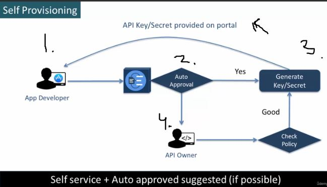
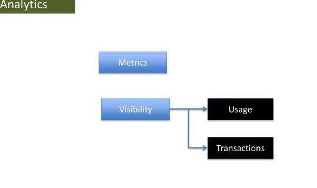
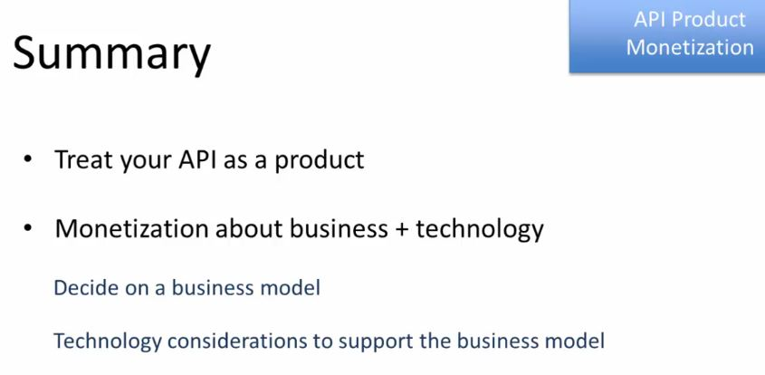

# Section 11 - API Management

# What I Learned

# 53. Introduction to API Management

 

1. These are manged by API Management.
2. Different API management platform.

1. There is many different servers running environment. API **polices** are applied to to API itself, trough some kind of **agent**.

1. Proxies are defined on the proxies. Calls routed to proxy are directed into API implementations.
2. **Policies** are implemented into proxy not to the **API**:S.
    - Security policies and traffic management policies. 
3. App developers can access **dev portals**

# 54. API Lifecycle & Developer Productivity

### Different stages of API

1. **Build** stage. API is created.
2.  After testing and validation, it goes **Publish** stage. App developer can get access to API.
3. **Published** version of API is marked as **Deprecated**. New developers are not granted **request access** to API.
4. API get **Retired** and code can be removed.
5. Example. When API is to Publish -> Public stage, is the documentation needed for developer to be made?
6. Roadmap is provided in advance. Even more crucial if app developers are external.
7. Keeping application developer community informed about lifecycle stage transitions.
8. Tools can be used as well.

1. API **Lifecycle** is not standard feature on API:m platform.

- Example here. IBM API Connect does support **Lifecycle** management. This whole process is supported by **API manager**.

1. These should be easily accessible trough **Developer Portal** 

1. There is different specification for creating API:s(Swagger) or for example **.RAML**.
2. We want write policies not to code itself, rather to the **.XML** or **JSON** or some other language.
3. If these wont be enough, there is extensible languages.

1. Paste **.RAML**  for creating API in **2.**.

- Demo about applying policies. We are going add **Basic Authentication** policy.

- You can add authentication in platform easily. 

# 55. API Developer Portal

- Developer portals are one stop for developer.

1. For external document you need link to **external** element.

- You can try out the Swagger API inside documentation.

1. Asking for access for **API** trough some mean.
2. API owned checks the policy. 

- This works on small or private team!

1. App developer logs in dev portal.
2. App developer makes request for access.
3. Key/Secret is auto generated and its shared with app developer at portal.
4. Other way is trough manual also. This is check **trough policy**.

- **Best approach** is to use **Self Service** + Auto approved.

- Registering to web page for API registration.

- API Management Platform gives access for **provisioning** for API. Like **apigee**.
    - You can set manual or automatic provisioning.
- Benefits for API Management Platform. Runtime and Dev portals are integrated.

- Below example from **apigee**.

1. Approval will be automatic or Manual.
2. Visible to.

1. You may need some ticketing system.
2. For API that are outside of organization, you may need provide these.

# 56. API Security Management

- Public data.

1. All data should have minimal security.
2. For using minimal security comes with benefit. Easier to add logging.

 

- **Key/Secret** management is not trivial implement.

1. **You** should implement **OAuth2.0** in you API CODE!
    - Instead you should get **off the shelve OAuth2**.
2. This will be connected to LDAP and this server will take care of all of this.

- These are most popular which is targeted to API.

1. Create scenario which mimics functional attacks.
    - Functional attacks on API.

1. In **Apigee** you can add following proxy protections.

 

1. Define proxy that connects to API implantation.
2. Polices are applied to proxy.

#### Some practices for secure API

 

# 57. API Traffic Management

 

1. Three main reason why API provider should **manage the traffic**.

1. Response time from database.
2. There will be bug in application.
3. End user response time for another customer will suffer to **5 secs**.

- We need to prevent from such happening for other our customer. Application should not suffer from **one misbehaving application**.
    - Use **Response time consistency**.

1. Is API response under 1 seconds
2. How check if client is making 10,00 per day.

1. Traffic management call, should be implement on edge of network. If not done this can be affecting internal usage of **API**. 
    - In case of DDOS attack.

2. This can be done using throttling or blocking requests.

1. Traffic policies can be applied to the proxy.
    - These can be **Quata**, **Rate Limiting** and **Spike Arrest**.

1. Maximum number of calls per unit time. Application can make to **API**. 
    - All public API today defines maximum calls.
2. There is no **Quata** in internal usage.
3. Externals **Quatfa** is 350 calls/Hour.

1. You can see for this account **Quata** 5000 per day.

- [Quata example](https://github.com/acloudfan/REST-API-Course-API-Management)

- Example setting **Quata** in Apigee. 

 

- With **Rate Limiting** we can limit **concurrent** connections to API.

1. To network we can make 100 concurrent calls/sec. Se we need to rate limit this on to "**20 concurrent calls/sec**" to each of these applications.

- Example in **Walmart Open API**.

1. Calls per second is limited to 5.

- **Spike Arrest** prevents calls from some mark reaching backend.

1. **Spike Arrest** policy configured

 

# 58. API Analytics

1. You see uses of API:s
2. You can catch errors from you API:s
3. You can understand threads/attacks better for preventing these kind of faults.
4. **Proxies** can catch interning data from API.

- Two categories for Analytics.

1. Metrics, error rate, response rate ... etc.
2. Visibility.
    - Into usage of API.
    - Into Transactions.

1. You can get following metrics form your api from this category. Example **average response time**.
2. Error rates. **API errors**.
3. **SLA** If you are **achieving promised SLA rates**.

1. Who is the the most poplar developer using your API.
2. **Region based** analytics from which region API is going invoked.
3. From **which device** the API is invoked.
4. This is very specific feature, not all are supporting this one.
    - These analytics need to build into **proxy**.

- All platform support analytics, but its different how they implement their analytics.

# 59. API Product and API Monetization

- You need to treat API like product, to sell it as product.

- There is two ways to get revenue from API. **API Monetization**.

1. They charges directly for using their API:s.s
2. Revenue is collected when their product is advertised or sold in their platform.

- Different monetization models.

 

 

