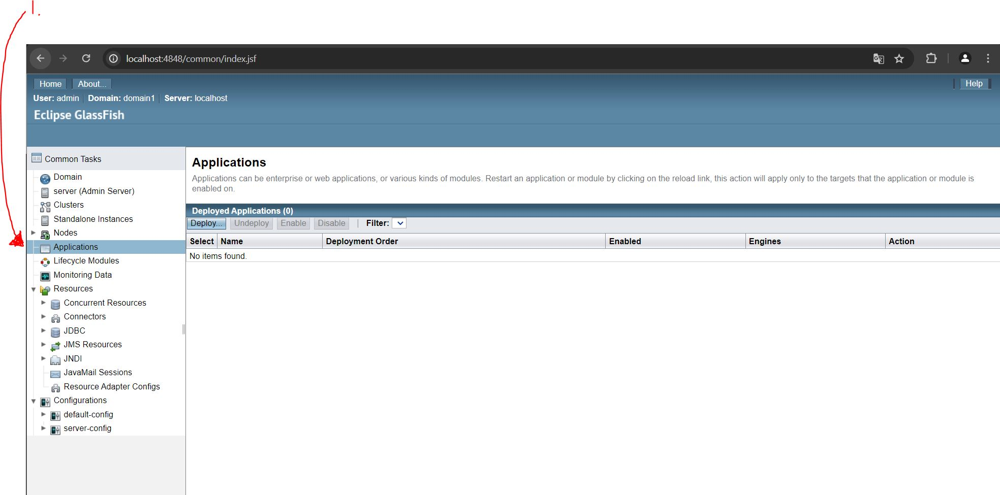

# SOAP Web Services 05 - Setting up Java EE 7 SDK

- [GlassFish Included nowadays](https://www.oracle.com/java/technologies/javaee-8-sdk-downloads.html)

- Starting **GlassFish** server. In Widows:
    - `asadmin start-domain`
    - `asadmin stop-domain`

- Admin UI: `http://localhost:4848/common/index.jsf`.

1. Deploying basic Java app in **GlassFish** server.

