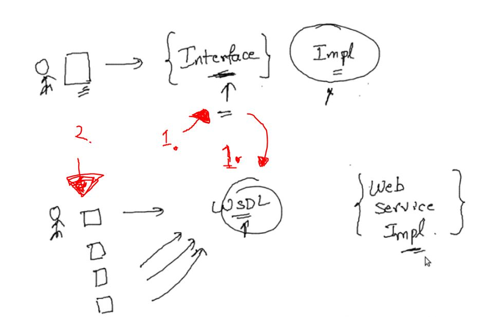
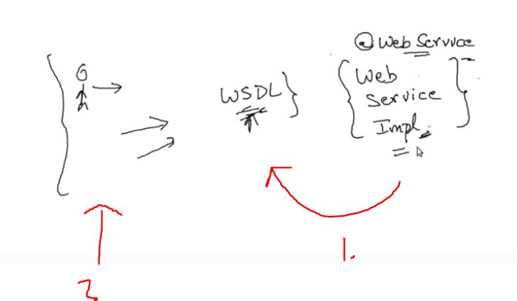
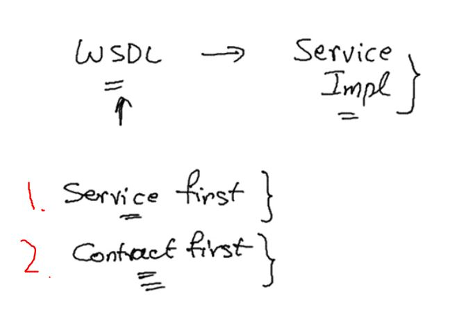

# SOAP Web Services 09 - Service First and Contract First Web Services

- `@WebService` is for simple Web Service.

- Do we write **Implementation** or **Interface** first?

1. If we write **Interface** first, then whenever client code changes → we don't need to change **Interface**.
2. Clients does not need to change.

1. This way around Web Service Implementation is made first, then **WSDL** is generated automatically.
2. Now clients get affected when ever **Web Service** is updated.

- There are two ways to write **Web Services**.

1. Write **Service Impl** first.
2. **WSDL** then generate **Service Impl** out of it.