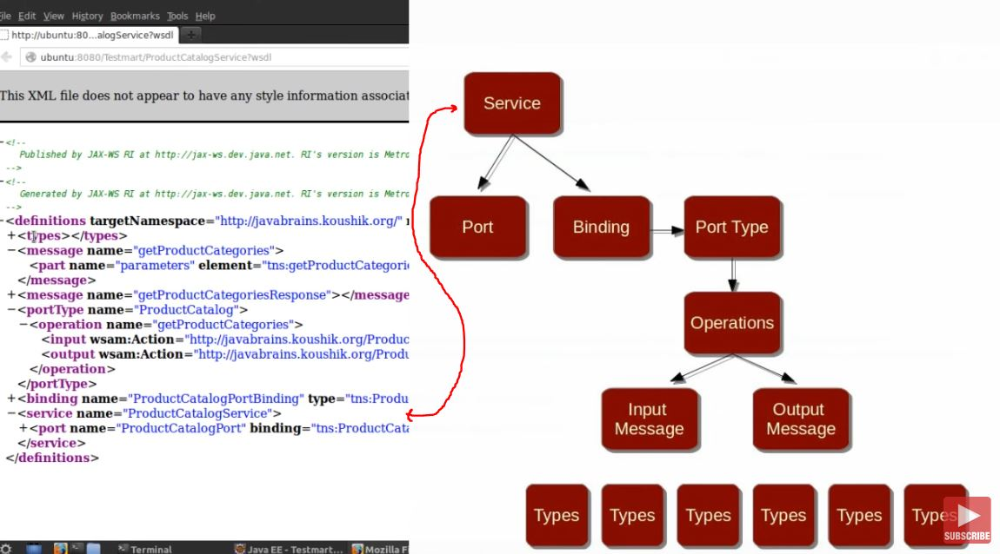

# SOAP Web Services 10 - Understanding the WSDL

```
public interface Calculator {

    int add (int a, int b);
    int multiply(int a, int b);

}
```

- Excluding method out of **Web Service**.

```
	@WebMethod(exclude = true) //This is optional
	public List<String> getProducts(String category)
	{
		System.out.println("Get Products");
		return productService.getProducts(category);
	}
```

- This is in **WSDL** interface. There is interface with input and output.

```
<portType name="ProductCatalog">
<operation name="addProduct">
<input wsam:Action="http://javabrains.org/ProductCatalog/addProductRequest" message="tns:addProduct"/>
<output wsam:Action="http://javabrains.org/ProductCatalog/addProductResponse" message="tns:addProductResponse"/>
</operation>
```

- Types are defined here, like Types in Java. There needs to be types in **WSDL**.

```
<types>
<xsd:schema>
<xsd:import namespace="http://javabrains.org/" schemaLocation="http://localhost:8080/TestmartSoap/home?xsd=1"/>
</xsd:schema>
</types>
```

- In **WSDL** there is one input and one output are bundled together.

- Return and argument type defined in **WSDL**.

```
<message name="addProduct">
<part name="parameters" element="tns:addProduct"/>
</message>
<message name="addProductResponse">
<part name="parameters" element="tns:addProductResponse"/>
</message>
```

- **Binding** how Web Service accepts requests.

```
<binding name="ProductCatalogPortBinding" type="tns:ProductCatalog">
</binding>
```

- Where **service** is made available and in what **port**.

```
<service name="ProductCatalogService">
<port name="ProductCatalogPort" binding="tns:ProductCatalogPortBinding">
<soap:address location="http://localhost:8080/TestmartSoap/home"/>
</port>
</service>
```


