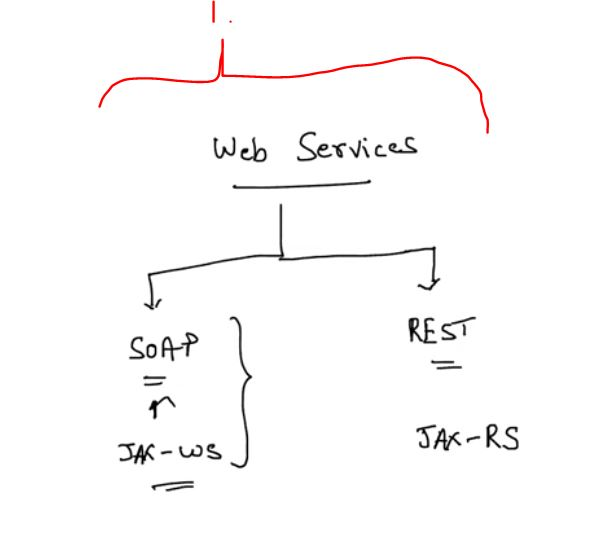
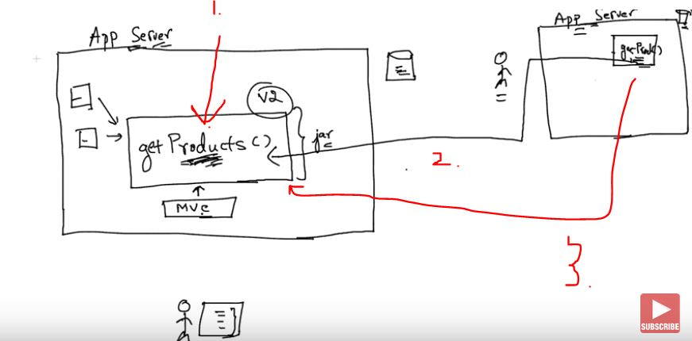

# SOAP Web Services 01 - Introduction To Web Services

- There is two main types of **Web Services**

- **SOAP** is the older one.

1. In Java World there is two main specifications for these ones. 
    - For **SOAP**: JAX-WS
    - For **REST**: JAX-RS

- **Website** is ment for human consumption.
- **Web Services** is for computer consumption.

1. Call for your business logic
    - This can be called by your app.
2. One way to deploy same functionality is to share the **.jar** for your friend, but when **.jar** files are updates, its needed to updated for your friend.
3. This call to one **getProduct()** is called **Web Service**

- **Web Services** allows two different machines to talk to each other.
- Web Services are standard
    - We can write these in Java or C++ or whatever  language.
