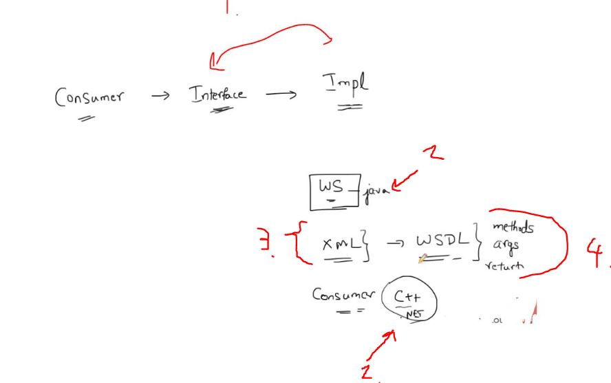
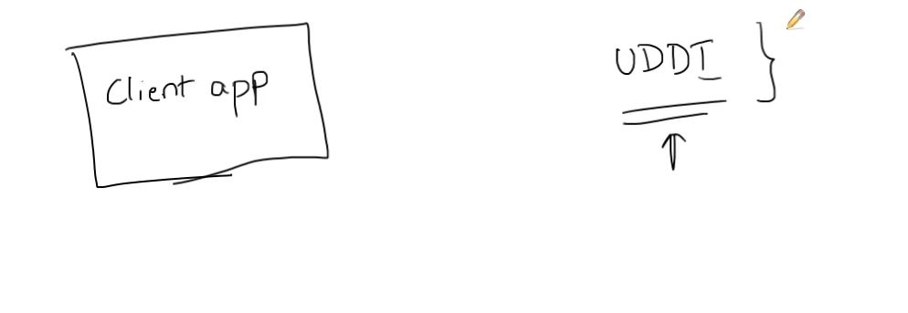
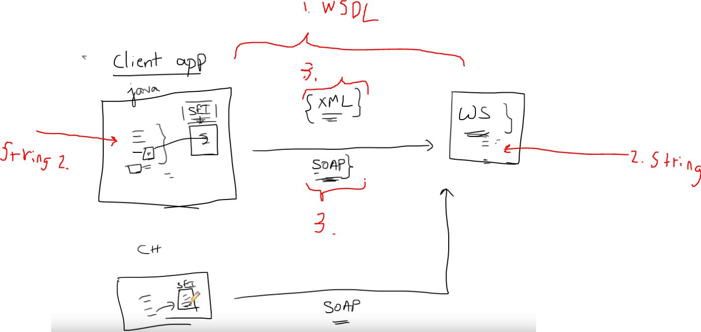

# SOAP Web Services 02 - Web Service Jargon

1. Best one is to share method is using **impl interface**.
2. If Consumer is made with **c++** and **Web Service** is Java. We need somehow to have same contract!
3. This is XML contract. This is called **WSDL**(**W**eb **S**ervice **D**escription **L**anguage). This will be **contract** between parties and in practice this is written in XML and shared between c++ Consumer, Java Web Service.
4. This will include  methods, return types and args, for example. Like **interface**.

- If your Client app, wants to discover what **Web Service** to call. Behaves like registry.

1. You can get information about interfaces of **Web Services**  using **UDDI**(**U**niversal **D**escription **D**iscovery and **I**ntegration)
    - Not the most popular concept.

1. We know the commutation like input types..etc, **WSDL**.
2. We want send **String in Java** and to client in **c++ String**. These are different! How you communicate this difference?
3. To send this **String** it needs to be in language neutral format like **XML** format. Now we send this **XML** via **XML protocol** called **SOAP**(**S**imple **O**bject **A**ccess **P**rotocol).
4. **SEI**(**S**ervice **E**ndpoint **I**nterface) Transfer your message to **SOAP** message. In this case Java Object to **XML SOAP** message. This is not needed to write by ourself, this **can be generated** for us.
    - You can have different endpoints every type of consumer.

