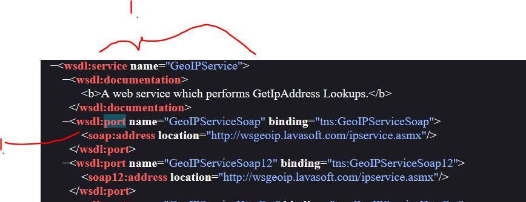
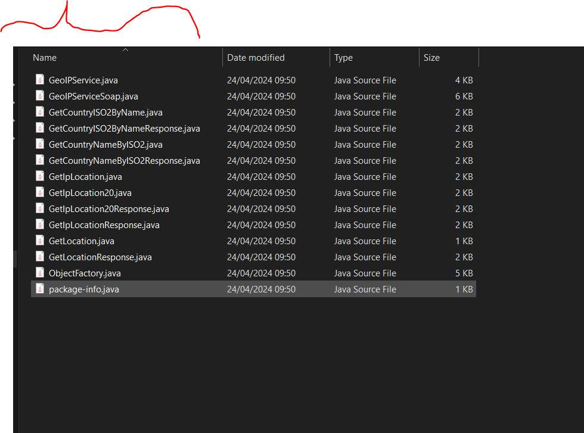

# SOAP Web Services 03 - Writing a Web service Client: Stub generation

- We are writing **Web Service** client. Of using [GeoIPService](http://wsgeoip.lavasoft.com/ipservice.asmx).

- Real World example of **W**eb **S**ervice **D**escription **L**anguage.
    - [Example if WSDL](http://wsgeoip.lavasoft.com/ipservice.asmx?WSDL).



1. Take note of these two important fields in **WSDL**. **Service** and **port**.

- Calling Service Point Interface in **Java**.

```

public class IPLocationFinder {

	
	public static void main(String[] args) {
			if (args.length != 1) {
				System.out.println("You need to pass in one IP addess");
				
			}
			else {
				String ipAdress = args[0];
				
				//Here we need to call Service Point Interface
				service.getCoutryName(ipAdress);
			}
	
	
	}
}

```

- Since `wsimport` is not shipped with **JDK** [anymore](https://stackoverflow.com/questions/72984802/installing-metro-jax-ws-and-running-wsimport-issue) we need to install `metro-jax-ws`.

- To install this, get this. This is from [here](https://eclipse-ee4j.github.io/metro-jax-ws/).

```
        <dependencies>
            <dependency>
                <groupId>jakarta.xml.ws</groupId>
                <artifactId>jakarta.xml.ws-api</artifactId>
                <version>4.0.0</version>
            </dependency>
        </dependencies>

        <dependencies>
            <dependency>
                <groupId>com.sun.xml.ws</groupId>
                <artifactId>jaxws-rt</artifactId>
                <version>4.0.0</version>
                <scope>runtime</scope>
            </dependency>
        </dependencies>
```

- We can call to **generate stubs using** `wsimport -keep -s src http://wsgeoip.lavasoft.com/ipservice.asmx?WSDL`.

- If cannot find **wsimport** you can download it separately. 
	- We install `wsimport` from [here](https://github.com/eclipse-ee4j/metro-jax-ws/releases/tag/3.0.2)

- We can see there is generated stubs for this **WSDL** web service.

