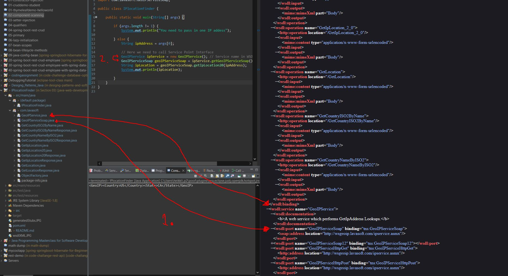

# SOAP Web Services 04 - Writing a Web service Client: Calling the Service

- Using Generated **SEI** in our Java code.



- All of these classes were generated from **WSDL**.

1. Service will have under same name generated service and port.
2. To use specific service: We need to create service and from there get port.

```
import com.lavasoft.GeoIPService;
import com.lavasoft.GeoIPServiceSoap;

public class IPlocationFinder {

	public static void main(String[] args) {

		if (args.length != 1) {
			System.out.println("You need to pass in one IP address");

		} else {
			String ipAddress = args[0];

			// Here we need to call Service Point Interface
			GeoIPService ipService = new GeoIPService(); // Service name in WSDL
			GeoIPServiceSoap geoIPServiceSoap = ipService.getGeoIPServiceSoap(); // Port inside WSDL
			String ipLocation = geoIPServiceSoap.getIpLocation20(ipAddress);
			System.out.println(ipLocation);

		}
	}
}

```