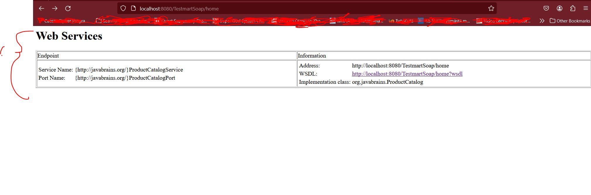
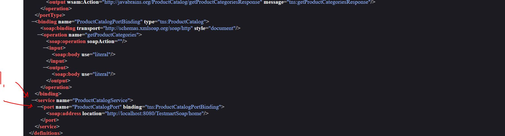

# SOAP Web Services 07 - Writing a Web service Client: Stub generation

- With **Tomcat 10**, you will need following configuration.

### web.xml

```

<?xml version="1.0" encoding="UTF-8"?>
<!DOCTYPE web-app PUBLIC "-//Sun Microsystems, 
Inc.//DTD Web Application 2.3//EN"
"http://java.sun.com/j2ee/dtds/web-app_2_3.dtd">

<web-app>
    <listener>
        <listener-class>
                com.sun.xml.ws.transport.http.servlet.WSServletContextListener
        </listener-class>
    </listener>
    <servlet>
        <servlet-name>ProductCatalog</servlet-name>
        <servlet-class>
         com.sun.xml.ws.transport.http.servlet.WSServlet
        </servlet-class>
        <load-on-startup>1</load-on-startup>
    </servlet>
    <servlet-mapping>
        <servlet-name>ProductCatalog</servlet-name>
        <url-pattern>/home</url-pattern>
    </servlet-mapping>
    <session-config>
        <session-timeout>120</session-timeout>
    </session-config>
</web-app>

```

### sun-jaxws.xml

```

<?xml version="1.0" encoding="UTF-8"?>
<endpoints
  xmlns="http://java.sun.com/xml/ns/jax-ws/ri/runtime"
  version="2.0">
  <endpoint
      name="ProductCatalog"
      implementation="org.javabrains.ProductCatalog"
      url-pattern="/home"/>
</endpoints>

```
- © Some smart dude from comment section!

- Converting this to SOAP Web Service.

```

public List<String> getProductCategories() {
		
		List<String> categories = new ArrayList<>();
		
		categories.add("Books");
		categories.add("Music");
		categories.add("Movies");
		categories.add("Cartoon");
		
		return categories;
	}

```

- Following example **WebService** in Java code.

```
package org.javabrains;

import java.util.ArrayList;
import java.util.List;

import jakarta.jws.WebMethod;
import jakarta.jws.WebService;

@WebService
public class ProductCatalog {
	
	
	@WebMethod //This is optional
	public List<String> getProductCategories() {
		
		List<String> categories = new ArrayList<>();
		
		categories.add("Books");
		categories.add("Music");
		categories.add("Movies");
		categories.add("Cartoon");
		
		return categories;
	}
}
```

-  When annotate the class with `@WebService` all the methods are for WebService, so its useless to annotate with `@WebMethod`, but you **could**.

- In **Tomcat** view endpoint. `http://localhost:8080/TestmartSoap/home`, you can see all the **WebServices**.



1. After annotating you can see web services.



1. WebService with postfix and port is created.

- Example of **WSDL** for our created **WebServices** `http://localhost:8080/TestmartSoap/home?wsdl`