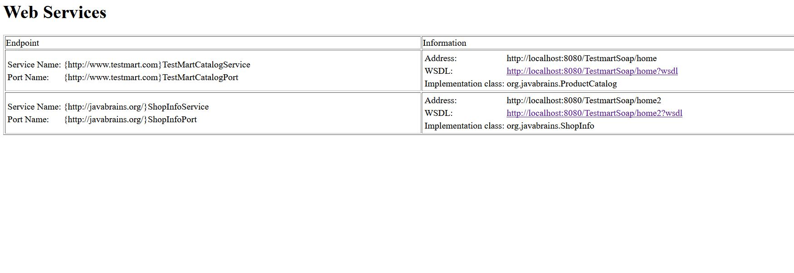
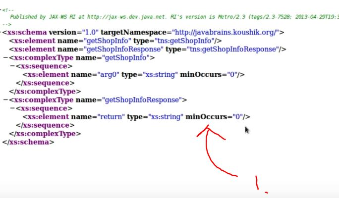

# SOAP Web Services 12 - Schema Types and Binding Styles

- Second Web Service.



<br>



1. We need one something. For input output.

- Default style is **DOCUMENT**.
    - **DOCUMENT** can be frameworks can **validate** this **WSDL** schema. Where **RPC** , can not!.


1. There is document style in **WSDL**.

- Changing document style to **RPC**.

```
<!--
 Published by XML-WS Runtime (https://github.com/eclipse-ee4j/metro-jax-ws). Runtime's version is XML-WS Runtime 4.0.0 git-revision#129f787. 
-->
<!--
 Generated by XML-WS Runtime (https://github.com/eclipse-ee4j/metro-jax-ws). Runtime's version is XML-WS Runtime 4.0.0 git-revision#129f787. 
-->
<definitions targetNamespace="http://javabrains.org/" name="ShopInfoService">
<types/>
<message name="getShopInfo">
<part name="arg0" type="xsd:string"/>
</message>
<message name="getShopInfoResponse">
<part name="return" type="xsd:string"/>
</message>
<portType name="ShopInfo">
<operation name="getShopInfo">
<input wsam:Action="http://javabrains.org/ShopInfo/getShopInfoRequest" message="tns:getShopInfo"/>
<output wsam:Action="http://javabrains.org/ShopInfo/getShopInfoResponse" message="tns:getShopInfoResponse"/>
</operation>
</portType>
<binding name="ShopInfoPortBinding" type="tns:ShopInfo">
<soap:binding transport="http://schemas.xmlsoap.org/soap/http" style="rpc"/>
<operation name="getShopInfo">
<soap:operation soapAction=""/>
<input>
<soap:body use="literal" namespace="http://javabrains.org/"/>
</input>
<output>
<soap:body use="literal" namespace="http://javabrains.org/"/>
</output>
</operation>
</binding>
<service name="ShopInfoService">
<port name="ShopInfoPort" binding="tns:ShopInfoPortBinding">
<soap:address location="http://localhost:8080/TestmartSoap/home2"/>
</port>
</service>
</definitions>
```

- Binding types in **RPC** is different. Some say its clearer.
    - Even **RPC** has two styles. **use** and **parametersStyle**.


- Changing RPC naming style for prams.

```
@WebService
@SOAPBinding(style = Style.RPC)
public class ShopInfo {
	
	@WebMethod
	@WebResult(partName="lookupOutput")
	public String getShopInfo(@WebParam(partName = "lookupInput") String property)
	{
		String response = "Invalid property";
		
		if ("shopName".equals(property)) {
			response = "Test Mart";
		}
		else if("since".equals(property))
		{
			response = "since 2012";
		}
		
		return response;
	}
}
```

- Now message is defined by such.

```
<message name="getShopInfo">
<part name="lookupInput" type="xsd:string"/>
</message>
<message name="getShopInfoResponse">
<part name="lookupOutput" type="xsd:string"/>
</message>
```