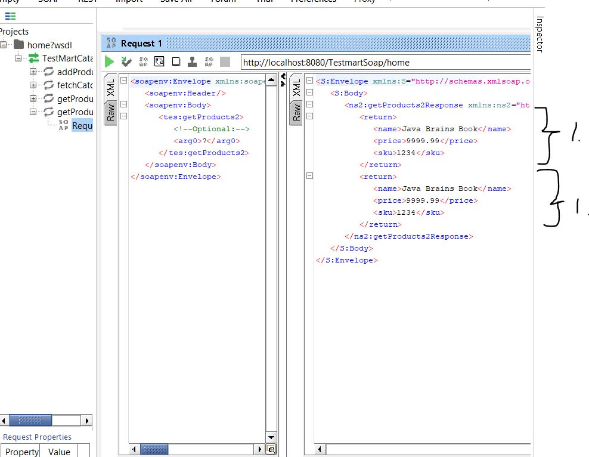

# SOAP Web Services 13 - Service Interface and Custom Types

### Pojo

```
package org.javabrains.model;

public class Product {
	
	private String name;
	private String price;
	private String sku;
	
	public Product(String name, String price, String sku) {
		this.name = name;
		this.price = price;
		this.sku = sku;
	}	
	
	public String getName() {
		return name;
	}
	public void setName(String name) {
		this.name = name;
	}
	public String getPrice() {
		return price;
	}
	public void setPrice(String price) {
		this.price = price;
	}
	public String getSku() {
		return sku;
	}
	public void setSku(String sku) {
		this.sku = sku;
	}


}

```

- When we change existing **WSDL** implementation code, we usually do new create new version. So version 2 `getProducts2()`.

```
@WebMethod //This is optional
	public List<Product> getProducts2(String category)
	{
		System.out.println("Get Products 2");
		return productService.getProducts2(category);
	}
```
- **Pojo** conversion to XML is made behind scene.



1. **Pojo** fields is converted into XML.

- In old Web Service days we needed to write **Interface** for these annotations. Like in below.


### Interface for Web Service

```
package org.javabrains;

import java.util.List;

import org.javabrains.model.Product;

import jakarta.jws.WebMethod;
import jakarta.jws.WebService;


@WebService(name = "TestMartCatalog", portName = "TestMartCatalogPort", serviceName="TestMartCatalogService", targetNamespace = "http://www.testmart.com")
public interface ProductCatalogInterface {

	@WebMethod(action="fetch_categories", operationName = "fetchCatogories") //This is optional
	List<String> getProductCategories();
	@WebMethod
	List<String> getProducts(String category);
	@WebMethod
	List<Product> getProducts2(String category);
	@WebMethod
	List<String> addProduct(String category, String product);

}
```

- Even though is a old way, but we want to decouple our Java application! So It's recommended to write **Interface**.
    - For this we need annotate main endpoint`@WebService(endpointInterface = "org.javabrains.ProductCatalogInterface")`

- These methods in interface are exposed for Web Operation.