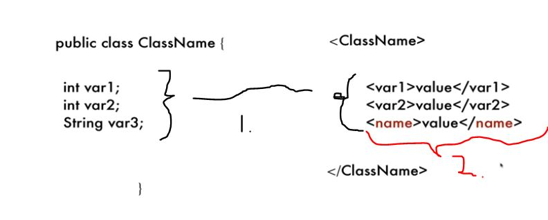

# SOAP Web Services 14 - Using JAXB Annotations Part 1

- Mapping between Beans and XML response, is helping tool called **JAXB**.
	- Binds different parts of Java Object with different part of **XML** object.

 

1. By default mapping will be one to one.
2. If we need to translate field to little bit different, you need to provide **@annotation**. 

- We need give **JAXB** annotation.