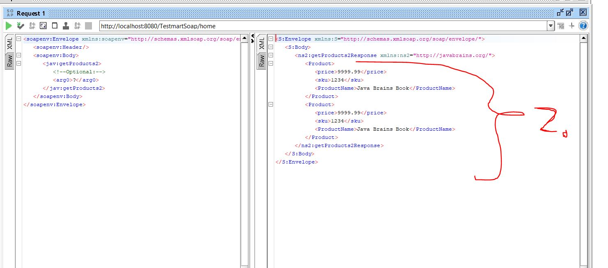

# SOAP Web Services 15 - Using JAXB Annotations Part 2

- We are changing **Pojo** formatting with **JAXB**.

- Indicating **JAXB** about root element `@XmlRootElement(name = "Product")`.
	- If Product has other classes inside itself.

- We can tell order for **XML** `@XmlType(propOrder = {"price", "sku", "name"})`.


- **Pojo** customized with **JAXB**

```

package org.javabrains.model;

import jakarta.xml.bind.annotation.XmlElement;
import jakarta.xml.bind.annotation.XmlRootElement;
import jakarta.xml.bind.annotation.XmlType;

@XmlRootElement(name = "Product")
@XmlType(propOrder = {"price", "sku", "name"})
public class Product {
	
	private String name;
	private String sku;
	private double price;
	
	public Product() {
	}
	
	public Product(String name, double price, String sku) {
		this.name = name;
		this.price = price;
		this.sku = sku;
	}	
	
	@XmlElement(name="ProductName")
	public String getName() {
		return name;
	}
	public void setName(String name) {
		this.name = name;
	}
	public double getPrice() {
		return price;
	}
	public void setPrice(double price) {
		this.price = price;
	}
	public String getSku() {
		return sku;
	}
	public void setSku(String sku) {
		this.sku = sku;
	}

}

```

- And putting `@WebResult(name="Product")` for catalog or interface makes it return inside such.

```

@WebService(name = "TestMartCatalog")
public interface ProductCatalogInterface {

	@WebMethod(action="fetch_categories", operationName = "fetchCatogories") //This is optional
	List<String> getProductCategories();
	@WebMethod
	List<String> getProducts(String category);
	@WebMethod
	@WebResult(name="Product")
	List<Product> getProducts2(String category);
	@WebMethod
	List<String> addProduct(String category, String product);

}
```



2. As you can see fields here are changed to what have been annotated!