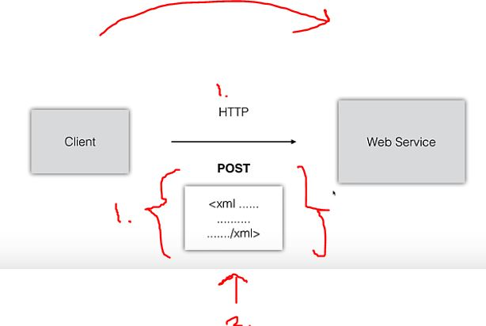
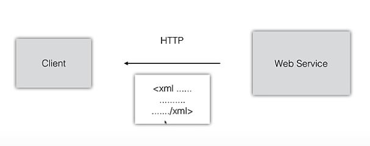
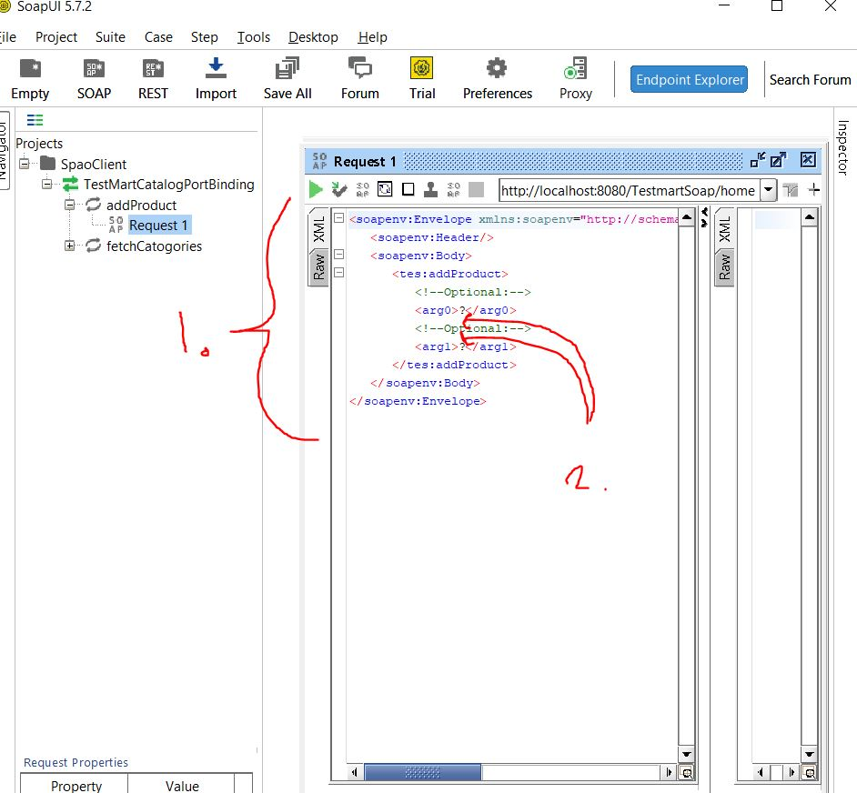

# SOAP Web Services 17 - Using SoapUI

- There is many SOAP testing tools.

- [SoapUI](https://www.soapui.org/)

- You can have standalone program or plugin.

1. We are making **HTTP request**. Different with this tool, is that is done in **POST** body.
2. **SOAP** has this **STRICT** standard for controlling **XML.**

- Tools are helping constructing **XML**!

- And return in like in normal queries.

 

1. Xml is generated from **WSDL**.
2. We can input different parameters for request.

- This is good tool for testing **Web Services**!
