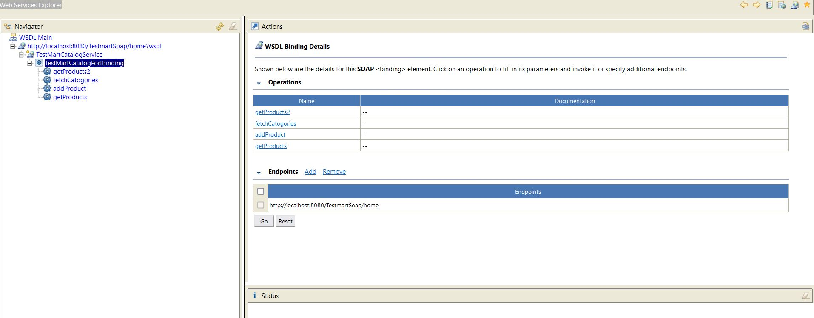
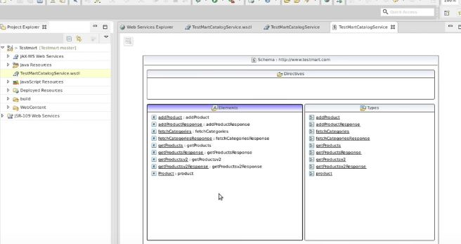

# SOAP Web Services 18 - Using Web Service Explorer

1. From the main menu, click File > Import. The Import wizard opens.
2. Select Web Service and click Next. The Web service import wizard opens.
3. Click Finish.

- Opening **Web Services Explorer**.

- Importing **WSDL** into **Eclipse.**

 

- We can explore **WSDL** in Eclipse.

