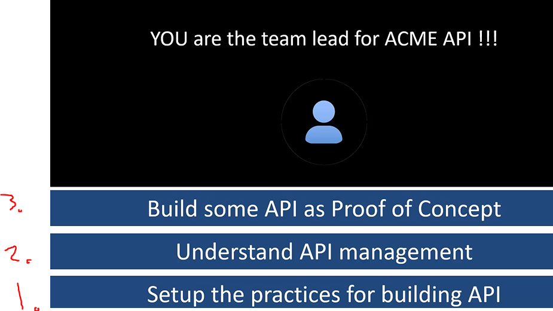
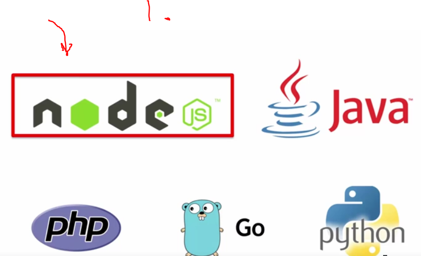
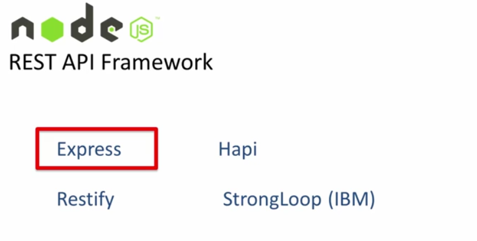
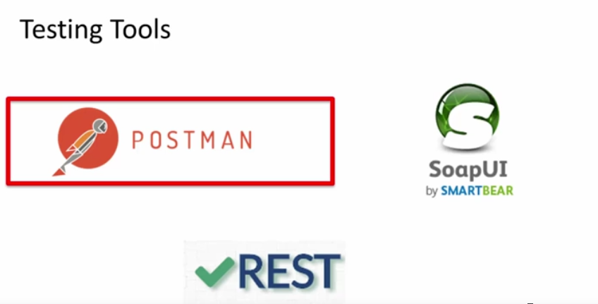
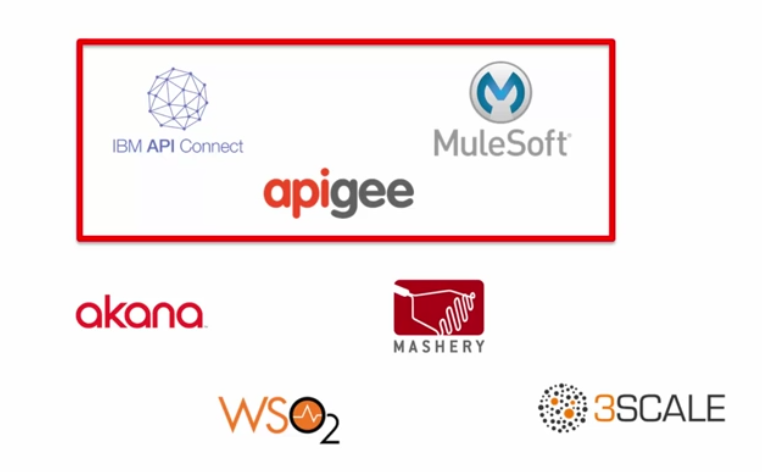

# Section 01 - Setting the stage

# What I Learned

- When API is deployed, do you need API management platform?

- There three tasks which you need to accomplish. **Let's build Cool API’S** 

1. Node is simple and many packages

- Express is fastest and easiest to create REST API’s

- Testing REST API’s
    - Will be using POSTMAN

- Mongolab for not installing mongoDb

- There is many API management tools, we will be using these three
