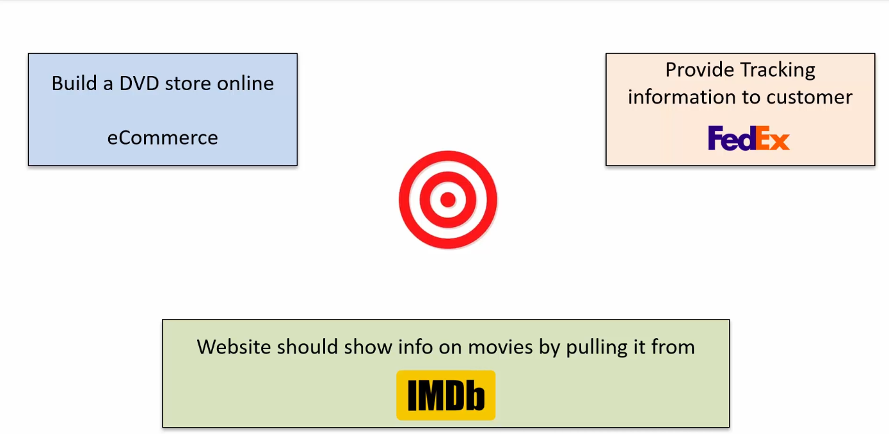
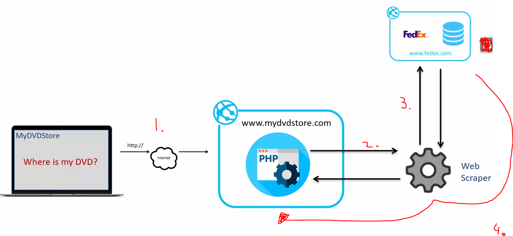
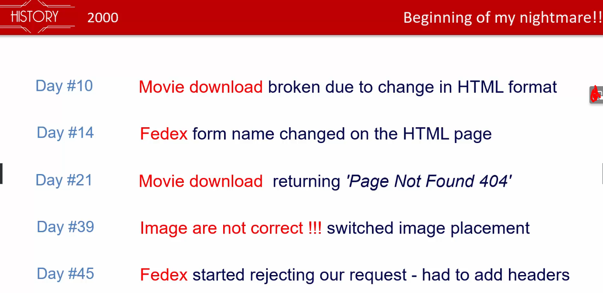
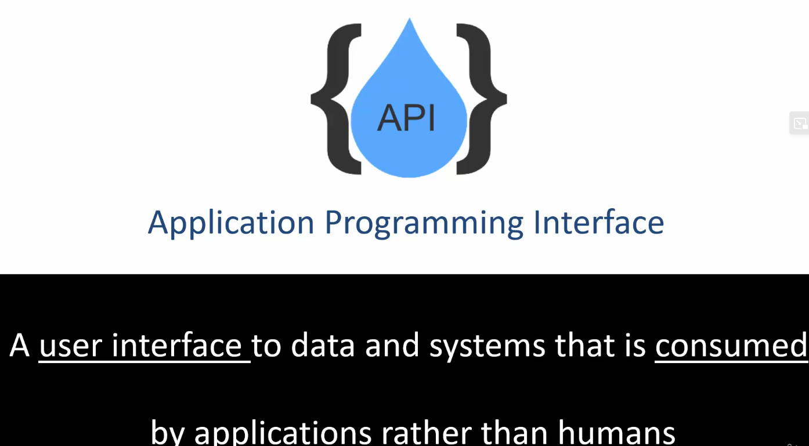
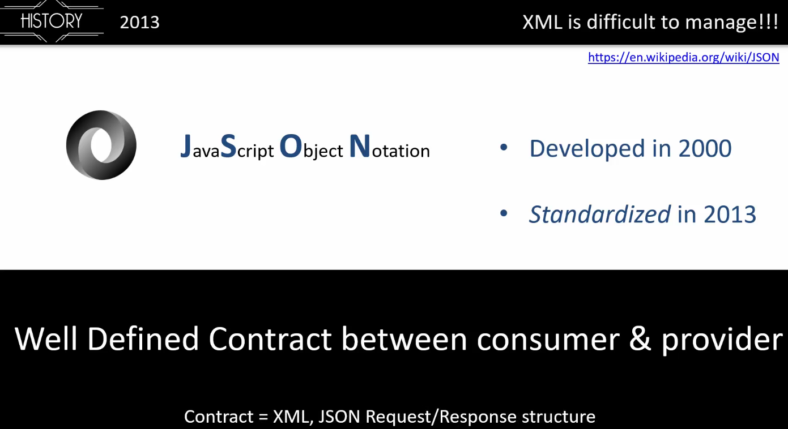
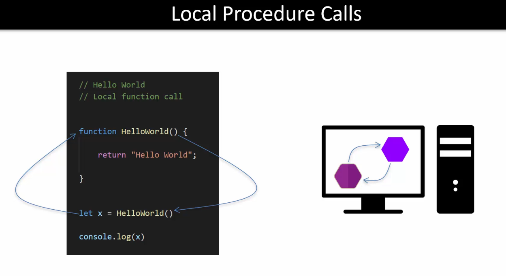

# Section 2: Evolution of  RESTful services

# What I Learned

## Evolving movie database(IMDB)

- Old days used to just browse into webpage and look for infomation

- Later FedEx released web tracking feature with ID, at the time this was super cool!

- WebScraping was used since it could parse `<html>` and later save it to database.
    - **FYI** Many developers were using this technique! Web Scraping

- 1. `PHP` based website will receive HTTP request to website
- 2. After receiving request, Web Scraper was **invoked()**
- 3. HTTP `GET` was invoked form Web Scraper
- 4. Response had tracking information about the movie

- This case was not end of trouble, there were many problems head

- It shows **Web Scraping** is not easy to maintain! Different stuff can be easily changed!

- Later FedEx released HTTP/XML RPC for tracking!
    - XML based

- This introduced API to developers!

- API has well-defined Contract between consumer & provider. Meaning this case **Contract = XML Request/Response structure**
    - Meaning our case stuff will not change randomly like in our `<html>` scrapper example

- API’s are expected to use by machine

- After 2013 JSON have grown popularity. Nowadays, it's the first choice for API developers.

